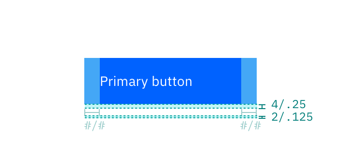

### Component contributions can take several forms. Most are either component enhancements or brand new assets.

## Create something

To contribute a component to Carbon, start by [opening an issue](https://github.com/carbon-design-system/carbon/issues/new?assignees=&labels=type%3A+enhancement+%F0%9F%92%A1&template=feature-request-or-enhancement.md&title=). Include a detailed description in which you:
* Explain the rationale
* Detail the intended behavior
* Clarify whether it's a variation of an existing component, or a new asset
* Include mockups of any fidelity (optional)
* Include any inspirations from other products (optional)

The issue can be the staging ground for the contribution and an opportunity for the community to weigh in with any suggestions. We'll also be able to tell you up-front whether the contribution is likely to become part of Carbon, and potentially save you time. 

### Complete contributions

A complete contribution ultimately includes the following parts. You're encouraged to surface works-in-progress. Someone in the community may be able to pick up where you left off.

#### 1. Rationale

Make your case. Carbon serves the widest possible range of products, and contributions that increase the scope of the system are more likely to be accepted. Be sure to include UX and interaction descriptions.

#### 2. Design spec

This spec provides a developer everything they need to create the design in code. Check out our [production guidelines](https://github.com/carbon-design-system/carbon-website/wiki/Production-guidelines#spec-guidelines) to get started.

You should include color tokens and type tokens used in this spec.

<ImageComponent caption="Example of a spec" cols="8">

</ImageComponent>

#### 3. Sketch symbol

Any new components or changes to existing components should also live in the [Carbon Sketch kit](/getting-started/designers#get-the-kit). Check out [Sketch's guide](https://www.sketch.com/docs/symbols/creating-symbols/) for creating a symbol. This symbol can be contributed with the asset or enhancement, but must be added to the kit by one of its maintainers.

#### 4. Docs

If the contribution adds additional behavior or expands a component's features, you'll need to document them with usage guidance, which will go in the usage tab of the component page. Color and type tokens will live in the style tab. 

See our [production guidelines](https://github.com/carbon-design-system/carbon-website/wiki/Production-guidelines#spec-guidelines) and the [documentation guidelines](/contribute/documentation) for help documenting your work.

#### 5. Code

The component or enhancement must be built in one of our supported frameworks (Vanilla, React, Vue, or Angular). See the contribution guidelines for the specific repo you intend to contribute to.

<Row className="tile--group">
<Column offsetLg="4" colMd="4" colLg="4" noGutterSm>
    <ClickableTile
      title="Contribute to Carbon Components React"
      href="https://github.com/carbon-design-system/carbon/blob/master/.github/CONTRIBUTING.md"
      type="resource">

  </ClickableTile>
</Column>
<Column colLg="4" noGutterSm>
  <ClickableTile
    title="Contribute to Carbon Components Angular"
    href="https://github.com/IBM/carbon-components-angular/blob/master/README.md#contributing"
    type="resource">

  </ClickableTile>
  
</Column>

<Column offsetLg="4" colMd="4" colLg="4" noGutterSm>
    <ClickableTile
      title="Contribute to Carbon Components Vue"
      href="https://github.com/carbon-design-system/carbon-components-vue/blob/master/.github/CONTRIBUTING.md"
      type="resource">

  </ClickableTile>
</Column>
</Row>
