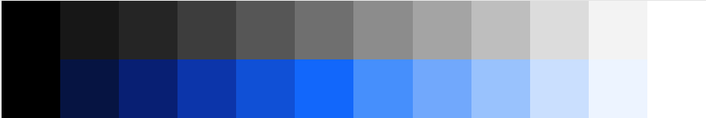
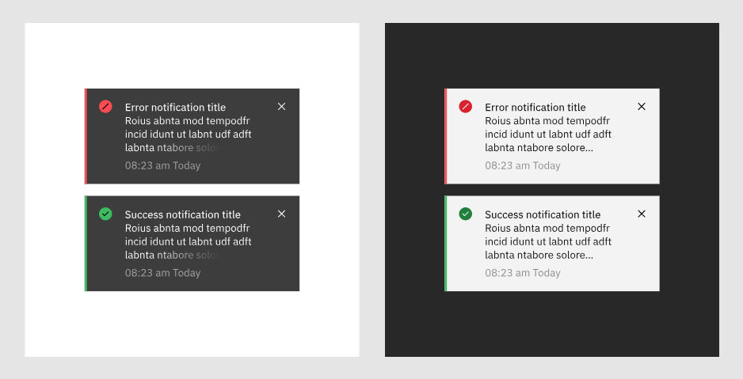
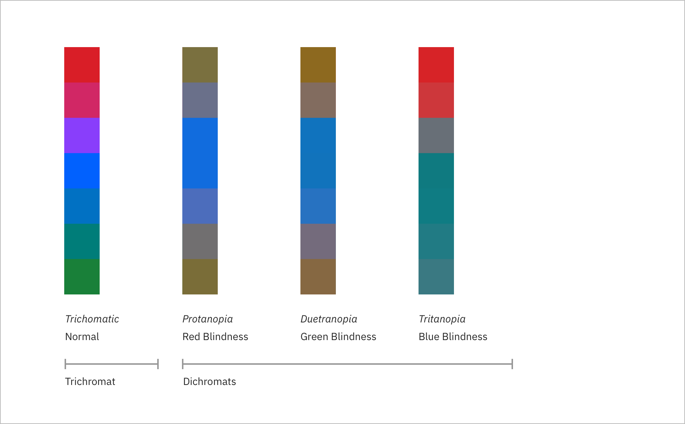

<page-intro>Maintaining consistent and engaging digital interfaces throughout IBM—whether applications or experiences—demands extended guidance around color usage. The following concepts are the foundation as we strive to achieve balance and harmony through our user interface design.
  Carbon uses a subset of the [IBM Design Language color palette](https://w3.ibm.com/design/language/elements/color/) for all IBM properties. Non-IBM Carbon users can create their own theme using Carbon's design tokens.
</page-intro>

1. [Color Tokenization](#color-tokenization)
2. [Color Anatomy](#color-anatomy)
3. [Color Themes](#color-themes)
4. [Color Roles](#color-roles)
4. [High Contrast](#high-contrast)
5. [Interaction States](#interaction-states)
6. [Digital Accessibility](#digital-accessibility)

## Color Tokenization
Our palette is designed and implemented in a themable manner using tokens. Tokens are based on usage and purpose; so while the purpose of any given token will not change, the color value associated with it can be changed at any time. A color value can be associated with multiple tokens, but a token will only ever be associated with a single color value, per theme.

Color values can also have multiple associated roles when the color is consistently used across those roles. This allows for uniform color application across themes while giving each theme the freedom to express its own individuality at a more detailed level. See [the themes section](guidelines/themes/) for more information on theming and tokenization.

## Color Anatomy
In product design, color plays more of a productive versus an expressive role. Too much color starts to distract from the primary goal: to guide the user through a task-oriented journey. Just like familiar screen regions, color creates a series of user expectations about hierarchy and relationships between elements in an interface. Bearing that in mind, color should be applied sparsely, with purpose and consistency. Bolder use of color in product is reserved for data visualization.

The Neutral Gray family serves as the foundation of our UI, making use of both subtle and dramatic shifts in value to help organize content and function.

**The core Blue family is the primary action color across all IBM products and experiences.**  Additional colors are used sparingly and purposefully.

## Color Themes
We are starting with two core themes: light and dark. Each theme works with a specific background color. These colors are global variables which determine the color of the component being applied within each theme. Default color tokens are provided for each component based on the primary background color.

### Global Background Colors

| Token                         | Role                                                         | Color Name     | Value |                                                  
| :----------------------------- | :------------------------------------------------------------ | :-------------- | :--------- | 
| `$global-background-light-01`                   | Light Theme Background | White        | <color-block>#ffffff</color-block>                |
| `$global-background-dark-01`                   | Dark Theme Background                                             | Gray 100        | <color-block>#171717</color-block>              |

### The Light Theme

The light theme uses a White background; Gray 10 components are generally paired with White background, however inverse tokens can call a dark-themed value for components in the light theme when [more contrast is needed.](#high-contrast)

### The Dark Theme

The dark theme uses a a Gray 100 background. Gray 90 components are generally paired with Gray 100 backgrounds, however inverse tokens can also call light-themed values for components in the dark theme when [more contrast is needed.](#high-contrast)

<!-- 

UI Foundational Colors

Alerts Colors

-->

<!-- <Margin top="2rem">
  <ColorMatrix colorName="gray"></ColorMatrix>
  <ColorMatrix colorName="blue"></ColorMatrix>
</Margin>
<Margin top="2rem">
  <ColorUIColorAnatomy></ColorUIColorAnatomy>
</Margin> -->

## Color Roles

It's important to remember that these token names are not final. The information on this page represents the latest in a rapidly evolving color system, and as such should be considered "not production ready." Please experiment, prod, stress-test, and, most importantly, [give feedback!](https://github.com/IBM/carbon-components/issues/new?template=question.md) 

### IBM Base Theme: Light*

<!--

| Color                                                 | Color Name     | Hex Value | Tokens        |
|-------------------------------------------------------|----------------|-----------|---------------|
|                | Blue 60        | `0062ff`  | `$brand-01`   |
|                | Blue 80        | `0530ad`  | `$brand-02`   |
|                | Blue 60        | `0062ff`  | `$brand-03`   |
|                    | White          | `ffffff`  | `$inverse-01` |
|                | Gray 10        | `f3f3f3`  | `$ui-01`      |
|                    | White          | `ffffff`  | `$ui-02`      |
|                | Gray 20        | `dcdcdc`  | `$ui-03`      |
|                | Gray 50        | `8c8c8c`  | `$ui-04`      |
|              | Gray 100       | `171717`  | `$ui-05`      |
|              | Gray 100       | `171717`  | `$text-01`    |
|                | Gray 70        | `565656`  | `$text-02`    |
|                | Gray 50        | `8c8c8c`  | `$text-03`    |
|      | Cool Gray 10   | `f2f4f8`  | `$field-01`   |
|        | Support Red    | `D6182D`  | `$support-01` |
|  | Support Orange | `F8792B`  | `$support-02` |
|  | Support Yellow | `FBCF47`  | `$support-03` |
|    | Support Green  | `30A14C`  | `$support-04` |

-->

| Token                         | Role                                                         | Color Name     | Value |                                                  
| :----------------------------- | :------------------------------------------------------------ | :-------------- | :--------- | 
| `$brand-01`                   | Primary brand  Interactive text   Primary icon color   Border highlight   Emphasis background | Blue 60        |  <color-block>#0062ff</color-block>                |
| `$brand-02`                   | Supporting brand                                             | Blue 80        |  <color-block>#0530ad</color-block>                |
| `$brand-03`                   | Tertiary brand   Loading                                | Blue 60        |  <color-block>#0062ff</color-block>               |
| `$ui-01`                      | Primary background   Layer 1 background                 | Gray 10        |  <color-block>#f3f3f3</color-block>               |
| `$ui-02`                      | Default page background   Layer 0 background   Secondary background | White          |  <color-block>#ffffff</color-block>                   |
| `$ui-03`                      | Subtle border                                                | Gray 20        |  <color-block>#dcdcdc</color-block>               |
| `$ui-04`                      | 3:1 color contrast   Emphasis border                    | Gray 50        |  <color-block>#8c8c8c</color-block>               |
| `$ui-05`                      | 4.5:1 color contrast   High contrast border   Secondary icons | Gray 100       |  <color-block>#171717</color-block>             |
|`$inverse-01`| High contrast component background | Gray 80 |  <color-block>#3d3d3d</color-block> |
| `$inverse-02` | Text for an inverse component | Gray 10 |  <color-block>#f3f3f3</color-block>  |
| `$text-01`                    | Primary text   Body copy                                | Gray 100       |  <color-block>#171717</color-block>             |
| `$text-02`                    | Secondary text   Subtle text  Help text           | Gray 70        |  <color-block>#565656</color-block>               |
| `$text-03`                    | Placeholder text                                             | Gray 50        |  <color-block>#8c8c8c</color-block>               |
| `$support-01` | Error    | Red       |  <color-block>#d6182d</color-block>       |
| `$support-02` | Warning | Orange       |  <color-block>#f8792b</color-block> |
| `$support-03` | Caution | Yellow        |  <color-block>#fbcf47</color-block> |
| `$support-04` | Success  | Green        |  <color-block>#30a14c</color-block>   |

***Dark theme values are coming soon**

## High Contrast

In some cases, it is helpful to apply light components to dark backgrounds or light components to dark backgrounds. This technique is useful to focus attention or create visual tension when necessary. We use inverse tokens to call dark or light-themed values onto a component of the opposite theme for this purpose. 

## Interaction States

The primary interaction states have been defined for all colors within the Duo palette. For values between 100 and 70, interaction gets lighter and for values between 60 and white, interaction gets darker.

### Hover*

A unique set of hex values and color tokens exists for the hover states. These colors are outside of the core Design Language Brand palette and can be considered as half steps in between two adjacent colors. 

***Hover values are coming soon.**

### Selected

The selected state is one full step lighter for values between 100 and 70 and one full step darker for values between 60 and 10. Exception: White shares the same selected state as Gray 10. Example: the Blue 60 selected state is Blue 70.

### Active

The active state is two full steps lighter for values between 100 and 70 and two full steps darker for values between 60 and 10. See [Color Anatomy](#color-anatomy) above to reference the steps. *Exception: White shares the same active state as Gray 10. Example: the Blue 60 active state is Blue 80.*

<!--
## Commonly Used Colors

The table below lists common colors that are not component specific, such as primary text, icons and alerts. For a more comprehensive list of values, please refer to the Style section for each individual component.

| Role                   | SCSS | Hex Value | Color                                    |
| ---------------------- | ---- | --------- | ---------------------------------------- |
| Text – Primary Light   | —    | `#171717` | <Swatch hex="#171717">Gray 100</Swatch>  |
| Text – Primary Dark    | —    | `#f3f3f3` | <Swatch hex="#f3f3f3">Gray 10</Swatch>   |
| Text – Secondary Light | —    | `#565656` | <Swatch hex="#565656">Gray 70</Swatch>   |
| Text – Secondary Dark  | —    | `#bebebe` | <Swatch hex="#bebebe">Gray 30</Swatch>   |
| Text – Hint            | —    | `#a4a4a4` | <Swatch hex="#a4a4a4">Gray 40</Swatch>   |
| Alert – Error          | —    | `#da1e28` | <Swatch hex="#da1e28">Red 60</Swatch>    |
| Alert – Warning        | —    | `#fdd13a` | <Swatch hex="#fdd13a">Yellow 30</Swatch> |
| Alert – Success        | —    | `#24a249` | <Swatch hex="#24a249">Green 50</Swatch>  |

<Spacer amount="3rem" amountmd="4rem"></Spacer>

-->

## Digital Accessibility

Using various forms of contrast is the most important consideration when making user-friendly color and interface choices. Awareness of standards and color blindness best practices is the key to accessible color selection.

### WCAG 2.0 Standards

All type color combinations on Duo must pass WCAG AA standards of 4.5:1 for normal text and 3:1 for large text. For larger text, if the font weight is light (300) or normal (400) the text should be no smaller than 24px. If the font weight is Semi-Bold (600) then the large text should be no smaller than 19px.

The color families in our palette contain ten values from 10 to 100. White and Black sit outside those values. Black text is WCAG AA accessible on colors ranging from 10 to 50. White text is accessible on colors from 60 to 100.

 

 

Beyond black and white, the IBM color palette provides a range of accessible combinations. Subtracting the foreground value from the background value (or vice versa) helps determine whether that color combination meets the WCAG AA contrast ratio success criteria. If the difference between two values is 50 or greater, the colors are accessible. Anything below a difference of 50 may fail accessibility standards.

 

 

### Color Blindness

The most common form of color blindness is red/green, where sufferers mix up all colors which have red or green as part of the whole color. Our palette and its usage emphasize blues, darks and lights. These concepts ensure a pleasurable and consistent color experience for as many users as possible.

Those affected by Protanopia color blindness are less sensitive to red light, while sufferers of Deuteranopia have the same problem with green. For example, a person with Protanopia will confuse blue and purple because they can’t recognize the red element of the color purple. 

The third type of color deficiency, Tritanopia, is the least common and refers to sufferers who struggle to distinguish blue or yellow light. The image below shows what the rainbow may look like to individuals with each of these forms of color blindness.

### Accessibility Resources

See [Carbon and Accessibility](../guidelines/accessibility/overview) for more information.

<!-- 
## Experimental theme

<flex-group>
<color-card name="brand-01" hex="#0062ff"></color-card>
<color-card name="brand-02" hex="#0530ad"></color-card>
<color-card name="brand-03" hex="#0062ff"></color-card>
<color-card name="ui-01" hex="#f3f3f3"></color-card>
<color-card name="ui-02" hex="#ffffff" border="true"></color-card>
<color-card name="ui-03" hex="#dcdcdc"></color-card>
<color-card name="ui-04" hex="#8c8c8c"></color-card>
<color-card name="ui-05" hex="#171717"></color-card>
<color-card name="text-01" hex="#171717"></color-card>
<color-card name="text-02" hex="#565656"></color-card>
<color-card name="text-03" hex="#8c8c8c"></color-card>
<color-card name="inverse-01" hex="#ffffff" border="true"></color-card>
<color-card name="field-01" hex="#f2f4f8"></color-card>
</flex-group>

### Hover Colors

<flex-group>
<color-card name="hover-primary" hex="#004ecc"></color-card>
<color-card name="hover-primary-text" hex="#0045b3"></color-card>
<color-card name="hover-danger" hex="#ad1820"></color-card>
<color-card name="hover-secondary" hex="#0062ff"></color-card>
<color-card name="hover-row" hex="rgba(5, 48, 173, 0.1)"></color-card>
</flex-group>

### Support Colors

<flex-group>
<color-card name="support-01" hex="#da1e28"></color-card>
<color-card name="support-02" hex="#24a249"></color-card>
<color-card name="support-03" hex="#fdd13a"></color-card>
<color-card name="support-04" hex="#418cff"></color-card>
</flex-group>

-->
