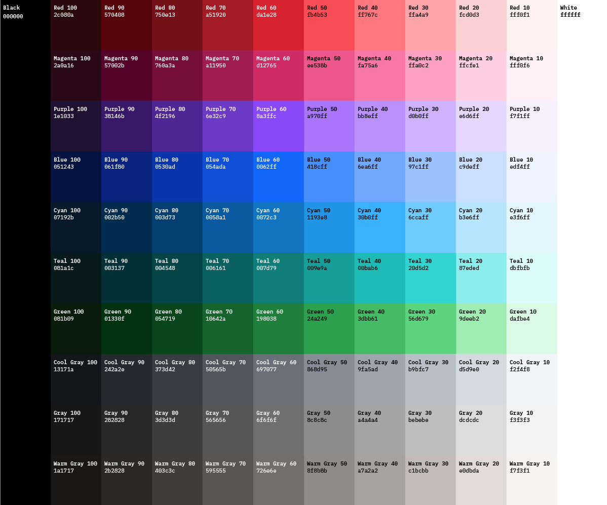
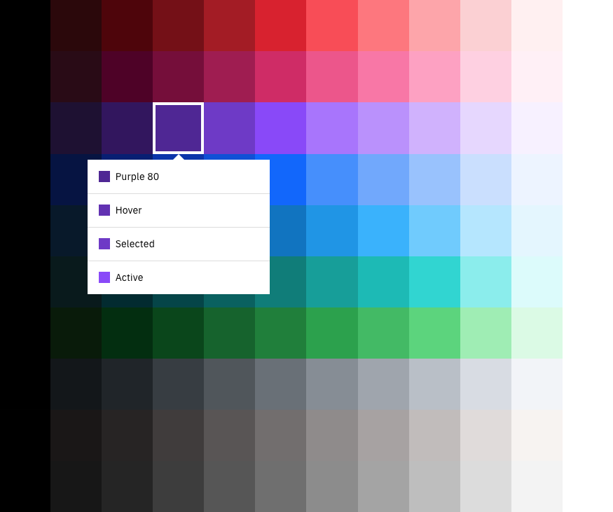
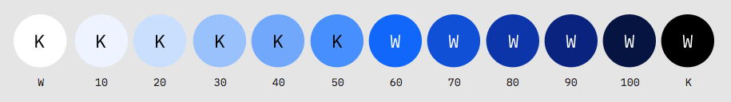
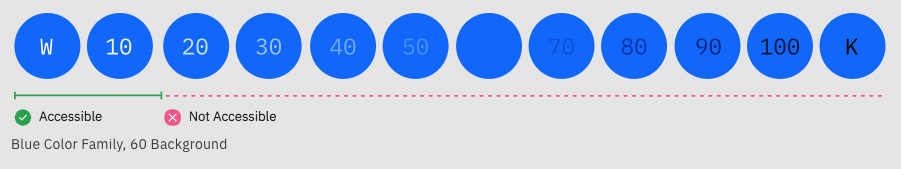
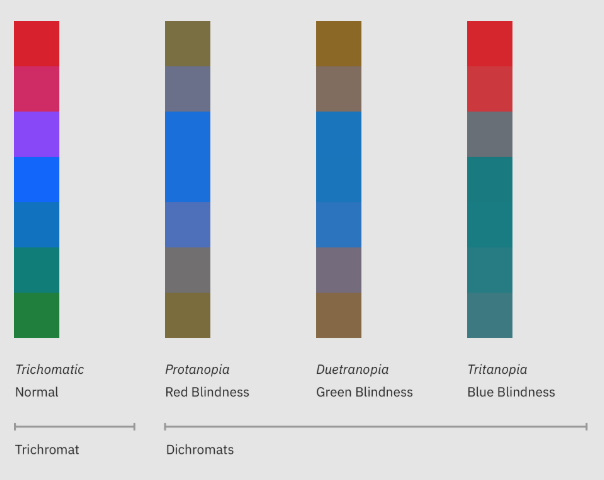

<page-intro>Maintaining consistent and engaging digital interfaces throughout IBM, whether applications or experiences, demands extended guidance around color usage. The following concepts are the foundation as we strive to achieve balance and harmony through our User Interface design.</page-intro>

## Color Palette
Carbon's unified color palette brings consistency, utility, and emotion to IBM’s vast array of digital products and interfaces.

## Color Anatomy
The Neutral Gray family serves as the foundation of our UI, making use of both subtle and dramatic shifts in value to help organize content and function.

**The core Blue family is the primary action color across all products and experiences.**  Additional colors are used sparingly and purposefully.

UI Foundational Colors

Alerts Colors

<Margin top="2rem">
  <ColorMatrix colorName="gray"></ColorMatrix>
  <ColorMatrix colorName="blue"></ColorMatrix>
</Margin>
<Margin top="2rem">
  <ColorUIColorAnatomy></ColorUIColorAnatomy>
</Margin>

## Themes
Each theme works with a specific set of primary background colors. These colors are global variables which determine the color of the component being applied within each theme. The light theme uses White and Gray 10 backgrounds and the dark theme uses Gray 100, 90 and 80 backgrounds. Default color tokens are provided for each component based on the primary background color.

[ swatches for Themed backgrounds White
Gray 10
Light

Gray 100
Gray 90
Gray 80
Dark
]

## Global Background Colors

| Role                    | SCSS | Hex Value | Color                                   |
| ----------------------- | ---- | --------- | --------------------------------------- |
| Global Background Light | —    | `#ffffff` | <Swatch hex="#ffffff">White </Swatch>   |
| Global Background Light | —    | `#f3f3f3` | <Swatch hex="#f3f3f3">Gray 10 </Swatch> |
| Global Background Dark  | —    | `#3d3d3d` | <Swatch hex="#3d3d3d">Gray 80 </Swatch> |
| Global Background Dark  | —    | `#282828` | <Swatch hex="#282828">Gray 90 </Swatch> |
| Global Background Dark  | —    | `#171717` | <Swatch hex="#171717">Gray 100</Swatch> |

<Spacer amount="3rem" amountmd="4rem"></Spacer>

## Light Theme

Gray 10 components are generally paired with White backgrounds and White components with Gray 10 backgrounds. Some components, such as buttons and toggles, are common across both backgrounds.

[Insert Do's and Don'ts examples here]

<!-- <DoDontLarge>
  <Do
    src="../media/pages/color-ui/light-theme-do-1.svg"
    caption="Gray 10 Dropdown on White background."
  ></Do>
  <Do
    src="../media/pages/color-ui/light-theme-do-2.svg"
    caption="White Dropdown on Gray 10 background."
  ></Do>
  <Do
    src="../media/pages/color-ui/light-theme-do-3.jpg"
    caption="White Overflow Menu on Gray 10 Card."
  ></Do>
  <Dont
    src="../media/pages/color-ui/light-theme-dont-1.svg"
    caption="Avoid use of midtones."
  ></Dont>
</DoDontLarge>
<DoDontStack>
  <ImageWithCaption
    src="../media/pages/color-ui/ui-against-light-bg.gif"
    caption="Components with common colors across both light UI backgrounds"
  ></ImageWithCaption>
</DoDontStack>
-->

[IMAGE: Components with common colors across both light UI backgrounds]

<!-- <Margin bottom="2rem">
  <HorizontalRow padded="true">
    <ColorUIExpandableImage caption="IBM Evidence Builder Prototype">
      
    </ColorUIExpandableImage>
    <ColorUIExpandableImage caption="IBM Radar Prototype">
      
    </ColorUIExpandableImage>
    <ColorUIExpandableImage caption="IBM Cloud Platform Prototype">
      
    </ColorUIExpandableImage>
  </HorizontalRow>
</Margin>

-->

## Dark Theme

Gray 90 components are generally paired with Gray 100 backgrounds and Gray 80 components with Gray 90 backgrounds. Some components, such as buttons and toggles, are common across all three dark UI backgrounds.

[Insert Do's and Don'ts examples here]

[IMAGE: Components with common colors across dark UI backgrounds]

<!--
<DoDontLarge>
  <Do
    src="../media/pages/color-ui/dark-theme-do-1.svg"
    caption="Gray 90 Dropdown on Gray 100 background."
  ></Do>
  <Do
    src="../media/pages/color-ui/dark-theme-do-2.svg"
    caption="Gray 80 Dropdown on Gray 90 background."
  ></Do>
  <Do
    src="../media/pages/color-ui/dark-theme-do-3.jpg"
    caption="Gray 70 is sometimes used when compound components are being applied such as an overflow menu."
  ></Do>
  <Dont
    src="../media/pages/color-ui/dark-theme-dont-1.svg"
    caption="Do not apply components that are darker than the background unless using high contrast mode."
  ></Dont>
</DoDontLarge>
<DoDontStack>
  <ImageWithCaption
    src="../media/pages/color-ui/ui-against-dark-bg.gif"
    caption="Components with common colors across all dark UI backgrounds"
  ></ImageWithCaption>
</DoDontStack>
<Margin bottom="2rem">
  <HorizontalRow padded="true">
    <ColorUIExpandableImage theme="dark" caption="IBM Watson API Demo">
      
    </ColorUIExpandableImage>
    <ColorUIExpandableImage theme="dark" caption="IBM Security Cloud Prototype">
      
    </ColorUIExpandableImage>
    <ColorUIExpandableImage theme="dark" caption="IBM Watson Health Prototype">
      
    </ColorUIExpandableImage>
  </HorizontalRow>
</Margin>

-->

## High Contrast

In some cases, it is helpful to apply light components to dark backgrounds or light components to dark backgrounds. This technique is useful to focus attention or create visual tension when necessary.

<!-- <DoDontLarge>
  <ImageWithCaption
    src="../media/pages/color-ui/high-contrast-do-dont-1.svg"
  ></ImageWithCaption>
  <ImageWithCaption
    src="../media/pages/color-ui/high-contrast-do-dont-2.svg"
  ></ImageWithCaption>
</DoDontLarge>

-->

## Interaction States

The primary interaction states have been defined for all colors within the Duo palette. For values between 100 and 70, interaction gets lighter and for values between 60 and white, interaction gets darker.

### Hover

A unique set of hex values and color tokens exists for the hover states. These colors are outside of the core Duo palette and can be considered as half steps in between two adjacent colors.

### Selected

The selected state is one full step lighter for values between 100 and 70 and one full step darker for values between 60 and 10. Exception: White shares the same selected state as Gray 10. Example: the Blue 60 selected state is Blue 70.

### Active

The active state is two full steps lighter for values between 100 and 70 and two full steps darker for values between 60 and 10. Exception: White shares the same active state as Gray 10. Example: the Blue 60 active state is Blue 80

[INSERT DUO INTERACTIVE PALETTE GRAPHIC HERE TO REPLACE THIS PLACEHOLDER]

## Commonly Used Colors

The table below lists common colors that are not component specific such as primary text, icons and alerts. For a more comprehensive list of values, please refer to the Style section for each individual component.

| Role                   | SCSS | Hex Value | Color                                    |
| ---------------------- | ---- | --------- | ---------------------------------------- |
| Text – Primary Light   | —    | `#171717` | <Swatch hex="#171717">Gray 100</Swatch>  |
| Text – Primary Dark    | —    | `#f3f3f3` | <Swatch hex="#f3f3f3">Gray 10</Swatch>   |
| Text – Secondary Light | —    | `#565656` | <Swatch hex="#565656">Gray 70</Swatch>   |
| Text – Secondary Dark  | —    | `#bebebe` | <Swatch hex="#bebebe">Gray 30</Swatch>   |
| Text – Hint            | —    | `#a4a4a4` | <Swatch hex="#a4a4a4">Gray 40</Swatch>   |
| Alert – Error          | —    | `#da1e28` | <Swatch hex="#da1e28">Red 60</Swatch>    |
| Alert – Warning        | —    | `#fdd13a` | <Swatch hex="#fdd13a">Yellow 30</Swatch> |
| Alert – Success        | —    | `#24a249` | <Swatch hex="#24a249">Green 50</Swatch>  |

<Spacer amount="3rem" amountmd="4rem"></Spacer>

## Digital Accessibility

Using various forms of contrast is the most important consideration when making user-friendly color and interface choices. Awareness of standards and color blindness best practices is the key to accessible color selection.

### WCAG 2.0 Standards

All type color combinations on Duo must pass WCAG AA standards of 4.5:1 for normal text and 3:1 for large text. For larger text, if the font weight is light (300) or normal (400) the text should be no smaller than 24px. If the font weight is Semi-Bold (600) then the large text should be no smaller than 19px.

The color families in our palette contain ten values from 10 to 100. White and Black sit outside those values. Black text is WCAG AA accessible on colors ranging from 10 to 50. White text is accessible on colors from 60 to 100.

Beyond black and white, the IBM color palette provides a range of accessible combinations. Subtracting the foreground value from the background value (or vice versa) helps determine whether that color combination meets the WCAG AA contrast ratio success criteria. If the difference between two values is 50 or greater, the colors are accessible. Anything below a difference of 50 may fail accessibility standards.

### Color Blindness

The most common form of color blindness is red/green, where sufferers mix up all colors which have red or green as part of the whole color. Our palette and its usage emphasize blues, darks and lights. These concepts ensure a pleasurable and consistent color experience for as many users as possible.

Those affected by Protanopia color blindness are less sensitive to red light, while sufferers of Deuteranopia have the same problem with green. For example, a person with Protanopia will confuse blue and purple because they can’t recognize the red element of the color purple. The third type of color deficiency, Tritanopia, is the least common and refers to sufferers who struggle to distinguish blue or yellow light. The image below shows what the rainbow may look like to individuals with each of these forms of color blindness.

## Accessibility Resources

[Explore accessibility topics in greater depth.] (../guidelines/accessibility/overview) 

<!-- 
## Experimental theme

<flex-group>
<color-card name="brand-01" hex="#0062ff"></color-card>
<color-card name="brand-02" hex="#0530ad"></color-card>
<color-card name="brand-03" hex="#0062ff"></color-card>
<color-card name="ui-01" hex="#f3f3f3"></color-card>
<color-card name="ui-02" hex="#ffffff" border="true"></color-card>
<color-card name="ui-03" hex="#dcdcdc"></color-card>
<color-card name="ui-04" hex="#8c8c8c"></color-card>
<color-card name="ui-05" hex="#171717"></color-card>
<color-card name="text-01" hex="#171717"></color-card>
<color-card name="text-02" hex="#565656"></color-card>
<color-card name="text-03" hex="#8c8c8c"></color-card>
<color-card name="inverse-01" hex="#ffffff" border="true"></color-card>
<color-card name="field-01" hex="#f2f4f8"></color-card>
</flex-group>

### Hover Colors

<flex-group>
<color-card name="hover-primary" hex="#004ecc"></color-card>
<color-card name="hover-primary-text" hex="#0045b3"></color-card>
<color-card name="hover-danger" hex="#ad1820"></color-card>
<color-card name="hover-secondary" hex="#0062ff"></color-card>
<color-card name="hover-row" hex="rgba(5, 48, 173, 0.1)"></color-card>
</flex-group>

### Support Colors

<flex-group>
<color-card name="support-01" hex="#da1e28"></color-card>
<color-card name="support-02" hex="#24a249"></color-card>
<color-card name="support-03" hex="#fdd13a"></color-card>
<color-card name="support-04" hex="#418cff"></color-card>
</flex-group>

-->
