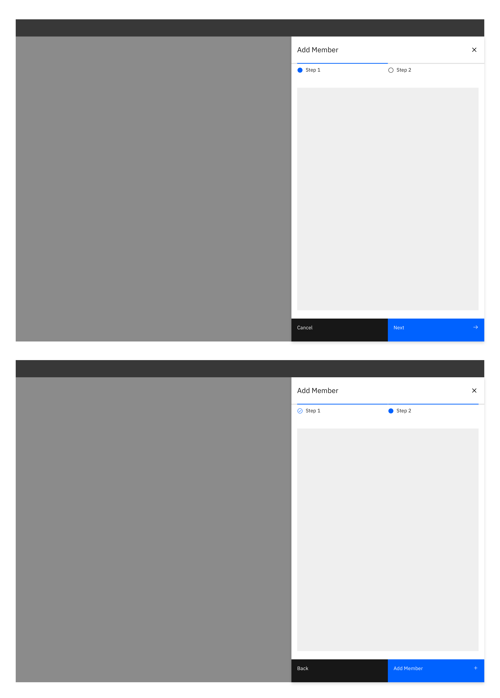
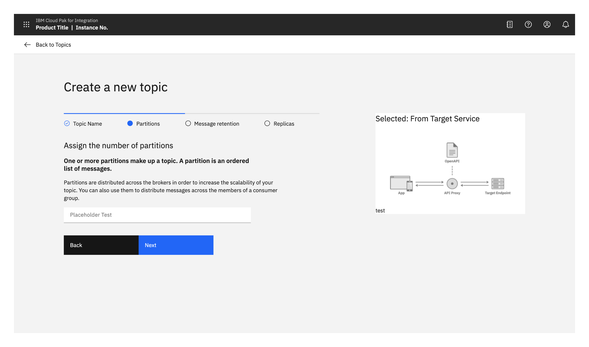

### Creating is the generation of a new resource. Relocating an existing resource is adding, not creating.

#### Maintainers:

[Vikki Paterson](https://github.ibm.com/VICTORIA), [Arnaud Gillard](https://github.ibm.com/Arnaud-Gillard)

<AnchorLinks>

- [Standard creation](#standard-creation)
- [Multistep creation](#multistep-creation)
- [Confirmation](#confirmation)

</AnchorLinks>

<ImageComponent caption="Example of a creation pattern." cols="8">

</ImageComponent>

#### Status:

Experimental

## Standard creation

The standard creation pattern is used when no stepped guidance is needed and the input fields are directly related to each other. 

<AnchorLinks small>

- [Modal](#modal)
- [Side panel](#side-panel)
- [Full screen](#full-screen)
- [Advanced option](#advanced-option)

</AnchorLinks>

### Modal

If there are only one or two decisions to be made during a creation, use a small, standard modal overlaying the content where the creation was initiated. Avoid scrolling inside a small modal. 

<ImageComponent caption="Example of a standard creation modal" cols="8">

</ImageComponent>

### Side panel

If you have limited screen real estate, consider using a side panel. Side panels also keep the user aware of the context in which they were working. You may choose to use either the slide in or slide over panels.

<ImageComponent caption="Example of a side panel creation flow" cols="8">

</ImageComponent>

### Full page

If your creation flow consists of multiple fields and/or supporting imagery, consider the full page option. Full page creation flows allow you to take advantage of maximum screen real estate.

<ImageComponent caption="Example of a fill page creation flow" cols="8">

</ImageComponent>

#### Supporting image

To include a supporting image, place it on the right hand side of the window. 

#### Advanced option

The advanced option is used to avoid overwhelming users, while allowing advanced users to access all options. It can be applied to the side panel and the full page dialog flows.

<ImageComponent caption="Example of advanced option" cols="4">

</ImageComponent>

Have a minimal set of options visible by default, with the ability for the user to chose if they want to expose more ‘advanced’ options. If the user switches to advanced mode, remember this next time they perform the same task.

## Multistep creation

If the creation task is complex, consider breaking the process up into multiple steps. Display related or dependant options together. 

Multistep creation follows the same principles as Standard creation, with the addition of multisteps.

<AnchorLinks small>

- [Side panel](#side-panel)
- [Full page](#full-page)

</AnchorLinks>

### Side panel

<ImageComponent caption="Example of a multi-step creation flow" cols="8">

</ImageComponent>

### Full page

<ImageComponent caption="Start of multistep creation flow" cols="8">

</ImageComponent>

<ImageComponent caption="Multistep creation flow with image" cols="8">

</ImageComponent>

### Confirmation

When any create action is a success, a notification banner can be presented to visually confirm this. 

<ImageComponent caption="Example of a successful creation confirmation" cols="8">

</ImageComponent>
