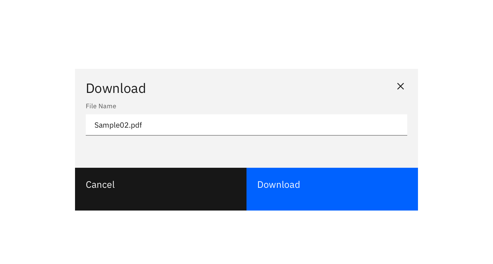
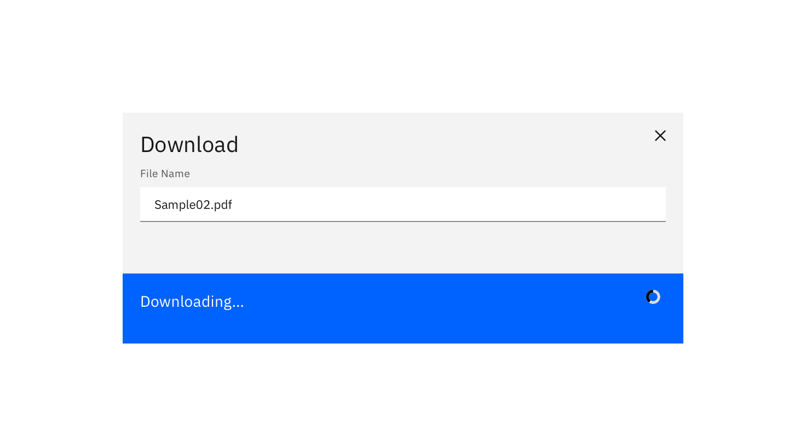

### Transferring a resource from a remote system to a local system.

#### Status: 

Experimental

#### Maintainers:

[Vikki Paterson](https://github.ibm.com/VICTORIA), [Arnaud Gillard](https://github.ibm.com/Arnaud-Gillard)

<AnchorLinks>

- [Intuitive default name](#intuitive-default-name)
- [Editable name](#editable-name)
- [Specify download location](#specify-download-location)

</AnchorLinks>

<ImageComponent cols="8" caption="Example of a download pattern using a modal">

</ImageComponent>

## Intuitive default name

When the resource is given an intuitive name by default - download occurs on the click of the button and nothing additional is displayed.

<ImageComponent cols="8">

</ImageComponent>

## Editable name

When downloading with an editable name, a dialog should be presented to the user displaying:

* An editable textbox pre-populated with the default name for the file
* Optionally, when the download button is selected it changes to show ‘Downloading’.  

<ImageComponent cols="8">

</ImageComponent>

<ImageComponent cols="8">

</ImageComponent>

## Specify download location

To specify the download location of a resource, the primary “download” button is pressed and activates the browsers default location panel. The file is automatically downloaded once a location is selected. 