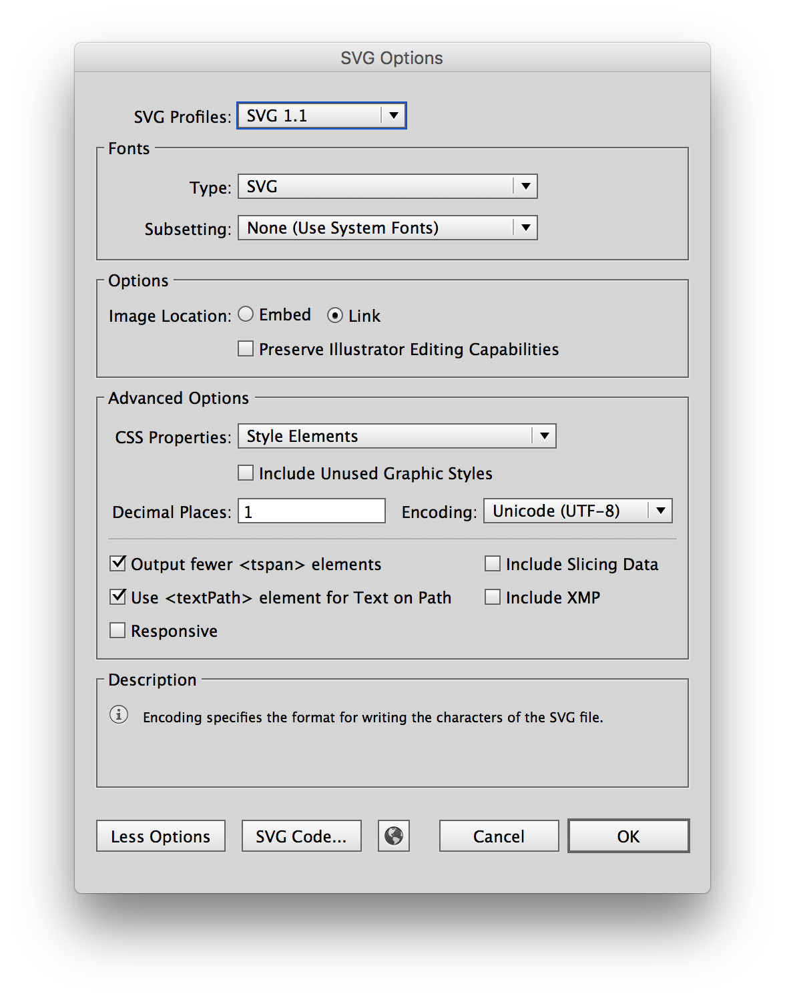

1.  [Design and Production Guidelines](#design-and-production-guidelines)
- [Best Practices and Pro Tips](#best-practices-and-pro-tips)
- [Exporting SVGs](#exporting-svgs)
- [Contribution Process](#contribution-process)

## Design and Production Guidelines

Don't see the icon you need in the library? Make your own! Follow these guidelines to ensure visual consistency and proper formatting.

* All icons should be unique and not redundant with any existing icons in the system. Search the [library](/library) for the keyword(s) associated with your proposed new icon to ensure that it is not already represented.

* All icons should adhere to the [IBM Design Language visual style](https://w3.ibm.com/design/language/elements/icons/).

* All icons should comply with IBM [accessibility standards](/guidelines/accessibility/overview).

* All icons should be usable across all supported platforms and devices.

* All icons should be understandable by a global audience of users, regardless of nationality or language.

### Production-Ready 

To be considered production-ready, all icon submissions must be delivered in SVG format at 16 x 16 pixels. 

## Best Practices and Pro Tips

- Create a 16 x 16 px artboard for each icon.
- Icons should be at whole pixels. No decimals are allowed in x and y coordinates or width and height fields.
- Set your workspace up from the start to snap to pixels and round values to whole pixels to avoid correcting shapes later.
- Never use center borders. Centering can cause half pixels.
- Avoid using the line tool and use the rectangle tool instead. The line tool will place the vector on half pixels.
- Be aware of automatic alignments which can place vectors on uneven or half pixels.
- Each artboard and the artwork within it must be aligned to the pixel grid.
- All strokes must be expanded.
- All strokes must be full pixels.
- Do not include padding when exporting icons (internal and external padding can be added with CSS).
- Combine all possible shapes and paths.
- Ungroup icon layers completely. The icon should be on the top-most layer in your artboard.
- Make sure to properly name layers and artboards (these names will also be exported into the code).

## Exporting SVGs

### Export SVGs from Sketch

1. Draw a 16 x 16 px artboard. The artboard should hug the edges of the icon.
2. Place the icon squarely on the artboard, making sure it's aligned to the pixel grid.
3. Convert all strokes to outlines `(Shift + ⌘ + O)`
4. Select any overlapping shapes and click the Union icon from the top navigation to merge all of the shapes together.
5. Make sure the icon is at `#000000` and has no additional styling.
6. Select the entire artboard (not just the icon).
7. Click `Make Exportable` at the bottom of the right toolbar in Sketch.
8. In the `Export` widget select "SVG" in the format dropdown.
9. Click `Export 'Artboard-Name'`.
10. Name icon with the `#name--modifier` convention. (ex. copy.svg, copy--glyph.svg, add.svg, add--glyph.svg).

<!-- 

 -->

### Export SVGs from Adobe Illustrator

1. Draw a 16 x 16 px artboard. The artboard should hug the edges of the icon.
2. Place the icon squarely on the artboard, making sure it's aligned to the pixel grid.
3. Expand all strokes `(Object > Expand)`.
4. Select all overlapping shapes and click the "Unite" icon in the Pathfinder panel to merge all of the shapes together.
5. Make sure the icon is at `#000000` and has no additional styling.
6. Select `File` > `Save a Copy...`` from the top navigation.
7. On the `Format` dropdown select "SVG."
8. Below `Format` select `Use Artboard`, then select either all or a range of artboards, depending on your need.
9. Click `Save`.
10. The `SVG Options` dialog will then open.
11. Make sure the preferences are the same as in the image below.

## Contribution Process

Does your icon have potential for other products at IBM? If so, please consider contributing to the design system. IBM welcomes icon contributions in the form of a pull request to our [icons repository](https://github.com/IBM/carbon-icons). If you're unable to make a pull request, please [submit an issue in the repo](https://github.com/IBM/carbon-icons/issues/new) with the icon attached.

Please note that Carbon contribution is **not required** in order to introduce a new icon into your product's UI. If your icon is determined to be broadly useful in Carbon and passes IBM Brand design reviews, then it may also be integrated into the design system.

If your icon submission is accepted, we will notify you. If changes are needed, you'll need to create a new contribution issue after reworking it based on feedback from the Design System and Brand teams.

<!-- 

 -->

<!-- ## Developer guidelines

### Naming SVG files

Use the following naming convention for SVG filenames:

- `name`: icon name (ex. `add.svg`)
- `name--outline`: icon with an outline (ex. `add--outline.svg`)
- `name--glyph`: icon that is a glyph (ex. `add--glyph`)
- `name--new`: new icon that replaces a deprecated icon

### Prepping SVG XML code

It's the goal of this library to make sure icons can be modified with CSS to change their **color** (`fill`) and **size** (`width`, `height`).

Run SVG XML code through <a href="https://jakearchibald.github.io/svgomg/" target=blank>SVGOMG</a>
Inspect the code and make sure that your XML doesn't include the following:

- `<style>` tags
- `<g>` tags
- `class` attributes
- `stroke` attributes
- `stroke-width` attributes

### Submitting new SVGs

1. Fork the <a href="https://github.com/IBM/carbon-elements" target=blank>carbon-elements</a> repo.
2. Close the fork.
3. Add new SVG file(s) to <a href="https://github.com/IBM/carbon-elements/tree/master/packages/icons/src/svg" target=blank>svg</a> folder. SVG subfolders are deprecated as of version `3.0.0`.
4. Submit a pull request
5. Do not commit built files (files created from `npm run build` script).

### Testing SVGs

1. `npm run build` to build new SVG sprite files.
2. `npm test` to run unit tests
3. `npm start` and go to [localhost:3000](http://localhost:3000/), make sure added icons are rendering correctly
4. Optional: Go to [localhost:3000/test](http://localhost:3000/test) and test styling of icon manually using CSS.

Unit tests are run against built SVG sprite files (carbon-icons.svg and sprite.svg).
Do not commit built files to pull requests.

-->

