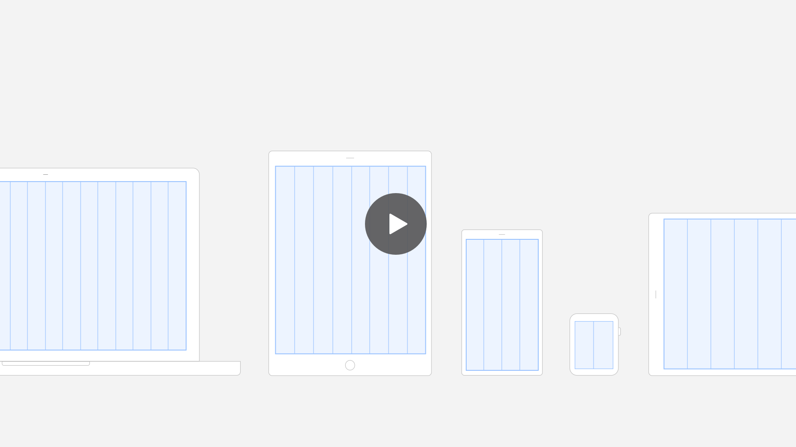
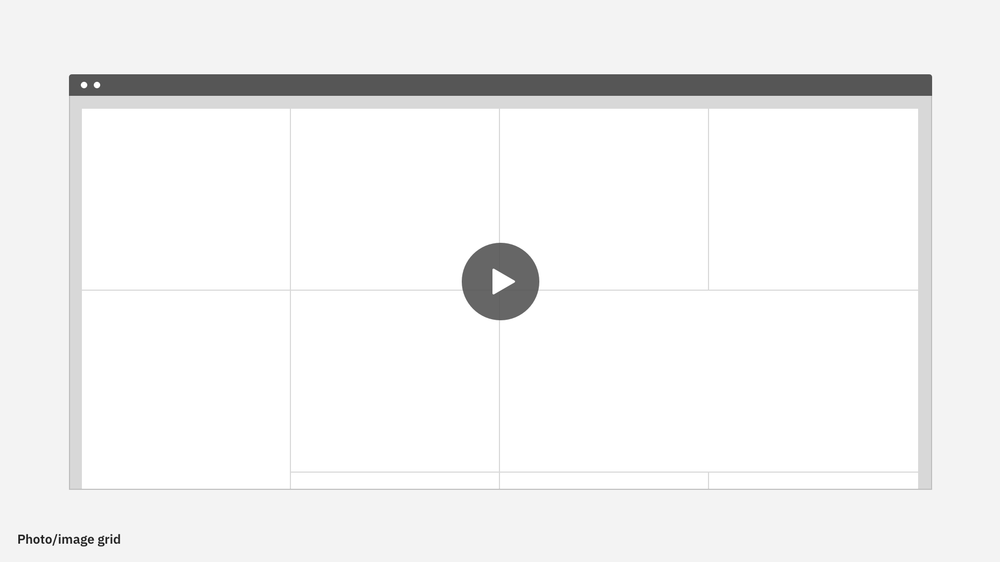
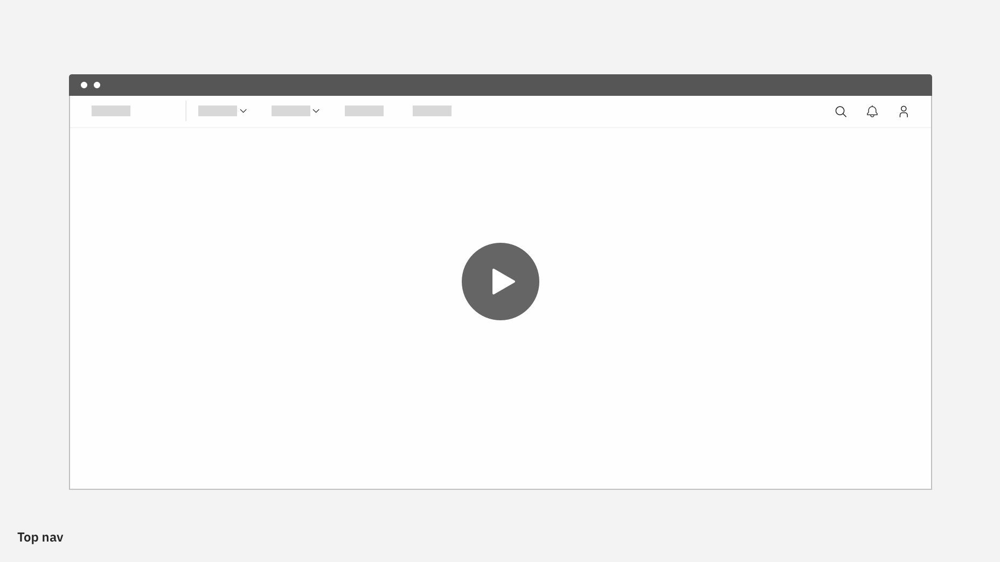
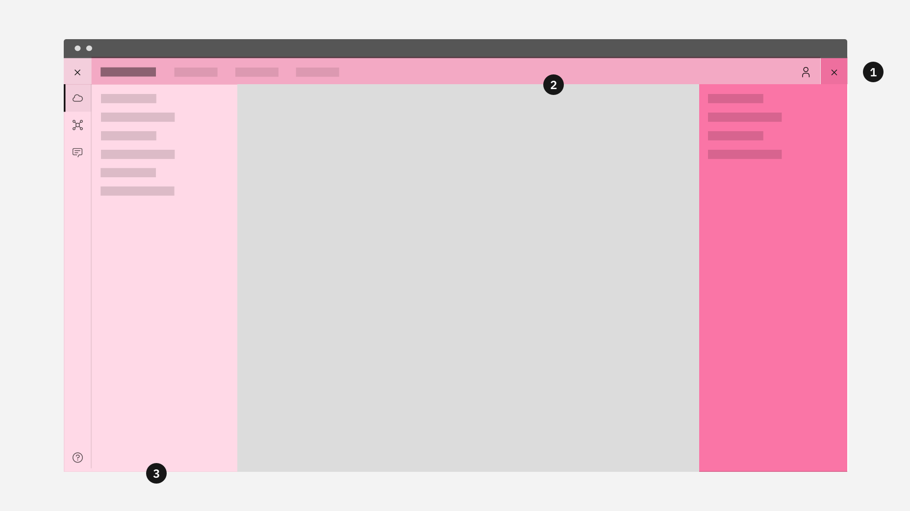
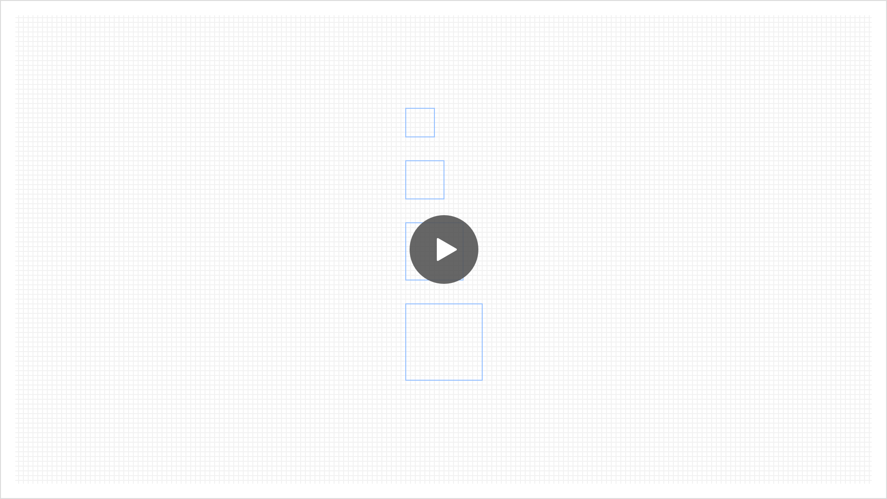
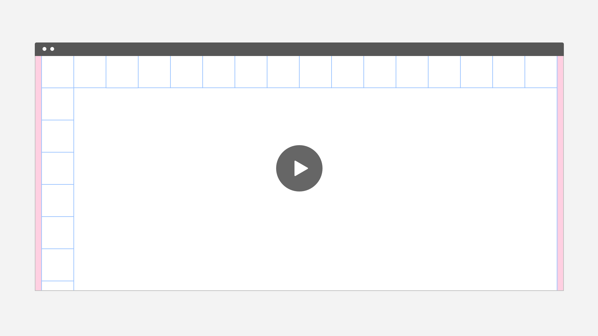
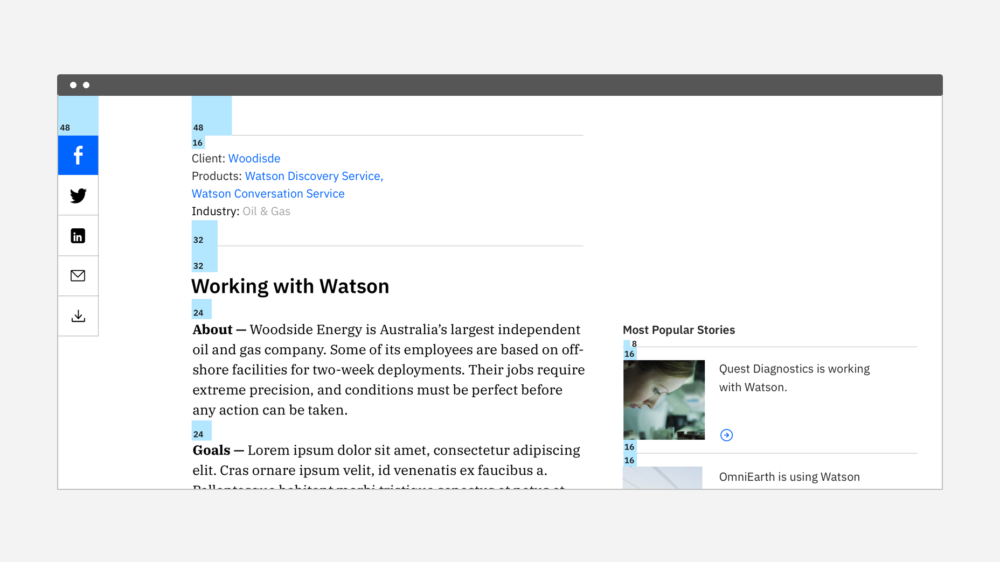
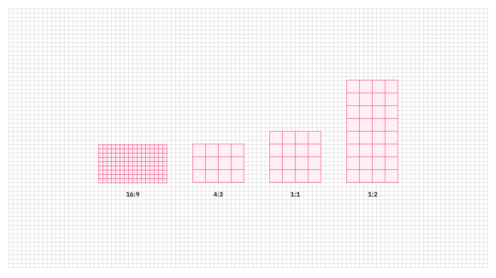

<page-intro>
It’s the framework for all the visual elements, functionality and typography of IBM Design. It’s fundamental to everything we design. No matter what device or medium you’re working 
with, the 2x Grid gives you structure and guidance to help make creative your decisions.IBM 2x Grid.

 </page-intro>

1.  [The 'Mini Unit'](#the-'mini-unit')

2.  [2x Grid Fundamentals](#2x-grid-fundamentals)

3.  [Breakpoints](#breakpoints)

4.  [Grid Behaviors](#grid-behaviors)

5.  [Grid Influencers](#grid-influencers)

6.  [Spatial Relationships](#spatial-relationships)

## The 'Mini Unit'
In digital experiences the mini unit is the underlying and guiding logic for our 2x Grid. It is comprised of 8 pixels 
by 8 pixels and creates the fixed master grid. 

It determines the dimensions of boxes, columns, components, margins, padding, and spacing. This simple logic makes it easy to divide the canvas in many ways to support your content. 

The Mini Unit master grid is simultaneously fixed and flexible.  

## 2x Grid Fundamentals
### Columns

The core of the 2x Grid concept is the idea of divisions or multiples of two. This multiple is immediately evident in the 2x column structure. 

Fluid column structures is essential for UI layouts. The primary layout choices for designs are 1, 2, 4, 8,and 16 columns. Maintaining column structure is vital to achieving a well crafted, visually consistent experience, especially for typography.

### Margins
Margins are fixed while the columns are fluid. They are available above medium size of the screens. Margin values are set to breakpoints. 24px margin for Max; 16px margin for Xlarge, Large and Medium; 0px margin for Small.

### Padding
Paddings are set to breakpoints. Paddings are fixed to 16 pixels while columns are fluid. Always align type to against the padding and organize content with discipline and rigor. 

### Gutters
Within the 2x Grid, a wide gutter is avaiable to support the need of layout design. Gutters help to build layouts with space between containers, such as dashboards, cards, etc.

## Breakpoints

We provide a major set of breakpoints for you to start with. The breakpoints help to maintain the design quality across screens. They are considered and built to connect the design and development perspectives.  For more information on breakpoints, download our  Design Kit or go to Grid Repo.

| Breakpoints | Value (px/rem)       | Columns              | Column Width (%)                 | Padding (px)  | Margin (px)  |
| ----------- | -------------- | ------------------ | --------------------- | --------------- | --------------- |
| Small   | 320/20   | 4      | 25%               | 16 | 0 |
| Medium   | 672/42    | 8          | 12.5%              | 16 | 16 |
| Large   | 1056/66 | 16      | 6.25% | 16 | 16 |
| X-Large   | 1312/82     | 16       | 6.25%              | 16| 16 |
| Max   | 1584/99     | 16 | 6.25%              | 16 | 24 |

<i>Essential breakpoints. Start to design with essential breakpoints allowing you to ensure the quality of layout design. Always check X-Large and Max for conveying layout adjustment.</i>

### Custom Breakpoints

Additional breakpoints provided for conveying content and layout adjustments. CSS Grid Layout allowing you to rearrange the layout at any width in your own media query. We also support rearranging layout at custom breakpoints for the legacy implementation when you compile your own Sass. Go to Grid Repo for more information.

## Grid Behaviors
### Adapting to your Content
The IBM 2x grid accounts for alternate approaches in UI design:  
1 ) a top-down or fluid approach, starting with a fluid column structure, 2) a bottom-up or fixed approach, starting with a 8px mini grid and 3) in some cases, a hybrid of the previous two.

The grid is a hybrid grid system, meaning it supports fixed, fluid and hybrid components. Consider the behavior of each elements and how it transforms in-between breakpoints is important to all the aspects of IBM digital experience. 

When dealing with lighter content, a fluid column structure works well. When dealing with dense content, use mini units for further alignment and spatial guidance.

### Fluid

Fluid components are created for certain scenarios, such as photo/image grids, video, data visualization container, etc.

### Fixed

Fixed components are created for certain scenarios, such as side navigation, side tool bar, checkbox, radio checkbox, etc.

### Hybrid

Hybrid components are created for certain scenarios, such as side panel, top navigation, modal, data table, etc. Hybrid components protentially have either fixed width and fluid height or fluid height and fixed width.

## Grid Influencers
### UI Shell Zones
In a UI layout, users expect to find certain types of content in certain areas. We call these areas UI Shell Zones. It is especially important for these zones to be consistent across devices, and adapt across breakpoints.

The IBM shell is divided into 3 distinct "zones" which establish purpose and hierarchy.

#### 1. Global sidenav
#### 2. Header
#### 3. Local sidenav

### Panel Behavior
All vertical panels expand to fill the full height of the browser window.

#### Flexible Panels
 The Flexible Panels allow for both collapsed and expanded states. The expanded state of a Flexible Panel is a fixed width that cannot be adjusted by the user. The collapsed Flexible Panel expands when the user hovers over any portion of it. 

 When flexible panels expand, they either condense both the content and the grid or they push content beyond the edge of the browser. 

#### Fixed Panels
Fixed panels maintain a static width, cannot be collapsed and also exist outside of the responsive grid. 

#### Floating Panels
This panel style floats above the primary content area and does not affect the responsive grid. Floating panels conceal any UI elements below them and must be dismissable by the user. Inline menus and tooltips also float.

## Spatial Relationships
The “Mini Unit” gives you visual balance and precision by determining a fixed range of padding, margins and spacing, along with component and container sizes. 

As mentioned above, the Mini Unit is simultaneously fixed and flexible. It follows then that multiples of the Mini Unit, which comprise our spacing scale, can also drive both fixed and fluid layouts. 

### Visual Rhythms
There are two ways to measure the height of a container or a content zone: 1. Mini Unit increments and 2. Column Widths. These key heights can be customized or changed to breakpoint.  

#### 1. Fixed Key Height 

Use either increments of the Mini Unit or the fluid key heights to drive not only the placement, but the height of containers, zones and visual banding in your layout. 
Common heights based on fixed multiples of the mini unit create shorter containers for smaller components, such as button, dropdown, input fields, etc.

<i>Key heights based on Mini Unit:</i>

| Breakpoints          |     Mini Unit Multiple (px) |
|-------------  | ----------------|  
| Small—Max   |     24, 32, 48, 64 |

#### 2. Fluid Key Heights 
Use the width of column to be the height of the container. 
Key height based on column width creates taller container for content. Use cases are leading section in a webpage, divded section for editorial content, modals, etc.

<i>Key heights breakdown based on column width:</i>

| Breakpoints          |     Key Height (px) |
|-------------  | ----------------|  
| Small   |     80, 160, 240, 320, 400, 480 |
| Medium    |      80, 160, 240, 320, 400, 480     |
| Large  |     64, 128, 192, 256, 320, 384, 448, 512  |
| X-Large   |     80, 160, 240, 320, 400, 480, 560, 640      |

### 2x Spacing Scale
All spacing is defined by the mini unit. Spacers are used to determine the spacing that both surrounds and defines container sizes. The common spacers we use are 8, 16, 24, 32, 48, 64, 80. A consistent and replicated usage of spacer ensures vertical rhythm between all the content. 

<i>[Need to insert captions under guidance.]</i>

### Key Alignments
Key alignments help guide layout decisions even when objects fall outside of the grid. When not using a fluid column structure, use the Mini Unit grid to drive both vertical and horizontal alignments. 

Horizontal and vertical alignment are equally critical. It’s not only easier for eye to follow the content, but also create harmony for the layout. 

### Containers and Aspect Ratios

#### Key Multiple
A key multiple is a means of using Mini Units to size a container without referring to the 2x column structure. 
Although the key multiple does not depend on a fluid column structure, the key multiple is derived from 2x column structure at a common breakpoint. 

The key multiple is a fixed measurement based on the Mini Unit that is used to determine the size of elements in your layout. It has equal height and width. When determining spatial relationships without referring to a column structure, such as an inline box or hybrid box scenario (i.e. pinterest) use this fixed increment and an appropriate aspect ratio. 

To make a container, like a large component or a card, multiply the number of these increments by the size of the increment. 

With gutter:
increment: 96 — 2x 3x 4x 

With no gutter (margin):
increment: 128— 2x 3x 4x 

#### Aspect Ratio
An aspect ratio is defined as the proportional relationship between an object's width and height. 

Use common aspect ratio, such as 16:9, 4:3, 1:1 and a 1:2 for images, photos, videos. Always measure the width of the object to the columns — the height is determined by that relationship.

In certain situations when either the height or width of a container is fluid — like a hybrid box layout — aspect ratios do not apply. However, the Key Multiple should still be used to determine the fixed dimension of the container.

