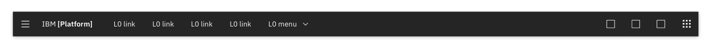
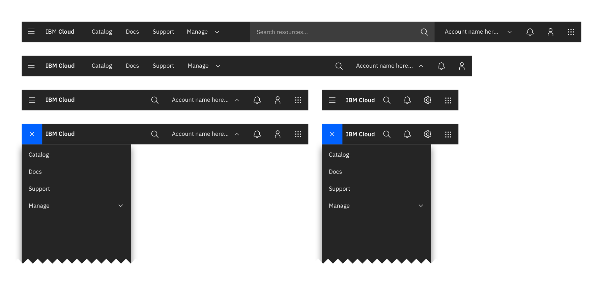
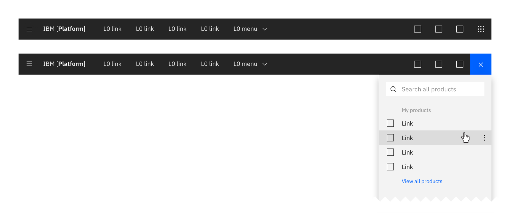
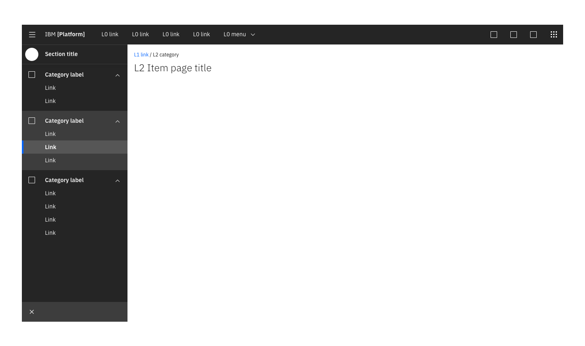
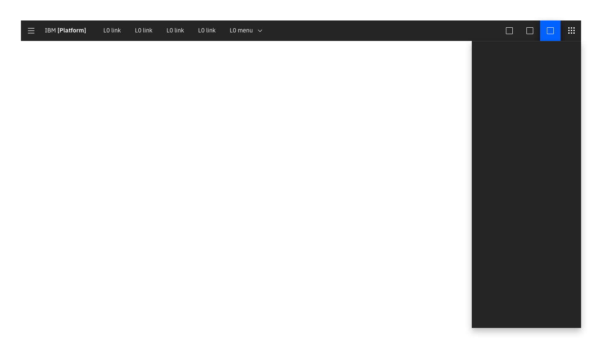
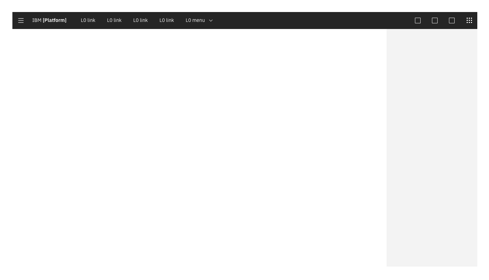
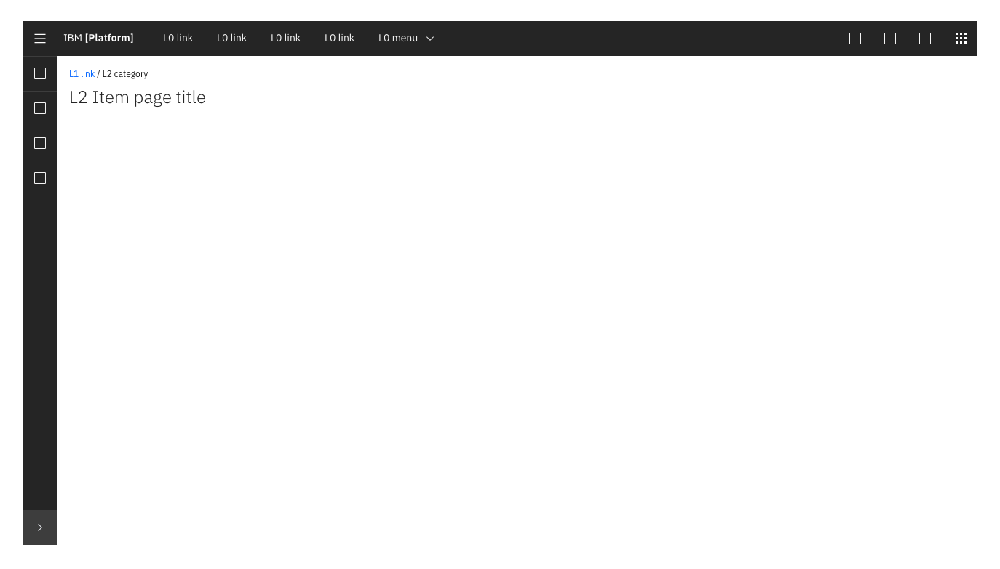
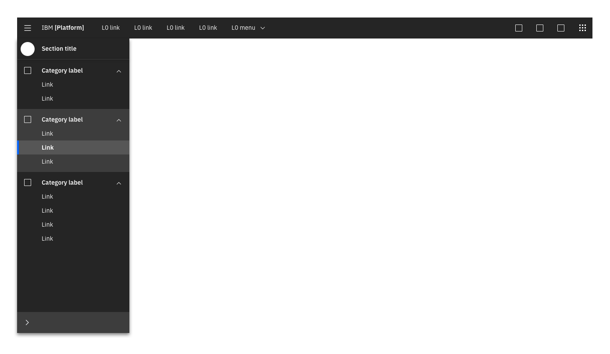
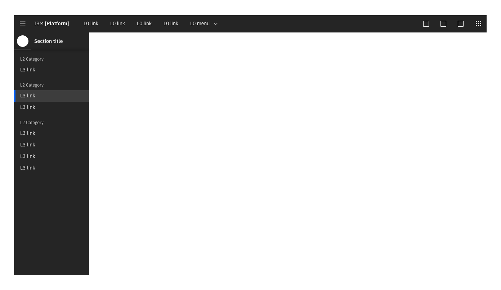

<AnchorLinks>

- [Experimental status](#experimental-status)
- [Purpose and function](#purpose-and-function)
- [UI shell zones](#ui-shell-zones)
- [UI shell components](#ui-shell-components)
- [Secondary navigation](#secondary-navigation)

</AnchorLinks>

## Experimental status

The UI shell, or simply, "the shell," is currently in experimental status. It is presented here for testing and feedback purposes but is not yet ready for production use. Experimental components have no guarantee of support from the Carbon team.

## Purpose and function

The shell is perhaps the most crucial piece of any UI built with Carbon. It contains the shared navigation framework for the entire design system and ties the products in IBM's portfolio together in a cohesive and elegant way. The shell is the home of the topmost navigation, where users can quickly and dependably gain their bearings and move between pages. 

The shell was designed with maximum flexibility built in, to serve the needs of a broad range of products and users. Adopting the shell ensures compliance with IBM design standards, simplifies development efforts, and provides great user experiences. All IBM products built with Carbon are required to use the shell's header.

To better understand the purpose and function of the UI shell, consider the "shell" of MacOS, which contains the Apple menu, top-level navigation, and universal, OS-level controls at the top of the screen, as well as a universal dock along the bottom or side of the screen. The Carbon UI shell is roughly analogous in function to these parts of the Mac UI. For example, the app switcher portion of the shell can be compared to the dock in MacOS.

## UI shell zones

The UI shell is the top level in a product's UI. It consists of the primary **header**, as well as **header panels** that are used for navigation and global UI services. The shell is further divided into two distinct "zones" which establish purpose and level of control.

### Platform zone
The platform zone contains platform-level elements, which could include functions like search, docs, support, profile, and notifications, and any corresponding panels. It also includes the universal app switcher. The contents of this zone are ideally controlled by the platform "owner." Platform owners can also choose to include custom top-nav text links in this zone.

<ImageComponent cols="8" caption="UI shell platform zone"> 

</ImageComponent>

### Local zone
The local zone is controlled at the product level. It contains the product-level side nav as well as the main content area.

<ImageComponent cols="8" caption="UI shell local zone">

</ImageComponent>

## UI shell components

The UI shell is designed to be configurable. Within the bounds of a specific zone, a product/platform owner can choose which shell components and configurations to use, based on their users' needs.

### Primary header

The header spans the full width of the viewport and is the topmost element in the browser window. Header elements are persistent throughout the product experience.

<ImageComponent cols="12" caption="Primary header">

</ImageComponent>

 

#### Header responsive behavior

As a header scales down to fit smaller screen sizes, header links and menus should collapse into a left-nav "hamburger" menu. See the examples below to better understand responsive behavior of the header. If your UI includes a side-nav panel, then the header links should be added above the left-nav, pushing it down accordingly.

<ImageComponent cols="12" caption="Responsive behavior of the UI shell header">

</ImageComponent>

 

#### Header anatomy

 

The header's architecture is structured to clarify meaning through placement along a left-to-right axis. The left side of the header, and its associated elements, represents the more "local" end of the spectrum, and contains items relevant at the product level. Moving to the right along the header, the functions become more global. Whereas elements in the middle of the header should represent platform-level controls, elements on the right side of the header, such as the app switcher, are the most global in their scope, and span multiple platforms. As a rule of thumb for the UI Shell, left-to-right translates to local-to-global.    

- **Hamburger menu:** The "hamburger" icon is used to open left-side nav panels (if they are used in the product's UI). If no collapsible left-nav panels are included as part of normal use, but the UI does utilize top-nav items, then the hamburger icon should appear at narrow breakpoints to accommodate the top nav items, which will flow into the menu.

- **Platform name (e.g. Cloud, IoT, Watson):** For IBM products, the platform name is always preceded by "IBM."

- **Primary navigation:** Up to five optional horizontal top-level nav links and/or dropdown menus are allowed. If using a dropdown, include the down-pointing chevron after the link label. Dropdowns open on click and are closed by either selecting an item in the menu, clicking outside the menu area, or clicking on the menu label. When open, the chevron should point up. Dropdown menu labels serve only to open the dropdown; they cannot link to another page in the product. 

- **The L0 icons:** These icons are reserved for universal, platform-level functions such as _profile_, _search_, _notifications_, and similar functions. Not every product on a platform is required to show the same L0 icons, but it is recommended for better cross-product user experience.

- **App switcher:** The app switcher provides a way for the user to easily switch between products and platforms. Recommended uses for this component include recently used apps, frequently used apps, all apps attached to the user's account, or, if the list is of a manageable size, all apps or products available on the platform. Links to related platforms should also live in the app switcher, as should a link to IBM.com.

<ImageComponent cols="12" caption="Primary header with app switcher example">

</ImageComponent>

### Side-nav panels

These panels contain product-level navigation and can be either fixed-width or flexible.

<ImageComponent cols="12" caption="Flexible side navigation panel template">

</ImageComponent>

### Header panels

These are vertical panels that are anchored in the header and invoked by controls on the right side of the header. Header panels have a consistent width, span the full height of the viewport, and are flush to the right edge of the viewport. Only one header panel can be open at a time. Header panels are always treated as floating panels. 

Use a header panel when additional content or actions associated with a header icon needs to be shown upon click. Profile and notifications panels are good examples of this element in action. More details about panel types and behaviors can be found under the [Layout](/guidelines/layout/) section.

<ImageComponent cols="8" caption="Header panel template">

</ImageComponent>

### On-page panels

These panels are at the same elevation as the primary content zone of the page, and can be either dismissable or fully fixed. 

<ImageComponent cols="8" caption="On-page panel template">

</ImageComponent>

 

#### Use an on-page panel when:

 

- presenting additional information that is relevant to the page context (i.e., contextual help)
- content does not need to be persistent on the page

<!--### Footer
Product footers are persistent and attached to the bottom of the browser window. A footer should be reserved for actions or information that is pertinent to the users current workflow. Footers should have clear means of dismissal. <mark>This is an unusual way to treat a footer, especially with it being dismissable... Is this really how we want to define them? -CJC</mark> <mark>Which "zone" does the footer belong to? - CJC</mark>

 -->

## Secondary navigation

If a secondary level of navigation is needed, then a side-nav can be nested below the header. 

<!--
### L1 Navigation Menu

Some products/platforms require an additional level of navigation above the side-nav. The L1 menu behaves like a product selector within the platform; the L1 selection will change the active product and thus the contents of the L2 menu.

The L1 Menu is accessed by clicking on the header's left-side hamburger menu. It is always styled as a floating menu.

-->

### Side-nav

 The side-nav contains secondary navigation and fits below the header. It can be configured to be either fixed-width or flexible, with only one level of nested items allowed. Both links and category lists can be used in the side-nav and may be mixed together. There are several configurations of the side-nav, but only one configuration should be used per product section.

If tabs are needed on a page when using a side-nav, then the tabs are secondary in hierarchy to the side-nav.

 

#### Use a side-nav when:

 

- There are more than five secondary navigation items
- Users are expected to switch between secondary items frequently

 

#### Side-nav items:

 

- **Link:** Links to different pages
- **Category:** A category must contain at least two links. Categories can be either collapsible or fixed. The label of a category is never a link.
- **L1 title bar:** (optional): contains the name of the section or page. It should link to the product's landing page or main console. This element can also include an optional L1 Menu selector element, to enable context-switching.

 

#### Flexible side-nav

 

Use a flexible side-nav when on-page space is a priority. The flexible side-nav has both an expanded and collapsed state, and expands on hover. It can also be expanded (to a fixed state) or collapsed by clicking on the chevron icon at the bottom of the panel. The expanded state contains both icons and corresponding labels, while the collapsed state shows only the icon. 

In a flexible side-nav, each link and category list has its own corresponding icon. Side-nav icons are stacked equidistant from each other in the collapsed state, and when expanded are aligned with their corresponding labels.

A flexible side-nav is more friendly to responsive designs than a fixed nav. Fixed nav is best for products that have a minimum width of 672px. Consider using a flexible nav for a fully responsive solution.

 

#### Use a flexible side-nav when:

 

- More space is needed for page content
- A fully responsive solution is needed

<ImageComponent cols="12" caption="Flexible side-nav, collapsed">

</ImageComponent>

<ImageComponent cols="12" caption="Flexible side-nav, hover">

</ImageComponent>

 

#### Fixed side-nav

 

A fixed side-nav contains only links and category lists—no icons—and cannot be collapsed.

 

#### Use a fixed side-nav when:

 

- Icons cannot clearly describe the categories
- Designs are for desktop only

<ImageComponent cols="12" caption="Fixed side-nav">

</ImageComponent>

<!--
The left side navigation component can be fixed or flexible-width. It allows for two levels of nesting.
#### L1 title bar (optional)

The L1 element contains the name of the product. It should link to the product's landing page or main console. This element can also include an optional selector element, to enable context-switching.

#### L2 nav items

L2 nav items can be either a Category or a Link. When clicked, L2 Categories reveal or hide a group of L3 Links. L2 Category items cannot contain links.

#### L3 Links
A Category must contain at least 3 L3 Links.

<mark>Side nav with L1, L2, L3 annotations.
-->

<!--

All vertical panels expand to fill the full height of the browser window.

### Flexible Panel

The Flexible Panel style allows for both a collapsed state and an expanded state. The expanded state of a Flexible Panel is a fixed width and cannot be adjusted by the user. By default, the collapsed Flexible Panel will expand when the user hovers over any portion of panel. The user can lock this panel into the expanded or collapsed state by clicking on the chevron control at the bottom of the panel. Flexible side nav panels should default to the expanded state on first use.

### Fixed Panel

Fixed panels maintain a static width and come in two sizes: default (256 px) and small (208 px).

### Floating Panel

This panel style is at a higher elevation than the primary content area and includes a drop shadow. Floating panels conceal any UI elements below them and must be dismissable by the user. Floating panels are always fixed-width at 256px.

## UI shell theming

The UI shell will be themeable and can be either light or dark. _More information on how to apply a shell theme coming soon._
-->