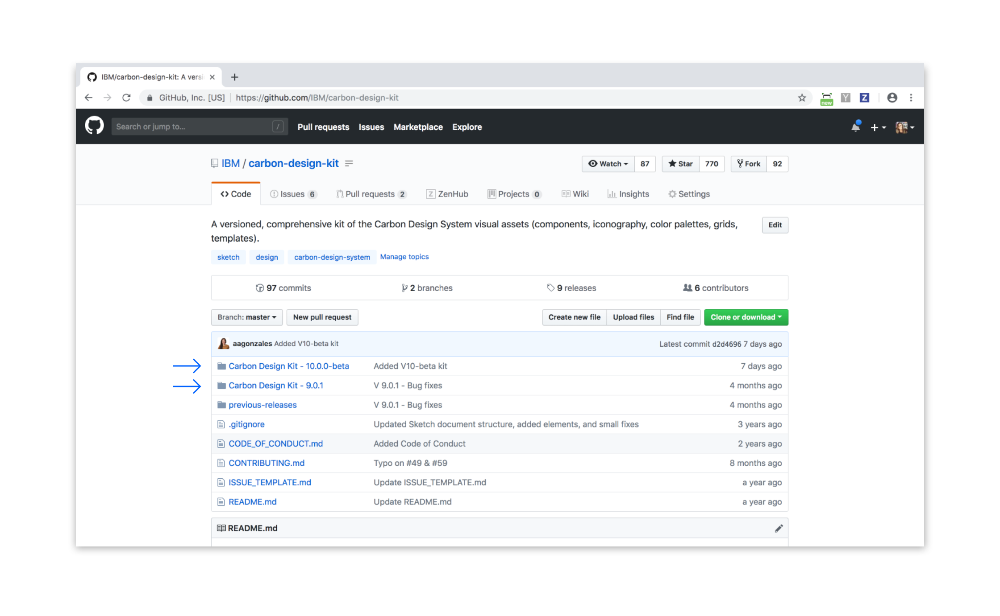

## Resources

<grid-wrapper col_lg="8" flex="true" bleed="true">
<clickable-tile
    title="Add Carbon Design Kit to Sketch library"
    href="sketch://add-library/cloud/JaVzz"
    type="resource"
     >
    
</clickable-tile>
<clickable-tile
    title="Download Carbon Design Kit from GitHub"
    href="https://github.com/IBM/carbon-design-kit"
    type="resource"
    >
    
</clickable-tile>
</grid-wrapper>

<anchor-links>
<ul>
    <li><a href="#carbon-design-kit">Carbon Design Kit</a></li>
    <li><a href="#how-to-get-it">How to get the kit</a></li>
    <li><a href="#get-the-kit-via-box">Get the kit via Box</a></li>
    <li><a href="#download-the-kit-from-github">Download the kit from GitHub</a></li>
    <li><a href="#connect-with-us">Connect with us</a></li>
</ul>
</anchor-links>

## Carbon Design Kit

The Carbon Design Kit is a constantly evolving document that contains all of the design system’s visual assets, including components, icons, color palettes, grids, etc. The kit helps you to work faster, and with confidence that your product or experience is aligned with the IBM Design System. It utilizes symbols and text styles, organized via pages in the left side panel of Sketch. This site, along with the Carbon Design Kit, provides designers with everything they need to get up and running with Carbon.

### Release Schedule

Every six months the Carbon team releases a major update to the system, including a new design kit, along with new version of the components. Style refinement and bug fixes are released as continuous updates that happen throughout the year. We track all release updates in our [change log](https://github.com/carbon-design-system/carbon-design-kit/releases).

## How to get it

There are three ways to obtain the kit. For timely updates, install the kit as Sketch Shared Library. Please note this requires Sketch version 53 or above.

<grid-wrapper col_lg="8" flex="true" bleed="true">
<clickable-tile
    title="Add Carbon design kit to Sketch library (Beta)"
    href="sketch://add-library/cloud/JaVzz"
    type="resource"
     >
    
</clickable-tile>
</grid-wrapper>

If you might work with a proprietary add-on library and still want to be connected for updates, please set up the kit via the Box Drive by following [these instructions](#get-the-kit-via-box).

If you would rather not receive library updates, or if you are looking for previous versions of the design kit, please visit our GitHub repository, and follow [these instructions](#download-the-kit-from-github) to download the kit.

## Get the kit via Box

Using Box Drive sync will ensure that your design kit file will always be up to date, eliminating the need to manually download new versions as they are released.

1. Follow the instructions on [IBM Digital Design](https://www.ibm.com/standards/web/design-kit/) to get the design kit through Box Drive.

- Once you have installed and gained access to the `IBM Design Kit`, navigate to the `product design` folder. Select the desired version of Carbon to find the right Carbon Design Kit file.
- When updates are available to the kit library, a purple `Library Update` badge will appear in the top right corner of your Sketch file. - Click `Library Updates Available` then `Accept updates` in the modal.

<image-component cols="12" caption="Update indicator">

</image-component>

## Download the kit from GitHub

#### 1. Download the Carbon Design Kit
   - Go to the <a href="https://github.com/carbon-design-system/carbon-design-kit" target=blank> Carbon Design Kit</a> repo and click the folder for latest version of the Carbon Design Kit.
   - On the next page click `Carbon Design Kit.sketch`
   - Click the “View Raw” link to begin downloading the kit.

<image-component cols="12" caption="Carbon Design Kit repo">

</image-component>

#### 2. Open the Carbon Design Kit in Sketch
   - Open and use the kit like any other Sketch file.
   - Use the left panel in the file to navigate through the different pages of the kit.

<image-component cols="12" caption="Design kit file">

</image-component>

#### 3. Install the Carbon Design Kit as a Sketch Library

   - The same Carbon Design Kit file can also be installed as a Sketch Library.
   - Follow the [instructions](https://github.com/IBM/carbon-design-kit/wiki/Sketch-Libraries-Overview) on the repo wiki page to set the kit up as Sketch Library.

<image-component cols="12" caption="Sketch library">

</image-component>

#### 4. Get the updates
   - To update to the latest Carbon library version you will have to download the newest version of the Carbon Design Kit each time it is released and replace the previous version.
   - Follow the specific [instructions](https://github.com/IBM/carbon-design-kit/wiki/Sketch-Libraries-Overview) on the wiki to ensure a smooth transition.

## Connect with us

Found a bug with the design kit? Care to contribute something new? Make an issue in the Carbon Design Kit [GitHub repository](https://github.com/ibm/carbon-design-kit/issues).
