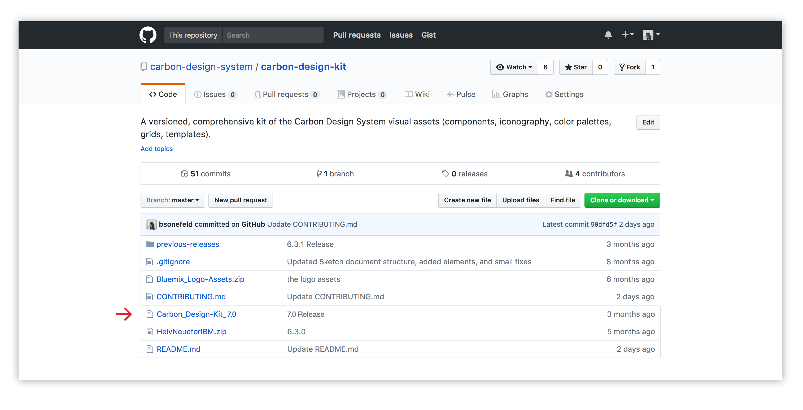
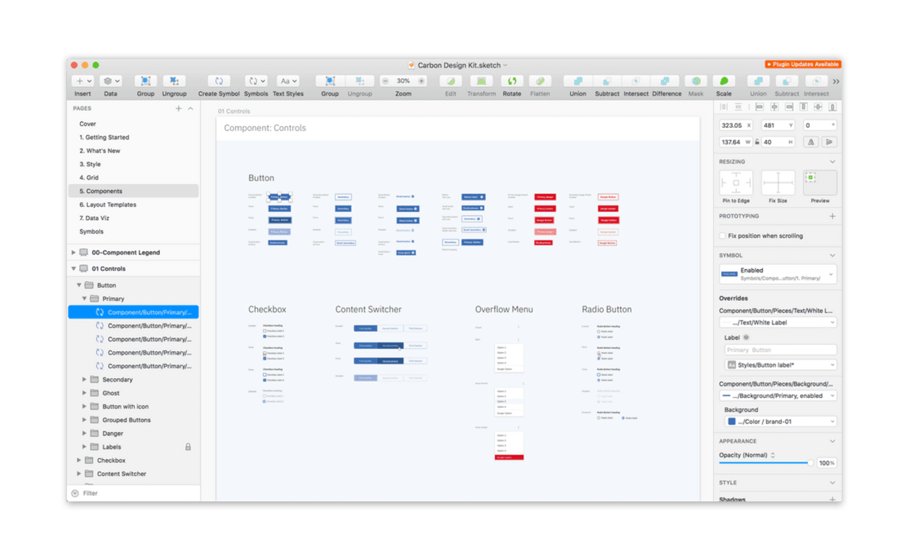
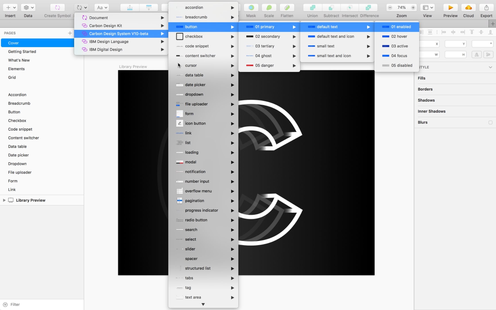
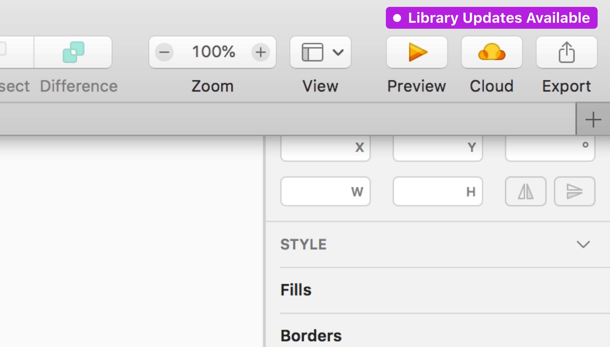

<page-intro>This site, along with the Carbon Design Kit, provides designers with everything they need to get up and running with Carbon.</page-intro>

## Carbon Design Kit

The Carbon Design Kit is a constantly evolving document that contains all of the design system's visual assets, including components, icons, color palettes, grids, etc. When used properly, the kit should help you work faster, with confidence that your product or experience is well aligned with the IBM Design System. It utilizes symbols and text styles, organized via pages in the left side panel of Sketch.

The design kit is available to the public through GitHub and internally to IBMers through Box Drive. The kit can be used directly in the Sketch application or loaded as a Sketch library source.

1.  [Carbon Design Kit](#why-sketch)
-  [Download from GitHub](#download-from-github)
-  [Use with Box Drive](#syncronize-via-box-drive)

### Why Sketch?

<a href="https://www.sketchapp.com/" target=blank>Sketch</a> is rapidly becoming the industry-standard software for UI design on Mac and is recommended by the IBM Design System team. Sketch is relatively affordable to license, and offers a 30-day free trial for new users. There are also plenty of free tutorials available online.

### Releases

The Carbon team releases frequent updates to the design kit. We track all release updates in our <a href="https://github.com/carbon-design-system/carbon-design-kit/releases" target=blank>change log</a>, so check back frequently!   

### Download from GitHub

1. Download the kit
   - Go to the <a href="https://github.com/carbon-design-system/carbon-design-kit" target=blank> Carbon Design Kit</a> repo and click the folder for latest version of the Carbon Design Kit.
   - On the next page click `Carbon Design Kit.sketch`
   - Click the “View Raw” link to begin downloading the kit.

2. Open the Carbon Design Kit in Sketch
   - Open and use the kit like any other Sketch file.
   - Use the left panel in the file to navigate through the different pages of the kit.

3. Install the Design Kit as a Sketch Library
   - The same Carbon Design Kit file can also be installed as a Sketch Library.
   - Follow the [instructions](https://github.com/IBM/carbon-design-kit/wiki/Sketch-Libraries-Overview) on the repo wiki page to set the kit up as Sketch Library.
  

4. Get the updates
	- To update to the latest Carbon library version you will have to download the newest version of the Carbon Design Kit each time it is released and replace the previous version.
	- Follow the specific [instructions](https://github.com/IBM/carbon-design-kit/wiki/Sketch-Libraries-Overview) on the wiki to ensure a smooth transition.

### Syncronize via Box Drive

_For IBM internal users only._ Using Box Drive sync will ensure that your design kit file will always be up to date, eliminating the need to manually download new versions as they are released.

1. Follow the instructions on [IBM Digital Design](https://www.ibm.com/standards/web/design-kit/) to get the design kit through Box Drive.
- Once you have installed and gained access to the `IBM Design Kit`, navigate to the `product design` folder. Select the desired version of Carbon to find the right Carbon Design Kit file.
- When updates are available to the kit library, a purple `Library Update` badge will appear in the top right corner of your Sketch file.
	-  Click `Library Updates Available` then `Accept updates` in the modal.

## Connect with us

Found a bug with the design kit? Care to contribute something new? Make an issue in the Carbon Design Kit [GitHub repository](https://github.com/ibm/carbon-design-kit/issues).
