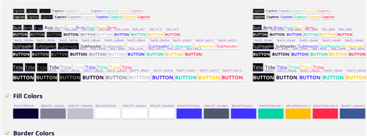
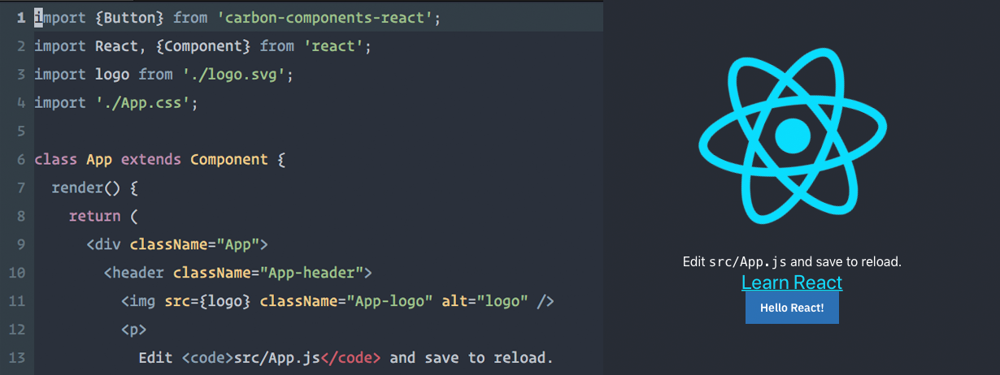
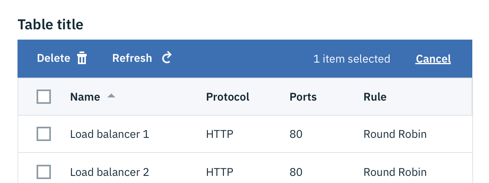
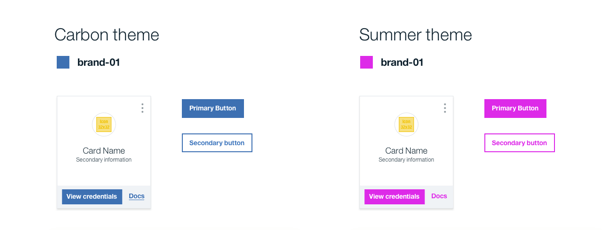

### What is the Carbon Design System?

Carbon is the design system for IBM Cloud products. It is a series of individual styles, components, and guidelines used for creating unified UI.

### Who works on the Carbon Design System?

Carbon has a [core team](https://github.com/orgs/carbon-design-system/people) of designers and front-end developers that are dedicated to developing and supporting the system. Our core team sits in the IBM Design Studio in Austin, Texas. There are also countless other designers and developers who also contribute back to [carbon-components](https://github.com/ibm/carbon-components#contributors) and [carbon-react](https://github.com/ibm/carbon-components-react#contributors).

### Who can use Carbon?

Anyone! Carbon is an open-source design system that is also the official product and digital design system for IBM. Carbon was originally developed to serve the IBM Cloud business unit, but has since expanded in scope to encompass all product and digital teams at IBM. [Contributions are welcome](/getting-started/contributing) from IBMers as well as the open-source community at large.

### How can I contribute and/or propose new components/ideas?

We have contributing guidelines for [Developers](/getting-started/contributing/developers) and [Designers](/getting-started/contributing/designers). We appreciate you helping out and contributing back.

### Which browsers are supported?

Carbon components is supported in the following browsers:

- IE11
- Microsoft Edge latest
- Firefox latest/latest ESR
- Chrome latest
- Safari latest

### What language are the components written in?

There are currently three official implementations of the Carbon Design System. One is a vanilla JS library; that's written in ES6+, SCSS, and HTML and ships deliverables in vanilla JavaScript in ES5 as well as ES6, CSS, SCSS, and HTML. There is also a React library, that ships a React rewrite of the JavaScript, but uses the same CSS as the core library and an Angular library, that ships an Angular rewrite of the JavaScript and also uses the same core CSS.

### I see a bug, how do I report it?

Please open an issue in the appropriate [GitHub repo](https://github.com/carbon-design-system). We will address the bug as soon as we can. If you have a fix for the bug please feel free to submit a PR for it.

### Why hasn't my bug been fixed yet?

If you have a pressing bug or change it is best to make PR for the issue yourself. Our team works in sprints and will try to address your bug as soon as possible, usually by the following sprint. Issues that are out of scope will be closed until it becomes a higher priority.

### I haven't updated to the latest version of Carbon yet, but I still need the old documentation. Is there a place I can find it?

Every version of Carbon that is still supported is hosted at its own domain. You can find the old sites version here:
**[V6](http://v6.carbondesignsystem.com/)**, **[V7](http://v7.carbondesignsystem.com/)**, and **[V8](http://v8.carbondesignsystem.com/)**.

### Where do I go if I've read everything and still have an issue/question?

If you still have questions or can't find the answer you are looking for feel free to reach out in one of the following ways:

**General inquiries**

Email: carbon@us.ibm.com  
Twitter: <a href="https://twitter.com/_carbondesign" target="_blank">@_carbondesign</a>

**Slack channels (IBM internal only)**

For design questions: #carbon-design-system 
For developer questions: #carbon-components, #carbon-react

**GitHub repos**

Open an issue in one of our <a href="https://github.com/carbon-design-system">GitHub repos</a>. Please choose the appropriate repo for your request.

## Featured

<flex-group>
<clickable-tile
    type="article"
    title="Smashing Magazine's “Design Systems” Book"
    href="https://www.smashingmagazine.com/design-systems-book/"
    >
    
</clickable-tile>
<clickable-tile
    type="article"
    title="Winter 2017 HOW In-House Design Award Winner"
    href="http://www.howdesign.com/84-award-winning-projects-from-in-house-design-teams/"
    >
    
</clickable-tile>
<clickable-tile
    type="article"
    title="Path to Design System Maturity"
    href="https://medium.com/ux-power-tools/the-path-to-design-system-maturity-d403daba692a"
    >
    
</clickable-tile>
<clickable-tile
    type="article"
    title="Responsive Web Design Podcast"
    href="https://responsivewebdesign.com/podcast/ibm-carbon/"
    >
    
</clickable-tile>
<clickable-tile
    type="article"
    title="UX Pin Virtual Design Summit"
    href="https://www.youtube.com/watch?v=eSvq5MieOdw&t=144s"
    >
    
</clickable-tile>
</flex-group>

## Articles

<flex-group>
<clickable-tile
    type="article"
    title="Up & Running with Carbon React in less than 5 minutes"
    author="Josh Black"
    date="October 19, 2018"
    href="https://medium.com/carbondesign/up-running-with-carbon-react-in-less-than-5-minutes-25d43cca059e"
    >
    
</clickable-tile>
<clickable-tile
    type="article"
    title="Hacktoberfest with Carbon"
    author="Josh Black"
    date="October 16, 2018"
    href="https://medium.com/carbondesign/hacktoberfest-with-carbon-95c48943f586"
    >
    
</clickable-tile>
<clickable-tile
    type="article"
    title="Data Table updates in Carbon React v5.22.0"
    author="Josh Black"
    date="February 20, 2018"
    href="https://medium.com/carbondesign/data-table-updates-in-carbon-react-v5-22-0-6da0c24a96d6"
    >
    
</clickable-tile>
<clickable-tile
    type="article"
    title="Introducing Carbon Themes"
    author="Bethany Sonefield"
    date="August 11, 2017"
    href="https://medium.com/design-ibm/introducing-carbon-themes-83d3985a8627"
    >
    
</clickable-tile>
<clickable-tile
    type="article"
    title="Carbon: Designing inside Big Blue"
    author="Bethany Sonefield"
    date="March 30, 2017"
    href="https://medium.com/design-ibm/carbon-designing-inside-big-blue-8577883cfe42"
    >
    
</clickable-tile>
</flex-group>
