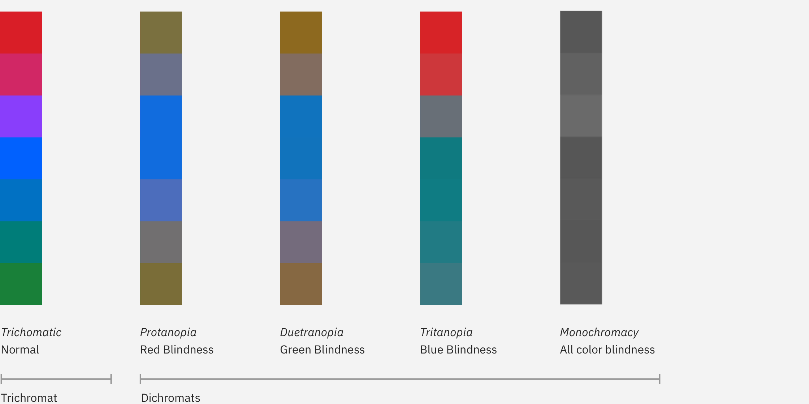
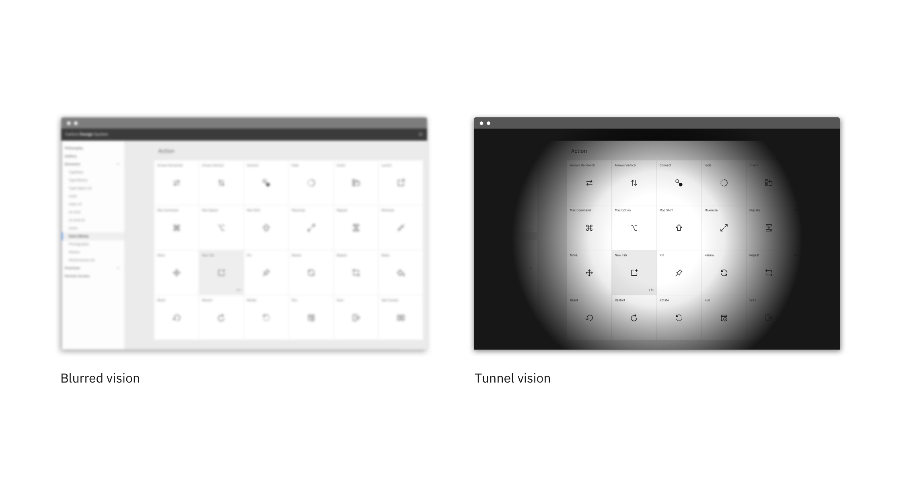

<page-intro>IBM is committed to serving all users, regardless of visual ability.</page-intro>

## Introduction

Visual impairments can include low vision, color blindness, and complete blindness. Carbon components have been designed to accommodate the entire spectrum of visual impairment, though designer diligence is still needed to ensure that the components are used correctly.

## Color contrast

**Carbon meets IBM Web Checklist (WCAG AA) standards across the entire system, including color contrast ratios.**

AA requirements state that:

- Text and images of text must have a contrast ratio of at least **4.5:1**. An exception is large text (at least 24px regular / 19px semi-bold) which must have a contrast ratio of **3:1.**
- UI components: Visual information used to indicate states and boundaries of UI components must have a contrast ratio of **3:1** against adjacent colors. A UI component is defined as "a part of the content that is perceived by users as a single control for a distinct function." This includes form elements.

**Watch out for text against non-static backgrounds**
There are times that text is rendered on a gradient background or image. You need to make sure that the text color always meets contrast standards. This is especially important for parallax applications or animations where text or backgrounds are moving independently of each other.

[IBM Checkpoint 1.4.3 Contrast (Minimum)](https://www.ibm.com/able/guidelines/ci162/contrast.html)

Please refer to our [usage section on the Colors page](/guidelines/color/usage) to learn more about color contrast ratios. You can also use this [color contrast](https://marijohannessen.github.io/color-contrast-checker/) tool to ensure your ratios pass WCAG AA standards.

To view best practices for using color in Data Visualization, view the [Data Vis color](/data-visualization/overview/colors) page.

## Color blindness

Color blindness involves difficulty in perceiving or distinguishing between colors, as well as sensitivity to color brightness. It affects approximately 1 in 12 men and 1 in 200 women worldwide.

| Type         | Color deficiency |
| ------------ | ---------------- |
| Protanopia   | Red/green        |
| Tritanopia   | Blue             |
| Deuteranopia | Green            |
| Monochromacy | All colors       |

### Designing for color blindness

Don't rely on color alone to convey meaning. This includes conveying information, indicating an action, prompting the user for a response, or distinguishing one visual element from another. When designing with color, it might help to use a color-blind simulator to review visibility of content. If you're working in Sketch, we recommend the [Stark](http://www.getstark.co/) plugin.

_Non-color blind user vs. color-blind user_

## Low vision

Low vision can include partial sight in one or both eyes, and range from mild to severe. It affects 246 million people, or about 4% of the world’s population.

| Type                     | Visual deficiency                                                                                         |
| ------------------------ | --------------------------------------------------------------------------------------------------------- |
| Low acuity               | Also known as **blurred vision.** Can make text difficult to read, since it would appear fuzzy.           |
| Low-contrast sensitivity | The ability to determine fine detail and distinguish one object from another.                             |
| Obstructed visual field  | The user's view is partially obstrucuted. Can include central vision and spotty vision.                   |
| Retinitis Pigmentosa     | Also known as **tunnel vision**. Obstructed peripheral vision - user is only able to see central elements |

_[Source: NoCoffee - Visual impairments ](https://accessgarage.wordpress.com/2013/02/09/458/)_

_Low-vision disabilities_

### Designing for low vision

To get an understanding of the various low-vision disabilities, we recommend using the [NoCoffee](https://chrome.google.com/webstore/detail/nocoffee/jjeeggmbnhckmgdhmgdckeigabjfbddl) Chrome plugin to preview websites. Low-vision users may be using a screen reader to preview your website or experience, so ensure you're following [keyboard guidelines](/guidelines/accessibility/keyboard) to ensure the page is read to the user in a logical order.

## Resources

- [IBM Web Accessibility Checklist](https://www.ibm.com/able/guidelines/ci162/accessibility_checklist.html) - (Internal only) IBM's specific ruleset for creating accessible web applications.
- [WCAG 2.1 guidelines](https://www.w3.org/TR/WCAG21/)
- [IBM accessibility quick guidance](https://w3.ibm.com/able/devtest/quick/) - (Internal only)
- [W3C low vision requirements](https://www.w3.org/TR/low-vision-needs/)

## Tools

- [High Contrast Chrome plugin](https://chrome.google.com/webstore/detail/high-contrast/djcfdncoelnlbldjfhinnjlhdjlikmph/related?hl=en)
- [Stark Sketch Plugin](http://www.getstark.co/)
- [NoCoffee vision simulator](https://chrome.google.com/webstore/detail/nocoffee/jjeeggmbnhckmgdhmgdckeigabjfbddl)
