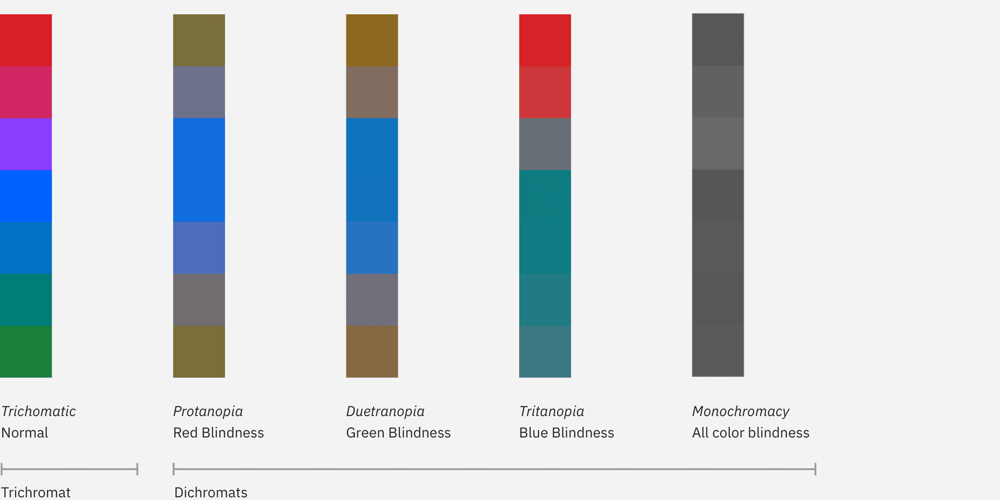
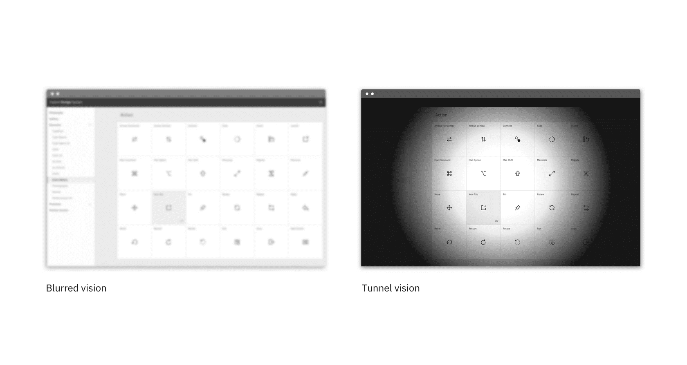

<page-intro>WCAG guidelines contain recommendations for making the web accessible to users with disabilities, including color blindness or low vision.</page-intro>

## Introduction
Web and software experiences should be accessible for everyone, regardless of a person's abilities or impairments. Visual impairments can range in severity, from low vision, to color blindness, to complete blindness. The Carbon team has done extensive research and testing to ensure each component was designed with accessibility as our top priority.

## Color contrast
There are different levels of compliance for WCAG, ranging from A to AAA. **Carbon meets AA standards across our entire system.**

AA requirements state that:

* Text and images of text must have a contrast ratio of at least **4.5:1**. An exception is large text (at least 24px / 19px semi-bold) which must have a contrast ratio of **3:1.**
* UI components: Visual information used to indicate states and boundaries of UI components must have a contrast ratio of **3:1** against adjacent colors.

You can read more and view the entire guidelines for [WCAG 2.1](https://www.w3.org/TR/WCAG21/) on their website.

To view best practices for using color in Data Visualization, view the [Data Vis color](/data-vis/overview/colors) page.

## Color blindness
Color blindness involves difficulty in perceiving or distinguishing between colors, as well as sensitivity to color brightness. It affects approximately 1 in 12 men and 1 in 200 women worldwide.

| Type | Color deficiency |
|------| ----------------|
| Protanopia | Red/green |
| Tritanopia | Blue      |
| Deuteranopia | Green   |
| Monochromacy | All colors |  

### Designing for color blindness
When designing color palettes, it's always good to run them through a color blind simulator. If you're working in Sketch, we recommend the [Stark](http://www.getstark.co/) plugin.

_Non-color blind user vs. color blind user_

## Low vision
Low vision can include partial sight in one or both eyes, and range from mild to severe. It affects 246 million people, or about 4% of the world’s population.

| Type | Color deficiency |
|------| ----------------|
| Low acuity | Also known as **blurred vision.** Can make text difficult to read, since it would appear fuzzy. |
| Low contrast sensitivity | The ability to determine fine detail and distinguish one object from another.     |
| Obstructed visual field | The user's view is partially obstrucuted. Can include central vision and spotty vision.  |
| Retinitis Pigmentosa | Also known as **tunnel vision**. Obstructed peripheral vision - user is only able to see central elements  |

_[Source: NoCoffee - Visual impairments ](https://accessgarage.wordpress.com/2013/02/09/458/)_

_Low vision disabilities_

### Designing for low vision
To get an understanding of the various low vision disabilities, we recommend using the [NoCoffee](https://chrome.google.com/webstore/detail/nocoffee/jjeeggmbnhckmgdhmgdckeigabjfbddl) Chrome plugin to preview websites. Low vision users may be using a screen reader to preview your website or experience, so ensure you're following [keyboard guidelines](/guidelines/accessibility/keyboard) to ensure the page is read to the user in a logical order.

## Resources
- [WCAG 2.1 guidelines](https://www.w3.org/TR/WCAG21/)
- [IBM accessibility quick guidance](https://w3.ibm.com/able/devtest/quick/) - (Internal only)
- [W3C low vision requirements](https://www.w3.org/TR/low-vision-needs/)

## Tools
- [High Contrast Chrome plugin](https://chrome.google.com/webstore/detail/high-contrast/djcfdncoelnlbldjfhinnjlhdjlikmph/related?hl=en)
- [Stark Sketch Plugin](http://www.getstark.co/)
- [NoCoffee vision simulator](https://chrome.google.com/webstore/detail/nocoffee/jjeeggmbnhckmgdhmgdckeigabjfbddl)
