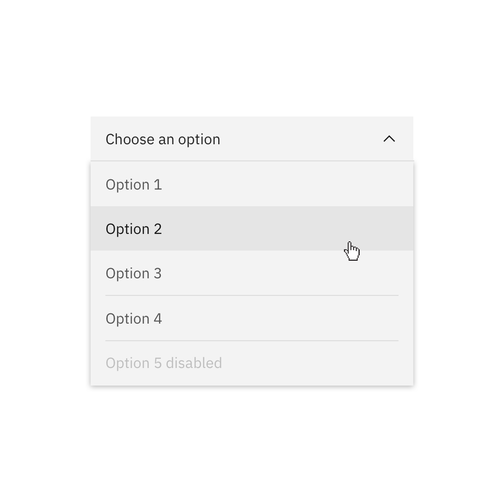
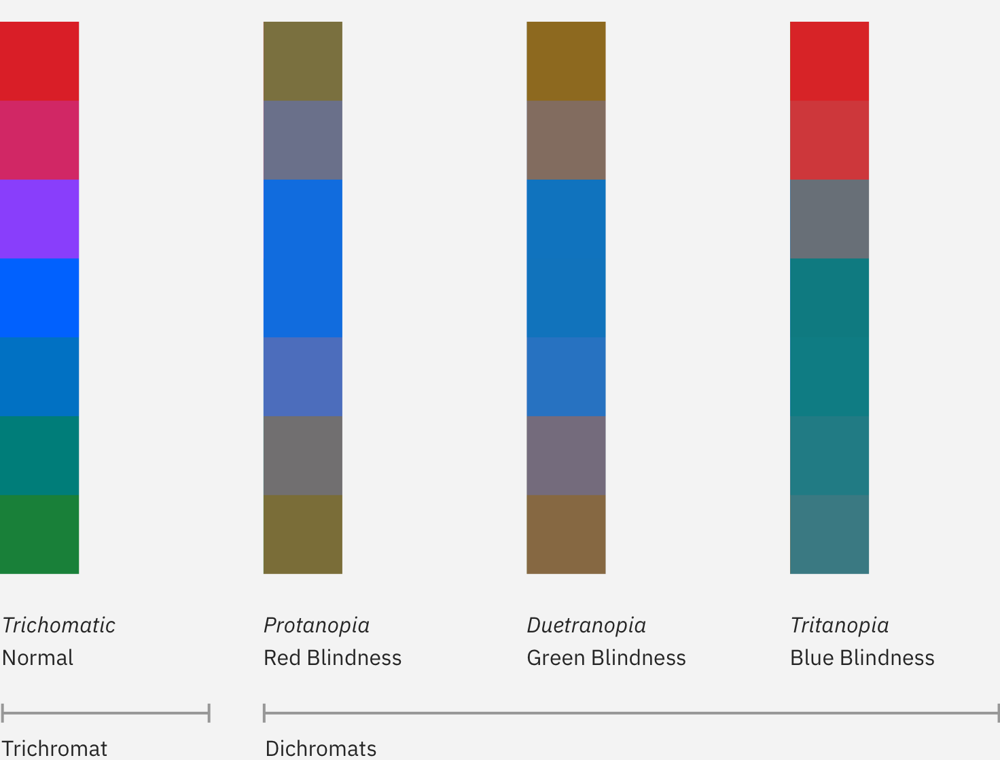

## Get started

<grid-wrapper col_lg="8" flex="true" bleed="true">
<clickable-tile
    title="Color Palettes for Adobe™(.ase)"
    href="https://w3.ibm.com/design/language//IBM-color-palettes.zip"
    type="resource"
    >
    
</clickable-tile>
</grid-wrapper>

<anchor-links>
<ul>
    <li><a href="#introduction">Introduction</a></li>
    <li><a href="#color-anatomy">Color anatomy</a></li>
    <li><a href="#ui-color-themes">UI color themes</a></li>
    <li><a href="#interaction-states">Interaction states</a></li>
    <li><a href="#digital-accessibility">Digital accessibility</a></li>
</ul>
</anchor-links>

## Introduction

Application of our color palette brings an unified and recognizable consistency to IBM’s vast array of digital products and interfaces. This consistency is grounded by a set of well-defined rules on how to work with our component library in the context of dark and light themes.

## Color anatomy

IBM Product Design uses a subset of the IBM Design Language color palette. The Neutral Gray family is dominant in our UI, making use of subtle shifts in value to help organize content into distinct zones. 

The core Blue family has been designated as the primary action color across all products and experiences, ensuring our color aesthetic is a part of every interaction. Additional colors are used sparingly and purposefully.

### Color terms

| Term      | Definition                                                                                                  |
| --------- | ----------------------------------------------------------------------------------------------------------- |
| Theme | The set of unique values assigned to each token.                                                            |
| Token | The code identifier for a unique role or set of roles. Tokens are universal and never change across themes. |
| Role | The systematic usage/s of a value. Roles cannot be changed between themes.                                  |
| Value | The actual style (ie hex code) assigned to a token.                         |

## UI Color themes

Our palette is designed and implemented in a themable manner. Each theme works with a specific set of primary background colors. These colors are global variables which determine the color of the component being applied within each theme. The light theme uses White and Gray 10 backgrounds and the dark theme uses Gray 100, 90 and 80 backgrounds. Default color tokens are provided for each component based on the primary background color.

| Theme | Primary Background       | Token                | Hex value    |    |
| --- | ----------- | ------------------- | -------------------- | ------------------- |
| White   | Global Background Light  | `$ui-background`        | <color-block showhex="true" size="xs">#ffffff</color-block>  |
| Gray 10   | Global Background Light | `$ui-background`  | <color-block showhex="true" size="xs">#f3f3f3</color-block>  |
| Gray 90  | Global Background Dark   | `$ui-background` | <color-block showhex="true" size="xs">#282828</color-block>    |
| Gray 100   | Global Background Dark  | `$ui-background`        | <color-block showhex="true" size="xs">#171717</color-block>     |

### Tokens

These themes are implemented with color tokens. In order to tokenize, a set of universal color variables must be determined by common roles and usage; tokens are not based singularly on a color value (i.e. unique hex code). The same color value may be assigned to multiple variables in a theme’s palette when the values have distinctly different roles.

A universal variable can also have multiple associated roles when the color is consistently used across those roles. This allows for uniform color application across themes while giving each theme the freedom to express its own individuality at a more detailed level.  

With this system, non-IBM users can also create their own theme using our color tokens.

### Light theme

Gray 10 components are generally paired with White backgrounds and White components with Gray 10 backgrounds. Some components, such as buttons and toggles, are common across both backgrounds. 

<grid-wrapper col_lg="12" flex="true">
    <do-dont-example correct=true label="Gray 10 Dropdown on white background.">
            
    </do-dont-example>
    <do-dont-example correct=true label="White Dropdown on a Gray 10 background.">
            
    </do-dont-example>
</grid-wrapper>

<grid-wrapper col_lg="12" flex="true">
    <do-dont-example correct=true label="White Overflow Menu on Gray 10 card.">
            
    </do-dont-example>
    <do-dont-example label="Avoid use of midtones.">
            
    </do-dont-example>
</grid-wrapper>

_Components with common colors across both light UI backgrounds_

### Dark theme

Gray 90 components are generally paired with Gray 100 backgrounds and Gray 80 components with Gray 90 backgrounds. Some components, such as buttons and toggles, are common across all three dark UI background.

<grid-wrapper col_lg="12" flex="true">
    <do-dont-example correct=true label="Gray 90 Dropdown on Gray 100 background.">
            
    </do-dont-example>
    <do-dont-example correct=true label="Gray 80 Dropdown on Gray 90 background.">
            
    </do-dont-example>
</grid-wrapper>

<grid-wrapper col_lg="12" flex="true">
    <do-dont-example correct=true label="Gray 70 is sometimes used when compound components are being applied such as an overflow menu.">
            
    </do-dont-example>
    <do-dont-example label="Do not apply components that are darker than the background unless using high contrast mode.">
            
    </do-dont-example>
</grid-wrapper>

_Components with common colors across both dark UI backgrounds_

### High contrast

In some cases, it is helpful to apply light components to dark backgrounds or light components to dark backgrounds. This technique is useful to focus attention or create visual tension when necessary.

<grid-wrapper col_lg="12" flex="true">
    <do-dont-example correct=true label=" ">
            
    </do-dont-example>
    <do-dont-example correct=true label=" ">
            
    </do-dont-example>
</grid-wrapper>

## Interaction states

In addition to the enabled state tokens above, the five other primary interaction states have also been defined and tokenized for each theme. For values between Black and 70, interaction gets lighter and for values between 60 and White, interaction gets darker.

#### Hover
A unique set of hex values and color tokens exists for the hover states. These colors are outside of the core palette steps and can be considered as half steps in between two adjacent colors. In order to simplify our token structure, the White theme shares the same hover value as the Gray 10 theme; the two dark theme backgrounds share a hover value as well.

#### Active
The active state is two full steps lighter for values between 100 and 70 and two full steps darker for values between 60 and 10. Exception: White shares the same actived state as Gray 10 and Black shares the same active state as Gray 100. Example: the Blue 60 active state is Blue 80.

#### Selected
The selected state is one full step lighter for values between 100 and 70 and one full step darker for values between 60 and 10. Exception: White shares the same selected state as Gray 10 and Black shares the same selected state as Gray 100. Example: the Blue 60 selected state is Blue 70.

#### Focus
The focus state usually appears as a Blue 60 border in the light theme and as a White border in the dark theme.

#### Disabled
Disabled components are unavailable for interaction, so they don't receive hover or focus and are not subject to WC3 contrast compliance standards. For the dark themes, disabled values are two full steps lighter than their respective background. For light themes, two full steps darker. Exception: The White theme disabled value is Gray 30.     

_Light theme interactive tokens_

_Dark theme interactive tokens_

## Digital Accessibility

Using various forms of contrast is the most important consideration when making user-friendly color and interface choices. Awareness of standards and color blindness best practices is the key to accessible color selection.

### WCAG 2.0 standards

All type color combinations must pass WCAG AA standards of 4.5:1 for normal text and 3:1 for large text. For larger text, if the font weight is light (300) or normal (400) the text should be no smaller than 24px. If the font weight is Semi-Bold (600) then the large text should be no smaller than 19px.

The color families in our palette contain ten values from 10 to 100. White and Black sit outside those values. Black text is WCAG AA accessible on colors ranging from 10 to 50. White text is accessible on colors from 60 to 100.

Beyond black and white, the IBM color palette provides a range of accessible combinations. Subtracting the foreground value from the background value (or vice versa) helps determine whether that color combination meets the WCAG AA contrast ratio success criteria. If the difference between two values is 50 or greater, the colors are accessible. Anything below a difference of 50 may fail accessibility standards.

_Blue Color Family, 60 Background_

### Color blindness

The most common form of color blindness is red/green, where sufferers mix up all colors which have red or green as part of the whole color. Our palette and its usage emphasize blues, darks and lights. These concepts ensure a pleasurable and consistent color experience for as many users as possible.

Those affected by Protanopia color blindness are less sensitive to red light, while sufferers of Deuteranopia have the same problem with green. For example, a person with Protanopia will confuse blue and purple because they can’t recognize the red element of the color purple. The third type of color deficiency, Tritanopia, is the least common and refers to sufferers who struggle to distinguish blue or yellow light. The image below shows what the rainbow may look like to individuals with each of these forms of color blindness.

## Accessibility resources

<grid-wrapper col_lg="8" flex="true" bleed="true">
<clickable-tile
    title="Color Contrast Analyzer"
    href="https://marijohannessen.github.io/color-contrast-checker/"
    type="resource"
    >
   
</clickable-tile>
<clickable-tile
    title="Accessible Color Guide"
    href="https://www.w3.org/TR/UNDERSTANDING-WCAG20/visual-audio-contrast-contrast.html"
    type="resource"
    >
    
</clickable-tile>
</grid-wrapper>