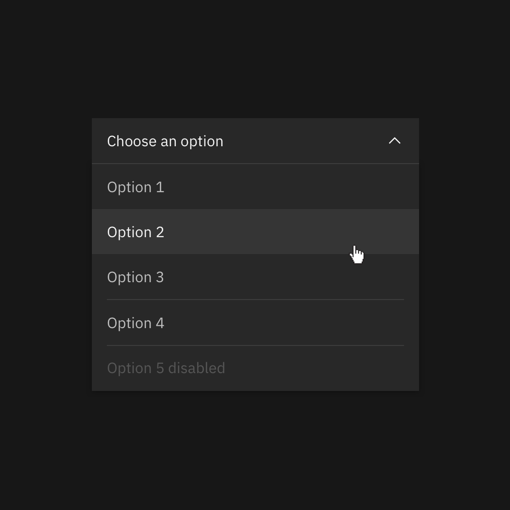
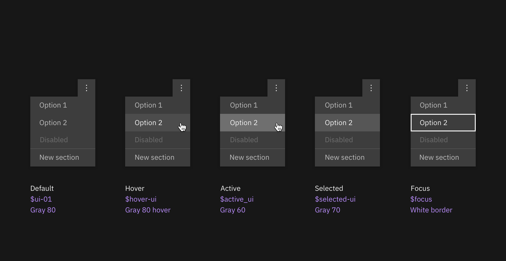

## Resources

<grid-wrapper col_lg="8" flex="true" bleed="true">
<clickable-tile
    title="Color palettes for Adobe™(.ase)"
    href="https://w3.ibm.com/design/language//IBM-color-palettes.zip"
    type="resource"
     >
    
</clickable-tile>
<clickable-tile
    title="Elements package: Color"
    href="https://github.com/IBM/carbon-elements/tree/master/packages/colors"
    type="resource"
    >
    
</clickable-tile>
</grid-wrapper>

<anchor-links>
<ul>
    <li><a data-scroll href="#introduction">Introduction</a></li>
    <li><a data-scroll href="#color-anatomy">Color anatomy</a></li>
    <li><a data-scroll href="#implementing-color">Implementing color</a></li>
    <li><a data-scroll href="#accessibility">Accessibility</a></li>
</ul>
</anchor-links>

## Introduction

Application of the color palette brings a unified and recognizable consistency to IBM's vast array of digital products and interfaces. This consistency is grounded by a set of well-defined rules on how to work with the Carbon component library in the context of dark and light themes. 

## Color anatomy

Carbon's default themes are derived from the IBM Design Language color palette. The Neutral Gray family is dominant in the default themes, making use of subtle shifts in value to help organize content into distinct zones. 

The core Blue family serves as the primary action color across all IBM products and experiences. Additional colors are used sparingly and purposefully.

## Implementing color

Carbon uses _tokens_ and _themes_ to manage color. Tokens are role-based, and themes specify the color values that serve those roles in the UI. 

| Term      | Definition                                                                                                  |
| --------- | ----------------------------------------------------------------------------------------------------------- |
| _Theme_ | The set of unique values assigned to the tokens of a Carbon interface                                                            |
| _Token_ | The code identifier for a unique role or set of roles. Tokens are universal and never change across themes. |
| _Role_ | The systematic usage(s) of a token. Roles cannot be changed between themes.                                  |
| _Value_ | The actual style (i.e. hex code) assigned to a token                         |

### Tokens

Color in Carbon is managed using color tokens. Tokens are a method of abstracting color by role or usage, independent of the actual color values. For example, instead of needing to code all instances of input labels in a UI to be `#565656`, the _form_ component in Carbon specifies the token `$text-02` for these lables, and that token is specified in a separate theme file to be `#565656`. For a different theme, that same `text-02` token could be mapped to a different hex value, like `#ffffff`. Thus, tokens not only allow for more efficient color updates within a theme, but also enable any UI (or portion of a UI) built with Carbon to easily switch between different themes. 

A single token can be associated with multiple roles, but only if the color value is used consistently across those roles. This allows for uniform color application across themes while maintaining full styling flexibility.

With this system, all Carbon users can create their own themes by assigning new values to the established color tokens. IBM products should use one of the four IBM default themes.

### Themes

Themes serve as an organizational framework for color in Carbon, with each theme based on a specific primary background color. There are two default "light" themes and two default "dark" themes.  The light themes use White and Gray 10 backgrounds, and the dark themes use Gray 100 and Gray 90 backgrounds. Default color tokens are provided for each component based on the primary background color. 

#### Global background colors

 

| Theme | Primary Background       | Token                | Hex value    |    |
| --- | ----------- | ------------------- | -------------------- | ------------------- |
| White   | Global Background Light  | `$ui-background`        | <color-block showhex="true" size="xs">#ffffff</color-block>  |
| Gray 10   | Global Background Light | `$ui-background`  | <color-block showhex="true" size="xs">#f3f3f3</color-block>  |
| Gray 90  | Global Background Dark   | `$ui-background` | <color-block showhex="true" size="xs">#282828</color-block>    |
| Gray 100   | Global Background Dark  | `$ui-background`        | <color-block showhex="true" size="xs">#171717</color-block>     |

#### Light themes

Gray 10 components are paired with White backgrounds to make the White theme and White components with Gray 10 backgrounds to make the Gray 10 theme. Some components, such as buttons and toggles, share the same colors across both light themes.

<grid-wrapper col_lg="12" flex="true">
    <do-dont-example correct=true label="Gray 10 dropdown on White background.">
            
    </do-dont-example>
    <do-dont-example correct=true label="White dropdown on a Gray 10 background.">
            
    </do-dont-example>
</grid-wrapper>

<grid-wrapper col_lg="12" flex="true">
    <do-dont-example correct=true label="White overflow menu on Gray 10 card.">
            
    </do-dont-example>
    <do-dont-example label="Avoid use of midtones.">
            
    </do-dont-example>
</grid-wrapper>

_Components with common colors across both light themes_

#### Dark themes

Gray 90 components are paired with Gray 100 backgrounds to make the Gray 100 Theme and Gray 80 components with Gray 90 backgrounds to make the Gray 90 Theme. Some components, such as buttons and toggles, share the same colors across both light themes.

<grid-wrapper col_lg="12" flex="true">
    <do-dont-example correct=true label="Gray 90 dropdown on Gray 100 background.">
            
    </do-dont-example>
    <do-dont-example correct=true label="Gray 80 dropdown on Gray 90 background.">
            
    </do-dont-example>
</grid-wrapper>

<grid-wrapper col_lg="12" flex="true">
    <do-dont-example correct=true label="Gray 70 is sometimes used when compound components are being applied, such as an overflow menu.">
            
    </do-dont-example>
    <do-dont-example label="Do not apply components that are darker than the background unless using high-contrast mode.">
            
    </do-dont-example>
</grid-wrapper>

_Components with common colors across both dark UI backgrounds_

#### High contrast

In some cases, it is helpful to apply light components to dark backgrounds or dark components to light backgrounds. This technique is useful to focus attention or create visual tension.

<grid-wrapper col_lg="12" flex="true">
    <do-dont-example correct=true label=" ">
            
    </do-dont-example>
    <do-dont-example correct=true label=" ">
            
    </do-dont-example>
</grid-wrapper>

### Interaction states

In addition to the enabled-state tokens above, the five other primary interaction states have been defined and tokenized for each default theme. For values between Black and 70, interaction gets lighter, and for values between 60 and White, interaction gets darker.

#### Hover
Hover states have their own tokens. In the IBM default themes, these colors fall outside of the core palette steps and act as "half steps" between two adjacent colors. The White theme shares the same hover value as the Gray 10 theme; the two dark theme backgrounds share a hover value as well.

#### Active
The active state is two full steps lighter for values between 100 and 70 and two full steps darker for values between 60 and 10. For example, the Blue 60 active state is Blue 80. The exception is that White shares the same active state as Gray 10, and Black shares the same active state as Gray 100. 

#### Selected
The selected state is one full step lighter for values between 100 and 70, and one full step darker for values between 60 and 10. For example, the Blue 60 selected state is Blue 70. The exception is that White shares the same selected state as Gray 10, and Black shares the same selected state as Gray 100. 

#### Focus
The focus state usually appears as a Blue 60 border in the light theme and as a White border in the dark theme.

#### Disabled
Disabled components are unavailable for interaction, so they don't receive hover or focus and are not subject to WC3 contrast compliance standards. For the dark themes, disabled values are two full steps lighter than their respective background. For light themes, they are two full steps darker. The exception is that the White theme disabled value is Gray 30.     

_Light theme interactive tokens_

_Dark theme interactive tokens_

## Accessibility

Using various forms of contrast is the most important consideration when making user-friendly color and interface choices. Awareness of standards and best practices is the key to accessible color selection.

The color families in the IBM palette contain ten values from 10 to 100. White and Black sit outside those values. Black text is WCAG AA accessible on colors ranging from 10 to 50. White text is accessible on colors from 60 to 100.

Beyond black and white, the IBM color palette provides a range of accessible combinations. Subtracting the foreground value from the background value (or vice versa) helps determine whether that color combination meets the WCAG AA contrast ratio success criteria. If the difference between two values is 50 or greater, the colors are accessible. Anything below a difference of 50 may fail accessibility standards.

_Blue color family, 60 background_

For a complete look at color-related accessibility topics in Carbon, visit the [Accessibility](/guidelines/accessibility/color) section.
