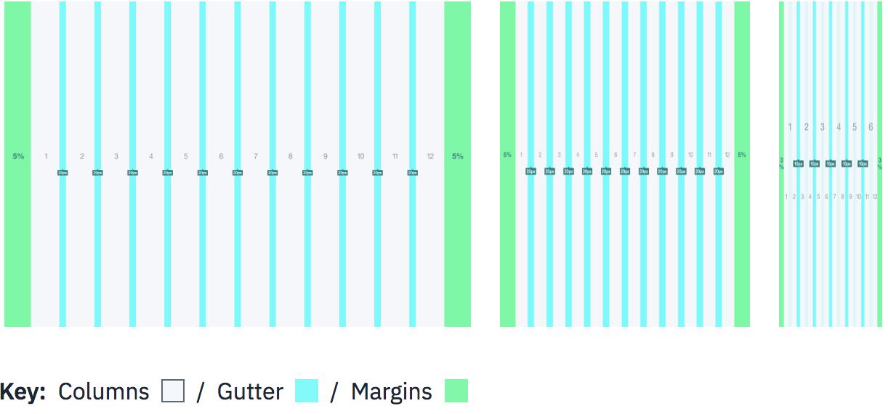
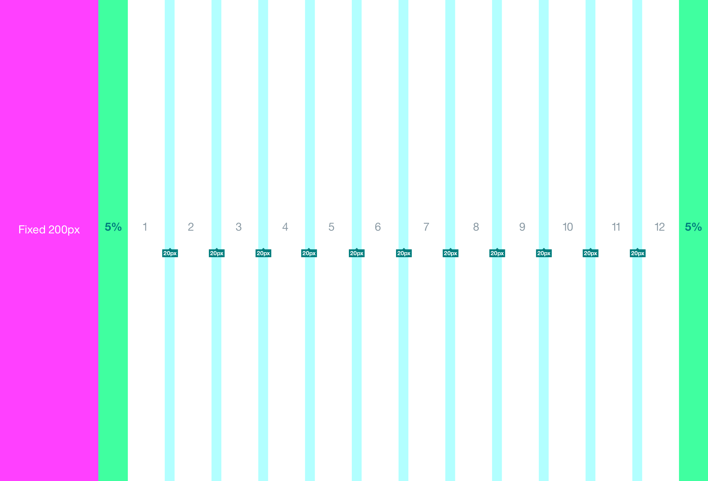

<page-intro>**Grid** systems are used for creating page layouts through a series of rows and columns that house your content. Carbon uses a responsive, mobile first, fluid grid system that appropriately scales up to 12 columns as the device or viewport size increases.</page-intro>

## Basic structure

### Grid with a side panel

A left or right side panel lives outside the bounds of the grid, including the grid margins. When a side panel appears it pushes the grid away from the outer edge of the browser window condensing the grid and content area.

For example, when using a persistent left navigation panel, the grid starts after the 200px of the navigation on the left side of the viewport. Normal grid rules still apply within the content area.

**Grid area with interior left navigation: page width minus 200px from left edge.**

## How it works

### Gutters

Columns create gutters (gaps between column content) through padding. For devices with a screen width greater than 768px, the column padding is 20px. For devices with a screen width less than 768px, the column padding is 10px.

**Screen width ≥ 768px = 20px gutters**

**Screen width < 768px = 10px gutters**

### Columns

Carbon designs should be limited to twelve columns. If designers feel that they need fewer columns in their grid, they can specify the number of twelve available columns they wish to span.

This can translate to percentages of the twelve columns. Using this method, a designer can create a folded, less granular grid. For example, if your component spans three equal columns, that is equal to 25% of twelve columns.

**Column count: 12**
_

_
_@1440px - 12 Columns / 20px Gutters / 5% Margins_

### Margins

The twelve column grid does not have a maximum width. It has a width of 100%, with built in margins that create padding between column count and the edges of the viewport.

In devices with a screen width greater than 768px, the margins are 5% on the left, and 5% on the right.

**Example: Screen Width 768px**

- 5% left = 38px (rounded to nearest whole pixel)
- 5% right = 38px (rounded to nearest whole pixel)
- 12 columns + gutters = 768px - 38px - 38px = 692px (rounded to nearest whole pixel)

In devices with a screen width less than 768px, the margins are 3% on the left, and 3% on the right.

**Example: Screen Width 320px**

- 3% left = 10px (rounded to nearest whole pixel)
- 3% right = 10px (rounded to nearest whole pixel)
- 12 columns + gutters = 320px - 10px - 10px = 300px (rounded to nearest whole pixel)

### Breakpoints

---

| Size        | Columns | Gutters            | Outer margins     |
| ----------- | ------- | ------------------ | ----------------- |
| XS (576px)  | 12      | 5px + 5px = 10px   | 3% left, 3% right |
| S (768px)   | 12      | 10px + 10px = 20px | 5% left, 5% right |
| M (992px)   | 12      | 10px + 10px = 20px | 5% left, 5% right |
| L (1200px)  | 12      | 10px + 10px = 20px | 5% left, 5% right |
| XL (1600px) | 12      | 10px + 10px = 20px | 5% left, 5% right |

## Large scale grid

Carbon allows for two types of large scale grids. The type of grid used should be based on content type and density. The large scale grid should be consistent within individual sections of the product. For example, all Configuration pages within Bluemix should have either a max width or grow exponentially. The choice of this grid belongs to the teams that own each section/template.

### Option 1: Exponential grid (default)

The width of the grid and content area grows exponentially and the margin always remain at 5%. The width of each column continuiously grows and gutters remain at 20px.

_

_
_@2560px - 12 Columns exponetial grid / 20px Gutters / 5% Margins_

### Option 2: Max width

The max width is 1600px, with the margins growing exponentially past that point. Content and columns are centered on page and the margins grow equally on left and right of content.

If a side panel exists with a max width layout, then the panel should stick to the edges of the viewport with the exponential margin between the grid columns and the panel. This is not an ideal usecase.

_

_
_@2560px - 12 Columns at max width 1600px / 20px Gutters / Exponential Margins_
