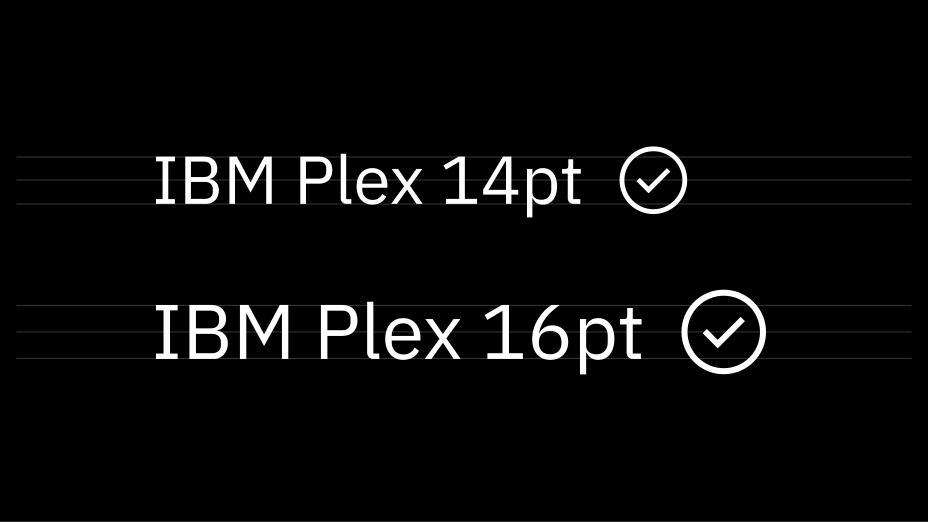

## Using Icons

### Sizing

UI icons that appear within Carbon components are generally 16 px square. Icons sized at 20, 24, and 32 px can be also used within the UI. Icons should only be used at their original sizes and not resized in code.



_16 px and 20 px icons are optimized to feel balanced when paired with 14pt and 16pt IBM Plex. Use 24 px and 32 px when larger icons are needed._

<grid-wrapper col_lg="8" flex="true">
    <do-dont-example correct="true" label="Do: use the correct icon size with IBM Plex.">
        
    </do-dont-example>
    <do-dont-example label="Don't: alter the icon-text size ratio.">
        
    </do-dont-example>
</grid-wrapper>

### Touch Targets

All touch targets for interactive icons need to be 44 px or larger. Developers can add padding to a touch target with CSS to meet the 44 px requirement.


### Color

Interactive UI icons need to pass the same color contrast ratio as typography at a 4.5:1 ratio. UI icons should always use solid colors. The color of the icon is determined by the importance of the icon's action.

|                        | SCSS              | HEX y                                                       |
| ---------------------- | ----------------- | ----------------------------------------------------------- |
| Primary action         | \$brand-01        | <color-block showhex="true" size="xs">#3d70b2</color-block> |
| Primary action:hover   | \$hover-primary   | <color-block showhex="true" size="xs">#30588C</color-block> |
| Secondary action       | \$ui-05           | <color-block showhex="true" size="xs">#5a6872</color-block> |
| Secondary action:hover | \$hover-secondary | <color-block showhex="true" size="xs">#3d70b2</color-block> |

**Exception:** There is an exception to both the `brand-01` and UI color rules. Certain icons, such as status or notification icons, can inherit their parent color. For example, a warning icon is yellow because warning notifications are yellow.

### Alignment

When used next to text, icons should be center-aligned.

<grid-wrapper col_lg="8" flex="true">
    <do-dont-example correct="true" label="Do: center-align icons when they’re next to text.">
        
    </do-dont-example>
    <do-dont-example label="Don't: baseline-align icons to the text.">
        
    </do-dont-example>
</grid-wrapper>

## Developer usage

### Using SVG sprite (recommended)

**Requirements:**

- Install `carbon-icons`

<p>Full installation details in <a href="https://github.com/ibm/carbon-icons">Carbon icons GitHub repo.</a></p>

### Using SVG sprite from static assets (recommended)

Use the SVG sprite (**carbon-icons.svg**) by serving it as a static asset.
Then reference the SVG icon you want to display using a path to the SVG sprite file.
To use SVG sprite files, they **must** be distributed through a web server and while using `svgxuse`.

```html
<!-- From static assets  -->
<svg>
  <use xlink:href="/path_to_static-assets/carbon-icons.svg#icon_name"></use>
</svg>
```

`path_to_static-assets` is the path to your static assets where `carbon-icons.svg` is located.

<p>`icon_name` is the icon name, which will display the corresponding icon. Refer to the <a href="/guidelines/iconography" target="_blank">iconography library</a> page for a full list of icon names.</p>

### CSS

You can override size and color with CSS.

```html
<svg class="icon">
  <use xlink:href="/path_to_static-assets/carbon-icons.svg#icon_name"></use>
</svg>
```

```css
.icon {
  width: 24px;
  height: 24px;
  fill: red;
}
```

All icons in the library are standardized so that they do not include `stroke` or internal spacing (`padding`).

### Inline SVG

If you're unable to use the recommended SVG sprite or `svgxuse`, you can inline SVG directly into your HTML.

Visit carbon-icons and browse the svg folder for any icons you want to use. (Remember, svg subfolders contain deprecated icons. Don't use these).

### Main files

Carbon icons ship with two main SVG files that contain different sets of external SVG sprite files:

| Filename          | Description                                                                                             | Supported versions     |
| ----------------- | ------------------------------------------------------------------------------------------------------- | ---------------------- |
| carbon-icons.svg  | Contains current icons (consolidated subset of legacy icons used in IBM Bluemix)                        | `3.x` and newer        |
| carbon-icons.json | JSON file created from carbon-icons.svg, used in [Carbon](/guidelines/iconography/library)              | `3.x` and newer        |
| carbon-icons.js   | JS module created from carbon-icons.svg, used in `Icon` React Component in [carbon-components-react](#) | `3.x` and newer        |
| sprite.svg        | SVG sprite contains legacy icons                                                                        | `1.x`, `2.x` and `3.x` |
| icons.json        | legacy JSON file created from sprite.svg                                                                | `1.x`, `2.x` and `3.x` |
| legacy-icons.js   | JS module created from sprite.svg                                                                       | `3.x` only             |

### Accessibility

For screen reader accessibility, provide a context-rich title for the SVG using `<title>` element.

```html
<svg>
  <title>Add a new service</title>
  <use xlink:href="/carbon-icons/dist/icon--add--glyph"></use>
</svg>
```

If support for older browsers is needed, use `aria-labelledby` attribute to reference the `<title>` element using an `id`.
The `<title>` element will be read by the screen reader to the user so it should describe its purpose.
Make sure that you do not duplicate this `id`.

```html
<svg aria-labelledby="add">
  <title id="add">Add a new service</title>
  <use xlink:href="/carbon-icons/dist/icon--add"></use>
</svg>
```

For more details on accessibility, see the following resources:

- "Accessible SVGs" via [CSS-Tricks](https://css-tricks.com/accessible-svgs/)
- "5.4 The 'desc' and 'title' elements" via [W3C.org](https://www.w3.org/TR/SVG11/struct.html#DescriptionAndTitleElements)
