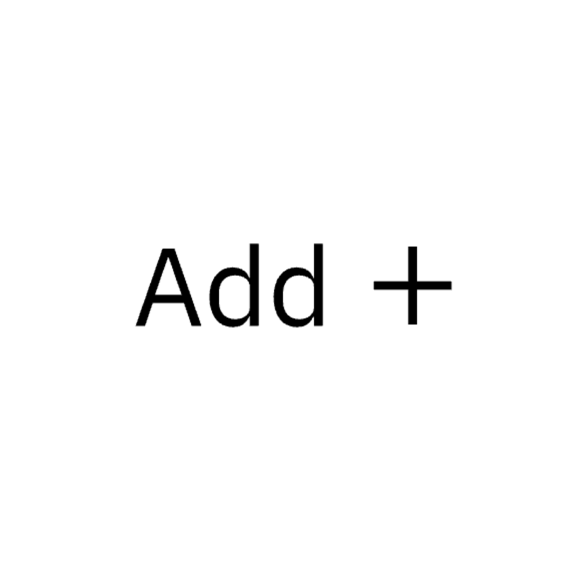
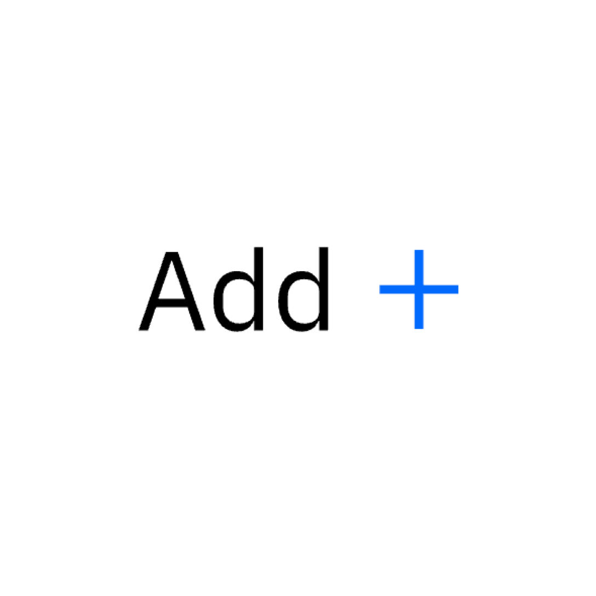

### IBM’s icons are visual symbols used to represent ideas, objects, or actions. They communicate messages at a glance, afford interactivity, and draw attention to important information. They draw from details found in the Plex typeface and work well at small sizes.

<AnchorLinks>

- [Usage for designers](#usage-for-designers)
- [Usage for developers](#usage-for-developers)

</AnchorLinks>

## Resources

<Row className="tile--group">
<Column offsetLg="4" colLg="4" colMd="4" noGutterSm>
  <ClickableTile
    title="Elements package: Icons"
    href="https://github.com/IBM/carbon-elements/tree/master/packages/icons"
    type="resource">


  </ClickableTile>
</Column>
<Column colLg="4" colMd="4"  noGutterSm>
  <ClickableTile
    title="Elements package: Icons-React"
    href="https://github.com/IBM/carbon-elements/tree/master/packages/icons-react"
    type="resource">


 </ClickableTile>
</Column>
</Row>

<br />
<br />

## Usage for designers

### Sizing

UI icons that appear within Carbon components are generally 16 px squares, however icons sized at 20 px, 24 px, and 32 px can be also used within the UI. Icons should only be used at their original sizes and not resized in code.

<ImageComponent  cols="12">


</ImageComponent>

<ImageComponent cols="12" caption="16 px and 20 px icons are optimized to feel balanced when paired with 14pt and 16pt IBM Plex. Use 24 px and 32 px when larger icons are needed.">


</ImageComponent>

<Row>
<Column offsetLg="4" colMd="4" colLg="4">
  <DoDontExample
    correct
    label="Do use the correct icon size with IBM Plex.">


  </DoDontExample>
</Column>
<Column colMd="4" colLg="4" >
  <DoDontExample label="Don’t alter the icon-text size ratio.">


  </DoDontExample>
</Column>
</Row>

### Touch targets

All touch targets for interactive icons need to be 44 px or larger. Developers can add padding to a touch target with CSS to meet the 44 px requirement.

<ImageComponent  cols="4" caption="The menu button that is also a touch target may have a 20px x 20px icon centered in a 48px x 48px button.">


</ImageComponent>

### Color

Icons are always a solid, monochromatic color and need to pass the same color contrast ratio as typography (4.5:1). The color of the icon should reflect the importance of the icon’s action which should always be to help guide a user. For more information on color, see the [Color guidelines](/guidelines/color).

It's also important to note that Carbon v10 icons themselves do not have interaction states, only their backgrounds do.

<Row>
<Column offsetLg="4" colMd="4" colLg="4">
  <DoDontExample
    correct
    label="Do match your icon color with your text color when pairing them.">



  </DoDontExample>
</Column>
<Column colMd="4" colLg="4" >
  <DoDontExample label="Don’t use different colors for text and icons.">



  </DoDontExample>
</Column>
</Row>

### Alignment

When used next to text, icons should be center-aligned.

<Row>
<Column offsetLg="4" colMd="4" colLg="4">
  <DoDontExample
    correct
    label="Do center-align icons when they’re next to text.">


  </DoDontExample>
</Column>
<Column colMd="4" colLg="4" >
  <DoDontExample label="Don’t baseline-align icons to the text.">


  </DoDontExample>
</Column>
</Row>

## Usage for developers

### Using SVG sprite (recommended)

#### Requirements:

- Install `carbon-icons`

<p>Full installation details can be found in the <a href="https://github.com/ibm/carbon-icons" target="blank">Carbon icons GitHub repo.</a></p>

### Main files

Carbon icons ship with two main SVG files that contain different sets of external SVG sprite files:

| Filename          | Description                                                                                             | Supported versions  |
| ----------------- | ------------------------------------------------------------------------------------------------------- | ------------------- |
| _carbon-icons.svg_  | Contains current icons (consolidated subset of legacy icons used in IBM Bluemix)                        | `3.x` & newer     |
| _carbon-icons.json_ | JSON file created from carbon-icons.svg, used in [Carbon](/guidelines/iconography/library)              | `3.x` & newer     |
| _carbon-icons.js_   | JS module created from carbon-icons.svg, used in `Icon` React Component in [carbon-components-react](#) | `3.x` & newer     |
| _sprite.svg_       | SVG sprite contains legacy icons                                                                        | `1.x`,`2.x`&`3.x` |
| _icons.json_       | legacy JSON file created from sprite.svg                                                                | `1.x`,`2.x`&`3.x` |
| _legacy-icons.js_  | JS module created from sprite.svg                                                                       | `3.x` only          |

### Accessibility

For screen reader accessibility, provide a context-rich title for the SVG using `<title>` element.

```html
<svg>
  <title>Add a new service</title>
  <use xlink:href="/carbon-icons/dist/icon--add--glyph"></use>
</svg>
```

If support for older browsers is needed, use the `aria-labelledby` attribute to reference the `<title>` element using an `id`.

The `<title>` element will be read by the screen reader to the user, so it should describe its purpose.

Make sure that you do not duplicate this `id`.

```html
<svg aria-labelledby="add">
  <title id="add">Add a new service</title>
  <use xlink:href="/carbon-icons/dist/icon--add"></use>
</svg>
```


#### For more details on accessibility, see the following resources:

<br />

- "Accessible SVGs" via [CSS-Tricks](https://css-tricks.com/accessible-svgs/)
- "5.4 The 'desc' and 'title' elements" via [W3C.org](https://www.w3.org/TR/SVG11/struct.html#DescriptionAndTitleElements)
