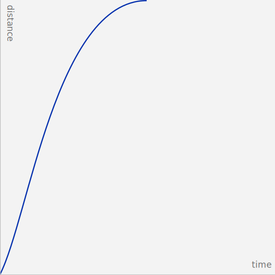
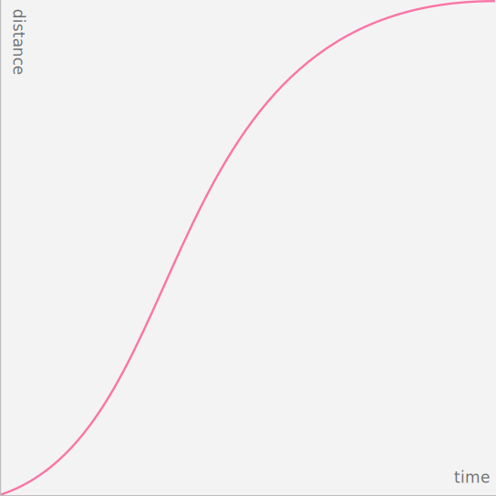

import { Tab } from 'carbon-components-react';

### Motion is a powerful tool in designing and building communication and user experience. It can bring your work to life, guide users through complex experiences, and help move forward—from here to there, now to next, start to finish—and make progress.

<AnchorLinks>

- [Style](#style)
- [Easing](#easing)
- [Duration](#duration)

</AnchorLinks>

## Resources

<GridWrapper col_lg="8" flex="true" bleed="true">
  <ClickableTile
    title="Motion Generator"
    href="https://ibm.github.io/motion/"
    type="resource"
  />
  <ClickableTile
    title="IBM Motion Package"
    href="https://github.com/IBM/carbon-elements/tree/master/packages/motion"
    type="resource"
  />
</GridWrapper>

 

 

## Style

IBM Design System recognizes different moments in user's experience, and offers two styles of motion—_productive_ motion, and _expressive_ motion. The motion curves are designed to reflect the philosophical duality of Man and Machine.

<WebsiteTabs>
<Tab label="Curves">

<SimpleColumns gutter="true">

  
Productive

  
Expressive

</SimpleColumns>

</Tab>
<Tab label="Abstract">

<Video vimeoId="310583009" />

</Tab>
<Tab label="In-situ">

<Video vimeoId="310583036" />

</Tab>
</WebsiteTabs>

### Productive

Productive motion creates a sense of efficiency and responsiveness,
while being subtle. Use Productive motion for moments when user needs to focus on tasks—micro-interactions such as button interaction and dropdown menus, revealing additional information upon user's request, or rendering data tables and visualizations.

### Expressive

Expressive motion delivers enthusiastic and vibrant, thus more visible movement. Use expressive motion for significant moments such as user opening a new page or clicking the primary action button, or when the movement itself conveys a meaning or needs to be noticed by the user such as system alert or notification box appearing.

Productivity and Expression are both essential to an interface. Reserve Expressive motion for occasional, important moments to better capture the user’s attention and offer a rhythmic break to the productive experience..

[Carbon components](../../components/overview/) have motion build in for microinteractions. However, keep in mind that the motion design of an interface still depend heavily on our users to define how the components themselves enter and exit screen, and how all the components work together. Use this guidance to customize, combine, coordinate and choreograph motion of all elements throughout experiences.

<GridWrapper col_lg="12" flex="true">
<DoDontExample correct="true" full_width="true" label="Productive moments are labeled blue, and Expressive moments are labeled magenta.">

<Video vimeoId="310583077" />

</DoDontExample>
</GridWrapper>

## Easing

Strictly linear movement appears unnatural to the human eye. Elements on the screen speed up quickly and slow down smoothly, obeying the physics of a light-weight material. "Easing curves" describe the precise amount of accelerations in motion. We commonly use one of these three types of easing.

<GridWrapper col_lg="12" flex="true">
<DoDontExample correct="true" full_width="true" label="Elements on the screen speed up quickly and slow down smoothly, obeying the physics of a light-weight material.">

<Video vimeoId="310582370" />

</DoDontExample>
</GridWrapper>

 

Avoid easing curves that are unnatural, distracting, or purely decorative. IBM motion is essential and efficient. We guide the users to value as quickly as possible.

<GridWrapper col_lg="12" flex="true">
<DoDontExample correct="false" full_width="true" label="Easing curves that suggest bounce, stretch, or sudden stops are not recommended.">

<Video vimeoId="310582418" />

</DoDontExample>
</GridWrapper>

### Standard easing

Use `standard-easing` when an element is visible from the beginning to end of a motion. Tiles expanding and table rows sorting are good examples.

<WebsiteTabs>
<Tab label="Curves">

<Video vimeoId="310582611" />

</Tab>
<Tab label="Examples">

<Video vimeoId="310582667" />

</Tab>
</WebsiteTabs>

| Style      | IBM Motion package         | CSS                           | After Effects             |
| ---------- | -------------------------- | ----------------------------- | ------------------------- |
| Productive | `motion(standard, productive)` | cubic-bezier(0.2, 0, 0.38, 0.9) | Outgoing 20%, incoming 62% |
| Expressive | `motion(standard, expressive)` | cubic-bezier(0.4, 0.14, 0.3, 1) | Outgoing 40%, incoming 70% |

### Entrance easing

Use `entrance-ease` when adding elements to the view such as a modal or toaster appearing, or moving in response to users' input, such as dropdown opening or toggle. An element quickly appears and slows down to a stop.

<WebsiteTabs>
<Tab label="Curves">

<Video vimeoId="310582467" />

</Tab>
<Tab label="Examples">

<Video vimeoId="310582503" />

</Tab>
</WebsiteTabs>

| Style      | IBM Motion package         | CSS                           | After Effects             |
| ---------- | -------------------------- | ----------------------------- | ------------------------- |
| Productive | `motion(entrance, productive)` | cubic-bezier(0, 0, 0.38, 0.9) | Outgoing 0%, incoming 62% |
| Expressive | `motion(entrance, expressive)` | cubic-bezier(0, 0, 0.3, 1)    | Outgoing 0%, incoming 70% |

### Exit easing

Use `exit-easing` when removing elements from view, such as closing a modal or toaster. The element speeds up as it exits from view, implying that its departure from the screen is permanent.

<WebsiteTabs>
<Tab label="Curves">

<Video vimeoId="310582530" />

</Tab>
<Tab label="Examples">

<Video vimeoId="310582574" />

</Tab>
</WebsiteTabs>

| Style      | IBM Motion package         | CSS                           | After Effects             |
| ---------- | -------------------------- | ----------------------------- | ------------------------- |
| Productive | `motion(exit, productive)` | cubic-bezier(0.2, 0, 1, 0.9)  | Outgoing 20%, incoming 0% |
| Expressive | `motion(exit, expressive)` | cubic-bezier(0.4, 0.14, 1, 1) | Outgoing 40%, incoming 0% |

An exception to exits: if an element leaves the view but stays nearby, ready to reappear upon user action, use standard easing instead. A good example of this is a side panel. The panel would leave the view, but slows down as it exits, implying that it would come to rest just outside the view, and ready to be recalled.

### Summary on easing

[IBM Motion Package](https://github.com/IBM/carbon-elements/tree/master/packages/motion) has the easing curves stored for fast access. This is the recommended method to call an easing curve and stay connected to receive any future updates.

| Easing curve    | Productive                     | Expressive                      |
| --------------- | ------------------------------ | ------------------------------- |
| Standard easing | `motion(standard, productive)` | `motion(standard, expressive)`  |
| Entrance easing | `motion(entrance, productive)` | `motion(entrance, expressive)`  |
| Exit easing     | `motion(exit, productive)`     | `motion(exit, expressive)`      |

If you are unable to use above method, cubic-bezier curve notation is the standard way to express easing curves.

| Easing curve    | Productive                      | Expressive                      |
| --------------- | ------------------------------- | ------------------------------- |
| Standard easing | cubic-bezier(0.2, 0, 0.38, 0.9) | cubic-bezier(0.4, 0.14, 0.3, 1) |
| Entrance easing | cubic-bezier(0, 0, 0.38, 0.9)   | cubic-bezier(0, 0, 0.3, 1)      |
| Exit easing     | cubic-bezier(0.2, 0, 1, 0.9)    | cubic-bezier(0.4, 0.14, 1, 1)   |

## Duration

Duration is calculated based on the style and size of the motion. Among the two motion styles, _Productive_ motion is significantly faster than _Expressive_ motion. Motion’s duration should be dynamic based on the size of the animation - the larger the change in distance (traveled) or size (scaling) of the element, the longer the animation takes.

<GridWrapper col_lg="12" flex="true">
<DoDontExample correct="true" full_width="true" label="Duration contrast between a taller and a shorter component.">

<Video vimeoId="310582312" />

</DoDontExample>
</GridWrapper>

 

When custom duration is possible, please use the [Motion Generator](https://ibm.github.io/motion/) to get the customized duration calculated for you element. We uses a non-linear duration scale to achieve better perceived consistency across all distances.

<GridWrapper col_lg="8" flex="true" bleed="true">
  <ClickableTile
    title="Motion Generator"
    href="https://ibm.github.io/motion/"
    type="resource"
  />
</GridWrapper>

 

### Duration tokens

We are working on making dynamic duration a build-in feature for Carbon components, and a part of the Motion package. Currently, we offer six static values as tokens for easier implementation.

| Token                   | Usage                                                         | Value |     |
| ----------------------- | ------------------------------------------------------------- | ----- | --- |
| `duration--fast-01`     | Micro-interactions such as button and toggle                  | 70ms  | |
| `duration--fast-02`     | Micro-interactions such as fade                               | 110ms | |
| `duration--moderate-03` | Micro-interactions, small expansion, short distance movements | 150ms | |
| `duration--moderate-04` | Expansion, system communication, toast                        | 240ms | |
| `duration--slow-05`     | Large expansion, important system notifications               | 400ms | |
| `duration--slow-06`     | Background dimming                                            | 700ms | |
