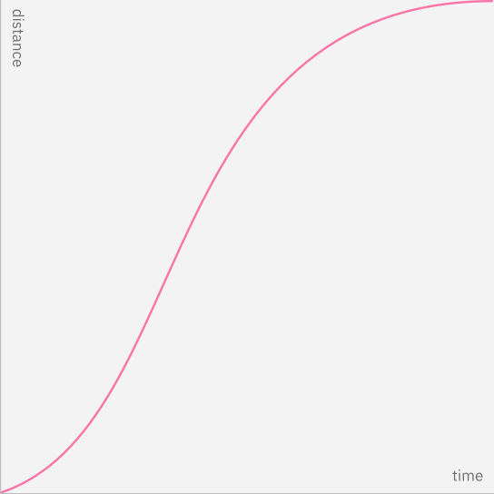

<anchor-links>
<ul>
    <li><a href="#get-started">Get Started</a></li>
    <li><a href="#style">Style</a></li>
    <li><a href="#easing">Easing</a></li>
    <li><a href="#duration">Duration</a></li>
    <li><a href="#paths">Paths</a></li>
    <li><a href="#choreography">Choreography</a></li>
</ul>
</anchor-links>

## Get Started

<grid-wrapper col_lg="8" flex="true" bleed="true">
<clickable-tile
    title="Motion Generator"
    href="#"
    type="resource"
    >
</clickable-tile>
</grid-wrapper>

## Style

Duo motion recognizes different moments in user's experience, and offers two modes - the Productive motion, and the Expressive motion. The motion curves are designed to reflect the philosophical duality of Man and Machine.

<website-tabs>
  <tab label="Curves">

      <grid-wrapper col_lg="8" flex="true">
        
Productive

        
      </grid-wrapper>
      <grid-wrapper col_lg="8" flex="true">
        
Expressive

        
      </grid-wrapper>
    
</tab>
  <tab label="Abstract">

      Content for second tab goes here.
  
</tab>
  <tab label="In-situ">

      Content for third tab goes here.
  
</tab>
</website-tabs>

### Productive

Productive motion create a sense of efficiency and responsiveness,
while being subtle. Use productive motion for moments when user needs to focus on tasks — micro-interactions such as button interaction and dropdown menus, revealing additional information upon user's request, or rendering data tables and visualizations.

### Expressive

Expressive motion delivers enthusiastic and vibrant, thus more visible movement. Use expressive motion for significant moments such as user opening a new page or clicking the primary action button, or when the movement itself conveys a meaning or needs to be noticed by the user such as system alert or notification box appearing.

Productive and Expression are both essential to an interface. Reserve Expressive motion for occational, important moments to better capture user’s attention, and offer rhymic break to the productive experience.

Our [Components](#) have Duo motion build in. Use this guidance to customize motion, combine and coordinate motion through out experiences.

[ VIDEO ]
caption:
Productive moments are labeled blue, and expressive moments are labeled magenta.

## Easing

Strictly linear movement appears unnatural to the human eye. Elements on the screen speed up quickly and slow down smoothly, obeying the physics of a light-weight material. "Easing curves" describe the precise amount of accelerations in motion. We commonly use one of these three types of easing.

<grid-wrapper col_lg="12">
    <do-dont-example full_width="true" correct=true label="Lorem Ipsum">
           
    </do-dont-example>
</grid-wrapper>

Avoid easing curves that are unnatural, distracting, or decorative should be avoided. Duo motion is essential and efficient. We guide the users to value as quickly as possible.

<grid-wrapper col_lg="12">
    <do-dont-example full_width="true" correct=false label="Lorem Ipsum">
           
    </do-dont-example>
</grid-wrapper>

### Standard easing

Use `standard-easing` when an element is visible from the beginning to  end of a motion. Tiles expanding and table rows sorting are good examples.

<website-tabs>
<tab label="Curves">

</tab>
<tab label="Examples">

Content for second tab goes here.

</tab>
</website-tabs>

| Curves        | Productive                      | Expressive                      |
|---------------|---------------------------------|---------------------------------|
| CSS           | cubic-bezier(0.2, 0, 0.38, 0.9) | cubic-bezier(0.4, 0.14, 0.3, 1) |
| After Effects | Outgoing 20%, incoming 62%      | Outgoing 40%, incoming 70%      |

### Entrance easing

Use `entrance-ease` when adding elements to the view such as a modal or toaster appearing, or moving in response to users' input, such as dropdown opening or toggle. An element quickly appears and slows down to a stop.

<website-tabs>
<tab label="Curves">

</tab>
<tab label="Examples">

Content for second tab goes here.

</tab>
</website-tabs>

| Curves        | Productive                      | Expressive                      |
|---------------|---------------------------------|---------------------------------|
| CSS           | cubic-bezier(0, 0, 0.38, 0.9)   | cubic-bezier(0, 0, 0.3, 1)      |
| After Effects | Outgoing 0%, incoming 62%       | Outgoing 0%, incoming 70%       |

### Exit easing

Use `exit-easing` when removing elements from view, such as closing a modal or toaster. The element speeds up as it exits from view, implying that its departure from the screen is permanent.

<website-tabs>
<tab label="Curves">

</tab>
<tab label="Examples">

Content for second tab goes here.

</tab>
</website-tabs>

| Curves        | Productive                      | Expressive                      |
|---------------|---------------------------------|---------------------------------|
| CSS           | cubic-bezier(0.2, 0, 1, 0.9)    | cubic-bezier(0.4, 0.14, 1, 1)   |
| After Effects | Outgoing 20%, incoming 0%       | Outgoing 40%, incoming 0%       |

An exception to exits: if an element leaves the view but stays nearby, ready to reappear upon user action, use Standard easing instead. A good example of this is a side panel. The panel would leave the view, but slows down as it exits, implying that it would come to rest just outside the view, and ready to be recalled. Learn more about our [Space and Light](#) modal.

[ IMAGE ]

### Duo Easing Curves

Cubic-bezier curve notation is the standard way to express easing curves. [Duo Motion Package](#) has the easing curves stored as tokens for fast access. Reference [Code](#) tab for details on how to use motion curve tokens.

| Easing          | Productive                      | Expressive                      |
|-----------------|---------------------------------|---------------------------------|
| Standard easing | cubic-bezier(0.2, 0, 0.38, 0.9) | cubic-bezier(0.4, 0.14, 0.3, 1) |
| Entrance easing | cubic-bezier(0, 0, 0.38, 0.9)   | cubic-bezier(0, 0, 0.3, 1)      |
| Exit easing     | cubic-bezier(0.2, 0, 1, 0.9)    | cubic-bezier(0.4, 0.14, 1, 1)   |

## Duration

Duo motion’s duration is dynamically calculated based on the size of the animation - the larger the change in distance (traveled) or size (scaling) of the element, the longer the animation takes. Duo uses a non-linear duration scale to achieve better perceived consistency across all distances. [More about non-linear duration scale](#)

[ IMAGE ]

Duo Components has dynamic motion build in. When creating custome motion, use the [Motion Generator](#) to get the accurate duration for you element, or watch the tutorial to learn how to use [IBM Motion Package](#)’s javascript methods to get duration like a pro.

<grid-wrapper col_lg="8" flex="true" bleed="true">
<clickable-tile
    title="Motion Generator"
    href="#"
    type="resource"
    >
</clickable-tile>
<clickable-tile
    title="Tutorial: Using the IBM Motion Package"
    href="#"
    type="resource"
    >
</clickable-tile>
</grid-wrapper>

## Paths

Elements of the Duo interface dance on the Grid. Motion paths trace lines along the grid which never run diagonal.

<grid-wrapper col_lg="12">
    <do-dont-example full_width="true" correct=true label="When expanding or moving elements across the screen, stagger the timing of horizontal and vertical animations to create a path with a rounded corner.">
           
    </do-dont-example>
</grid-wrapper>

<grid-wrapper col_lg="12">
    <do-dont-example full_width="true" correct=false label="Not staggering horizontal and vertical animations create a straight diagonal path. It breaks the grid and is harsh to the eye.">
           
    </do-dont-example>
</grid-wrapper>

<grid-wrapper col_lg="8" flex=true>
    <do-dont-example correct=true label="When removing an item from the grid, thumbnails on the edge existing and re-entering container create a smooth transition.">
           
    </do-dont-example>
    <do-dont-example correct=false label="Thumbnails moving on diagonal paths feels sporadic and harsh.">
           
    </do-dont-example>
</grid-wrapper>

<grid-wrapper col_lg="8" flex=true>
    <do-dont-example correct=true label="When sorting or shuffling items on the grid, always using rounded corner paths to visually organize the movements.">
           
    </do-dont-example>
    <do-dont-example correct=false label="Criss cross sorting appears disorganized. Avoid this motion path.">
           
    </do-dont-example>
</grid-wrapper>

## Choreography

When multiple animated elements coexist or interact with each other within the same view, it is vital to make the many moving elements work together and form coherent experience, to better provide way-finding and focus to guide the user experience.

### Consistency

When elements convey the same meaning, or perform the same functions, use the same motion for them. Similarly, actions with dramatically different meaning and intente should carry different motions. This helps to reinforce the meaning behind a motion, and improves user’s proficiency with the interface.

[ IMAGE ]
caption:
Both expanding a row of a data table and opening a dropdown uses a chevron. The intent is to reveal additional content hidden in a seam, therefore they should have the same motion style (productive) and easing (entrance, standard), albeit different durations due to their difference in size.

Pay attention to the spatial relationships between elements and screens, and information hierarchy. Visually similar elements may need the different motions to respect their respective spatial location.

[ IMAGE ]
caption:
When the new content panel is on a higher layer, motion is “sliding”, moving content within with the panel.  Also always dim the content below when new layer is introduced above.

[ IMAGE ]
caption:
When the new content panel is on the same layer, motion is “expanding”, revealing content within with a mask.

> Effective use of inconsistency in motion highlights a difference in meaning or intent behind actions with similar visual appearance.

<grid-wrapper col_lg="8" flex=true>
    <do-dont-example correct=true label="Use motion to reinforce meaning. Affirmative action here triggers a different exit motion for the modal than negation.">
           
    </do-dont-example>
    <do-dont-example correct=false label="Criss cross sorting appears disorganized. Avoid this motion path.">
           
    </do-dont-example>
</grid-wrapper>

### Continuity

Motion can help establishing a sense of continuity between screens and experiences. Pay attention to shared elements across screens, such as the title panels, or buttons, to create a graceful transition.

[ IMAGE ]
caption:
Shared elements can effectively guide users through a multi-layered information architecture.

<grid-wrapper col_lg="8" flex=true>
    <do-dont-example correct=false label="Continuous elements are for guidance and should not distract. Always finish a sequence with the important content on page.">
           
    </do-dont-example>
</grid-wrapper>

### Sequence & Stagger

When multiple elements need to animate, distribute their entrances over time in stead of introducing everything at the user at once. This will help user to understand the content and orient themselves.

[ IMAGE ]
Staggering the entrance of table content by 20ms significantly reduces the cognitive load. Depending on the number of staggered elements, the delay should be adjusted to ensure total time is still within 500 ms.

Sequence the entrance of page content when possible. Start with the most orienting content, such as the static content* and header, and end with the most important information, such as the Call to Action button or a calculation result, to focus user’s attention to them.

[ IMAGE ]
Follow this recommended sequence of different types of content when choreographing content entrance. Not all categories might be present in every experience. [Learn to categorize content in Motion Strategy ](#)

| Seq | Category              | Examples                                                |
|-----|-----------------------|---------------------------------------------------------|
| 1   | Static content        | UI shell, top and side navigation                       |
| 2   | Static content (body) | Header, written content, images                         |
| 3   | Dynamic content       | Data within a data table, querie results from data base |
| 4   | Primary action        | Primary action button                                   |
| 5   | Animated content      | Data visualizations                                     |
