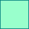
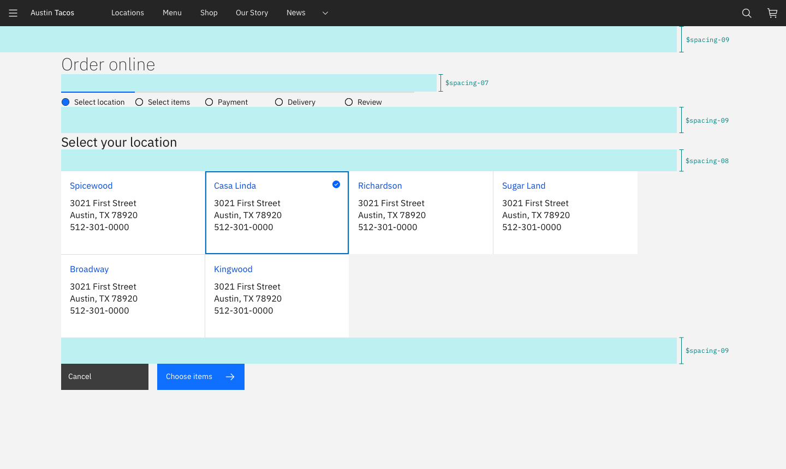

<page-intro>**Spacing** tokens are used to consistently apply margin and padding across components and UIs. Having a set spacing scale brings a rhythm to the product and creates a natural and familiar flow from page to page.</page-intro>

## Intro to spacing

### Two Scales

Carbon has two spacing scales, one for general spacing within components and the other for layout spacing. Both are designed to complement the existing components and typography throughout the system.

Each scale has its own distinct purpose. The two scales have certain overlapping values that serve two different roles so be mindful when picking a spacing token.

| Scale             | Purpose                                                                                                                                                                                                                            |
| ----------------- | ---------------------------------------------------------------------------------------------------------------------------------------------------------------------------------------------------------------------------------- |
| **Spacing Scale** | Used for smaller, more refined spacing situations, specifically within the context of a component (ie. the space between a label and a Text Input).                                                                                |
| **Layout Scale**  | Used to create larger spacial differences most commonly with positioning components on a page (ie. the space between a Text fields and a Select). The Layout Scale controls the amount of white space set between larger elements. |

### Applying spacing

Both the Spacing and the Layout scale can be applied to `margin` or `padding` properties. Likewise, these spacing tokens can be applied to both vertical and horizontal edges. The token takes the place of the values normally assigned to `margin` and `padding`. The following are all approved ways to syntactically apply Carbon spacing tokens:

```css
margin: $spacing-xs;
margin: $layout-sm $layout-2xs;
margin: $spacing-xl 0 $spacing-sm 0;
margin-right: $layout-lg;
padding: $spacing-sm;
padding: $layout-lg $layout-sm;
padding: $spacing-xl $spacing-sm 0 $spacing-sm;
padding-left: $spacing-auto;
```

## Spacing Scale

Use the Spacing Scale when building individual elements. It includes minute increments needed to create appropriate spacial relationships for detail-level designs. This scale is applied and used within all Carbon components.

| Token            | rem   | px  | Example                                       |
| ---------------- | ----- | --- | --------------------------------------------- |
| **$spacing-3xs** | 0.125 | 2   |   |
| **$spacing-2xs** | 0.25  | 4   |   |
| **$spacing-xs**  | 0.5   | 8   |    |
| **$spacing-sm**  | 0.75  | 12  |    |
| **$spacing-md**  | 1     | 16  |    |
| **$spacing-lg**  | 1.5   | 24  |    |
| **$spacing-xl**  | 2     | 32  |    |
| **$spacing-2xl** | 2.5   | 40  |  |
| **$spacing-3xl** | 3     | 48  |  |


_Example of Spacing tokens applied_

### Other spacing options

There are a few other non-token methods that can be used for spacing elements. Each has its own unique use case.

| Method   | Purpose                                                                                                                                                           |
| -------- | ----------------------------------------------------------------------------------------------------------------------------------------------------------------- |
| `center` | Used to fluidly center an element between two edges.                                                                                                              |
| `auto`   | Used on one side of an element to allow undefined space to automatically grow and shrink according to screen size. Typically used for asymmetrical fluid spacing. |
| Gutter   | Used to space items between the grid's 12 columns                                                                                                                 |

## Layout Scale

The Layout Scale is used for arranging components and other UI parts into a full page layout. It has larger increments that are used to control the density of a design. Use the smaller layout tokens to create more dense compositions and direct relationships. Use the larger tokens to increase the amount of white space and to disassociate sections.

| Token           | rem | px  | Example                                      |
| --------------- | --- | --- | -------------------------------------------- |
| **$layout-2xs** | 1   | 16  |  |
| **$layout-xs**  | 1.5 | 24  |   |
| **$layout-sm**  | 2   | 32  |   |
| **$layout-md**  | 3   | 48  |   |
| **$layout-lg**  | 4   | 64  |   |
| **$layout-xl**  | 6   | 96  |   |
| **$layout-2xl** | 10  | 160 |  |


_Example of Layout tokens applied_

### Using Layout Scale with the grid

The Carbon 12-column grid is still an acceptable and encouraged way to horizontally space UI elements. The Layout Scale is most commonly used for vertical spacing but it can also be applied for horizontal spacing when appropriate, especially in the case of fixed spacing.

## Designing with space

Every part of a UI should be intentional including the empty space between elements. The amount of space between items creates relationships and hierarchy.

### Creating relationships

Having less space between elements creates a close association and are therefore interpreted as related. Oppositely, elements that have a large amount of space separating them become disassociated with the relationship weakening the further away they get from each other.

Patterns created through spacing can also create relationships. Elements arranged in the same spacing pattern are seen as related pieces that have equal weight.

Space can also be used to denote groups of associated information. This creates content sections on page without having to use lines or other graphical elements as a divider.

### Creating hierarchy

Elements that have more spacing around them tend to be higher in importance than elements that have less space between them. Take this page for instance. The top level headers have more space surrounding them giving them focus and prominence. Then as the headers descend in importance they receive less space signaling they are subordinate.

Elements that are set close to each can be easily overlooked from an individual level. Users may see the grouping but not process each individual item. Therefore, if you have an element or content of high importance on the page consider giving it extra surrounding space to help it attract focus.

### White space

Empty space also known as white space is a good thing. It can be used to break up sections on a page or to help create focus on certain element(s). White space helps with information processing; too much dense information can be disorienting and overwhelming for a user. Sections of a UI are allowed to be dense but the whole page should not be crowded; there should be white space to let the user's eye rest. Think of it like a period at the end of sentence, it metaphorically lets the user catch his or her breath before moving on.

## FAQ

##### Are spacing increments outside of the scale allowed?

There are always exceptions to the rule but deviating from the spacing scales should be avoided whenever possible.

##### Can I still use the Carbon grid for horizontal spacing?

Yes, in fact it's encouraged.

##### Can I still use percentages for spacing?

Percentages like 50% (1/2) or 33% (1/3) are still acceptable ways to divide a page. Percentages can all still be used to control max and min widths. However, using percentages for padding or margin inside of a component or element should be avoided (ex. `padding-right: 10%`). The exception to this is if you're applying it to fit the 5% grid margins.

##### Are the spacing tokens responsive?

No, the tokens themselves do not change values based on the screen size. However, it is acceptable at page breakpoints to jump a step(s) on the spacing scale to fit spacial needs (ie. at 1440px `padding-right: $spacing-md` but at breakpoint 768px `padding-right: $spacing-xs`).
