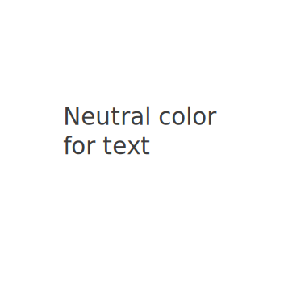
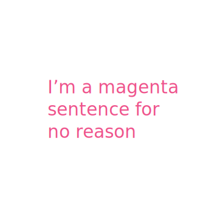
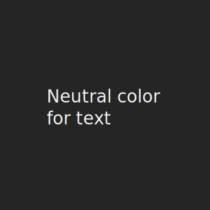
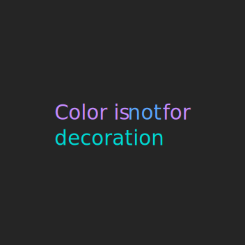
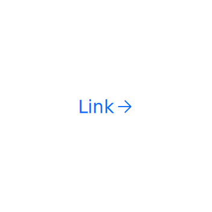
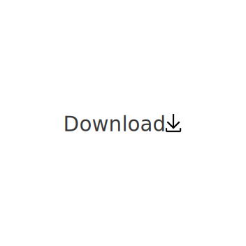
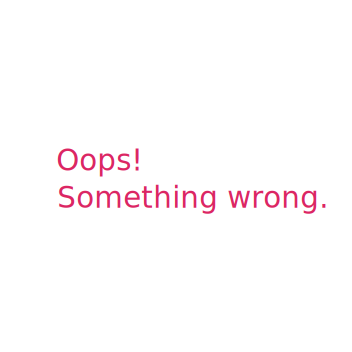
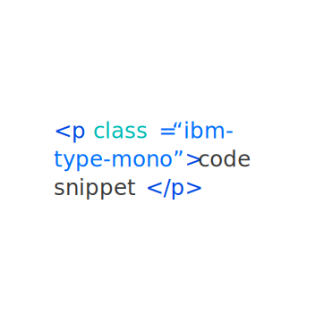

## Resources

<grid-wrapper col_lg="8" flex="true" bleed="true">
<clickable-tile
    title="Get the latest IBM Plex™ download on GitHub"
    href="https://github.com/IBM/plex/releases/latest"
    type="resource"
    >
    
</clickable-tile>
<clickable-tile
    title="Visit the IBM Plex™ website to learn more"
    href="https://www.ibm.com/plex/"
    type="resource"
    >
</clickable-tile>
</grid-wrapper>

<anchor-links>
<ul>
    <li><a href="#type-tokens-and-themes">Type tokens and themes</a></li>
    <li><a href="#typeface-ibm-plex">Typeface: IBM Plex</a></li>
    <li><a href="#scale">Scale</a></li>
    <li><a href="#style">Style</a></li>
    <li><a href="#type-color">Type color</a></li>
</ul>
</anchor-links>

## Type tokens and themes

Carbon utilizes type tokens and themes to manage typrography.

A _token_ is a named entity in a design system which represents specific visual attributes, such as font size, font weight, color, etc. Using tokens enables these specific values to be centralized and abstracted in the system, which in turn makes it easier to update designs—however wide-ranging—from a single source of truth.

A _theme_ is a complete set of tokens that have been designed to work harmoniously together.

Two different themes in the same system could share the same token architecture, but would have different values for some or all of the tokens.

## Typeface: IBM Plex

Carbon uses the open-source typeface **IBM Plex**. It has been carefully designed to meet IBM's needs as a global technology company and reflect IBM's spirit, beliefs, and design principles. IBM Plex can be accessed and downloaded from the [Plex GitHub Repo](https://github.com/ibm/plex).

<type-weight type="types"></type-weight>

### Sans-serif font stack

```scss
font-family: 'IBM Plex Sans', 'Helvetica Neue', Arial, sans-serif;
```

### Serif font stack

```scss
font-family: 'IBM Plex Serif', 'Georgia', Times, serif;
```

### Mono font stack

```scss
font-family: 'IBM Plex Mono', 'Menlo', 'DejaVu Sans Mono',
  'Bitstream Vera Sans Mono', Courier, monospace;
```

## Scale

The IBM type scale is built on a single equation. The formula for our scale was created to provide hierarchy for all types of experiences. The formula assumes that y₀=12 px:

<type-scale-table></type-scale-table>

```
Xn = Xn-1 + {INT[(n-2)/4] + 1} * 2
Xn: step n type size Xn-1: step n-1 type size
```

## Style

Typography creates purposeful texture, guiding users to read and understand the hierarchy of information. The right typographic treatment and the controlled usage of type styles helps manage the display of content, keeping it useful, simple, and effective.

### Weights

Font weight is an important typographic variable that can add emphasis and differentiate content hierarchy. Font weight and size pairings must be carefully balanced. A bold weight will always have more emphasis than a lighter weight font of the same size. However, a lighter weight font can rank hierarchically higher than a bold font if the lighter weight type size is significantly larger than the bold one.

We suggest using IBM Plex Light, Regular, and SemiBold for digital experiences. The semibold weight is ideal for section headers, but should not be used for long text.

<type-weight></type-weight>

### Italic

Each weight has an italic style, which should only be used when you need to emphasize certain words in a sentence (titles of works, technical terms, names of devices, captions, etc.).

<type-weight type="italic"></type-weight>

## Type color

Type color should be carefully considered, with legibility and accessibility as paramount concerns. Keep type color neutral in running text. Use primary blue for primary actions.

<grid-wrapper col_lg="8" flex="true">
    <do-dont-example correct=true>
            
    </do-dont-example>
    <do-dont-example>
            
    </do-dont-example>
</grid-wrapper>
<grid-wrapper col_lg="8" flex="true">
    <do-dont-example correct=true dark="true">
            
    </do-dont-example>
    <do-dont-example dark="true">
        
    </do-dont-example>
</grid-wrapper>
<grid-wrapper col_lg="8" flex="true">
    <do-dont-example correct=true" label="Core blue colors are used for text links and primary actions">
        
    </do-dont-example>
    <do-dont-example correct=true" label="Secondary actions use Gray 100 and icons">
        
    </do-dont-example>
</grid-wrapper>
<grid-wrapper col_lg="8" flex="true">
    <do-dont-example correct=true label="Other use cases for colored type are code snippets, warnings, alerts, etc.">
        
    </do-dont-example>
    <do-dont-example correct=true>
        
    </do-dont-example>
</grid-wrapper>
