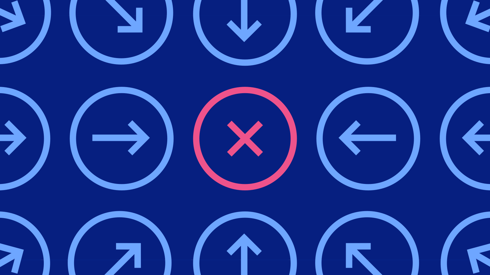

import FeatureTile from '../../src/components/FeatureTile';
import ClickableTile from '../../src/components/ClickableTile';

<FeatureTile
    href="/getting-started/designers"
    label="Start"
    title="Designing"
    margin="true">

</FeatureTile>
<FeatureTile
    href="/getting-started/developers"
    label="Start"
    title="Developing">

</FeatureTile>

### Other Resources

The Component Libraries give developers a collection of re-usable React components they can use for building websites and user interfaces. See a [complete list of resources.](/resources)

<Row className="tile--resource--no-margin tile--group">
<Column lg="4" md="4" bleedSm>
  <ClickableTile
    dark="true"
    title="Carbon Design Kit"
    href="https://github.com/ibm/carbon-design-kit"
    type="resource">

  </ClickableTile>
</Column>
<Column lg="4" md="4" offsetLg="0" bleedSm>
  <ClickableTile
    dark="true"
    title="Carbon Components"
    href="https://github.com/ibm/carbon-components"
    type="resource">

 
  </ClickableTile>
</Column>
<Column lg="4" md="4" bleedSm>
  <ClickableTile
    dark="true"
    title="Carbon Components React"
    href="https://github.com/ibm/carbon-components-react"
    type="resource">

 
  </ClickableTile>
</Column>
<Column lg="4" md="4" offsetLg="0" bleedSm>
  <ClickableTile
    dark="true"
    title="Carbon Components Angular"
    href="https://github.com/ibm/carbon-components-angular"
    type="resource">

 
  </ClickableTile>
</Column>
</Row>

### Latest articles

<Row>
<Column lg="4" md="4" bleedLeftMd>
<ClickableTile
    dark="true"
    type="article"
    title="What to expect in Carbon 10"
    author="Robin Cannon"
    date="December 10, 2018"
    href="https://medium.com/carbondesign/what-to-expect-in-carbon-10-5af1bd6e25f6"
    >

</ClickableTile>
</Column>
<Column lg="4" md="4" offsetLg="0" bleedLeftMd>
<ClickableTile
    dark="true"
    type="article"
    title="Up & Running with Carbon React in less than 5 minutes"
    author="Josh Black"
    date="October 19, 2018"
    href="https://medium.com/carbondesign/up-running-with-carbon-react-in-less-than-5-minutes-25d43cca059e"
    >

</ClickableTile>
</Column>
<Column lg="4" md="4" offsetLg="0" bleedLeftMd>
<ClickableTile
    dark="true"
    type="article"
    title="Hacktoberfest with Carbon"
    author="Josh Black"
    date="October 16, 2018"
    href="https://medium.com/carbondesign/hacktoberfest-with-carbon-95c48943f586"
    >

</ClickableTile>
</Column>
</Row>