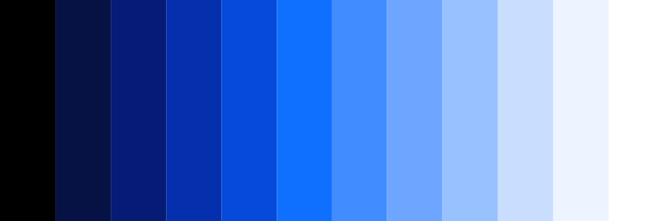

import FeatureTile from '../../src/components/FeatureTile';
import ClickableTile from '../../src/components/ClickableTile';

<FeatureTile
    href="/getting-started/designers"
    label="Start"
    title="Designing"
    margin="true">

</FeatureTile>
<FeatureTile
    href="/getting-started/developers"
    label="Start"
    title="Developing">

</FeatureTile>

### Other resources

The component libraries give developers a collection of reusable components for building websites and user interfaces. See a [complete list of resources.](/resources)

<Row className="tile--resource--no-margin tile--group">
<Column offsetLg="4" colLg="4" colMd="4" noGutterSm>
  <ClickableTile
    dark="true"
    title="Sketch libraries"
    href="/resources#sketch-libraries"
    type="resource">

  </ClickableTile>
</Column>
<Column colLg="4" colMd="4"  noGutterSm>
  <ClickableTile
    dark="true"
    title="Carbon Components"
    href="https://github.com/ibm/carbon-components"
    type="resource">

  </ClickableTile>
</Column>
<Column offsetLg="4" colLg="4" colMd="4" noGutterSm>
  <ClickableTile
    dark="true"
    title="Carbon Components React"
    href="https://github.com/ibm/carbon-components-react"
    type="resource">

  </ClickableTile>
</Column>
<Column colLg="4" colMd="4"  noGutterSm>
  <ClickableTile
    dark="true"
    title="Carbon Components Angular"
    href="https://github.com/ibm/carbon-components-angular"
    type="resource">

  </ClickableTile>
</Column>
<Column offsetLg="4" colLg="4" colMd="4" noGutterSm>
  <ClickableTile
    dark="true"
    title="Carbon Components Vue"
    href="https://github.com/carbon-design-system/carbon-components-vue"
    type="resource">

  </ClickableTile>
</Column>
</Row>

### Latest articles

<Row>
<Column offsetLg="4" colLg="4" colMd="4" noGutterMdLeft>
<ClickableTile
    dark="true"
    type="article"
    title="Essentials: Learn to build with Carbon"
    author="Matt Rosno"
    date="May 15, 2019"
    href="https://medium.com/carbondesign/essentials-learn-to-build-with-carbon-1d11ce05125f"
    >

</ClickableTile>
</Column>
<Column colLg="4" colMd="4"  noGutterMdLeft>
<ClickableTile
    dark="true"
    type="article"
    title="Carbon is moving to a monorepo"
    author="Josh Black"
    date="May 10, 2019"
    href="https://medium.com/carbondesign/carbon-is-moving-to-a-monorepo-c6bfcbe87de0"
    >

</ClickableTile>
</Column>
<Column colLg="4" colMd="4"  noGutterMdLeft>
<ClickableTile
    dark="true"
    type="article"
    title="Carbon dark themes are here"
    author="Lauren Rice"
    date="April 29, 2019"
    href="https://medium.com/carbondesign/carbon-dark-themes-are-here-a18910a0f910"
    >

</ClickableTile>
</Column>
</Row>