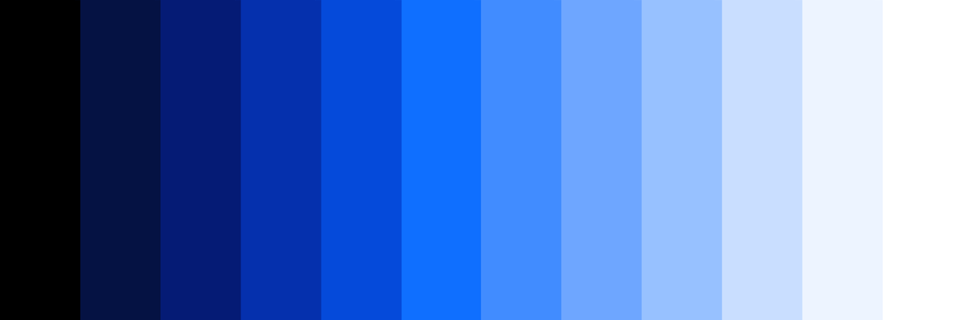

import FeatureTile from '../../src/components/FeatureTile';
import GridWrapper from '../../src/components/GridWrapper';
import ClickableTile from '../../src/components/ClickableTile';

<FeatureTile
    href="/getting-started/designers"
    label="Start"
    title="Designing"
    margin="true">

</FeatureTile>
<FeatureTile
    href="/getting-started/developers"
    label="Start"
    title="Developing">

</FeatureTile>

### Other Resources

The Component Libraries give developers a collection of re-usable React components they can use for building websites and user interfaces. See a [complete list of resources.](/resources)

<GridWrapper col_lg="8" flex="true" bleed="true">
  <ClickableTile
    dark="true"
    title="Carbon Design Kit"
    href="https://github.com/ibm/carbon-design-kit"
    type="resource">

  </ClickableTile>
  <ClickableTile
    dark="true"
    title="Carbon Components"
    href="https://github.com/ibm/carbon-components"
    type="resource">

 
  </ClickableTile>
  <ClickableTile
    dark="true"
    title="Carbon Components React"
    href="https://github.com/ibm/carbon-components-react"
    type="resource">

 
  </ClickableTile>
  <ClickableTile
    dark="true"
    title="Carbon Components Angular"
    href="https://github.com/ibm/carbon-components-angular"
    type="resource">

 
  </ClickableTile>
</GridWrapper>

### Latest Articles

