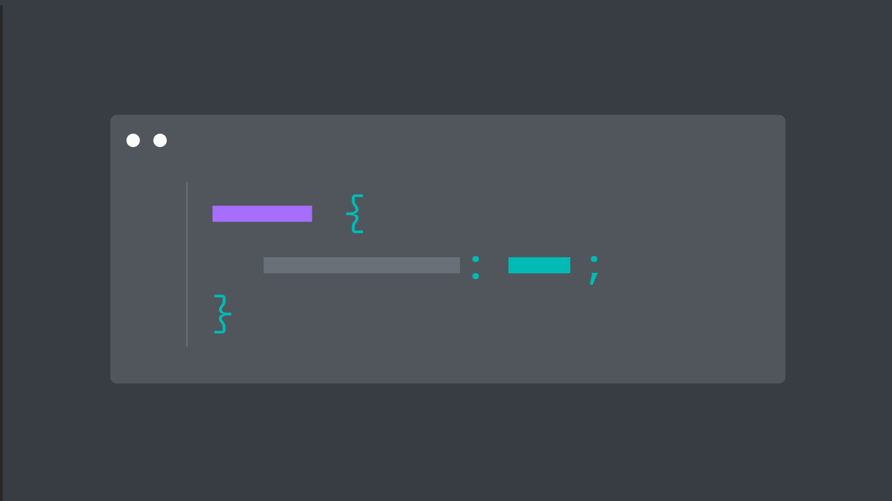

import FeatureTile from '../../src/components/FeatureTile';
import ClickableTile from '../../src/components/ClickableTile';

<FeatureTile
    href="/getting-started/designers"
    label="Start"
    title="Designing"
    margin="true">

</FeatureTile>
<FeatureTile
    href="/getting-started/developers"
    label="Start"
    title="Developing">

</FeatureTile>

### Other resources

The component libraries give developers a collection of reusable components for building websites and user interfaces. See a [complete list of resources.](/resources)

<Row className="tile--resource--no-margin tile--group">
<Column offsetLg="4" colLg="4" colMd="4" noGutterSm>
  <ClickableTile
    dark="true"
    title="Carbon Design Kit"
    href="https://sketch.cloud/s/JaVzz"
    type="resource">

  </ClickableTile>
</Column>
<Column colLg="4" colMd="4"  noGutterSm>
  <ClickableTile
    dark="true"
    title="Carbon Components"
    href="https://github.com/ibm/carbon-components"
    type="resource">

  </ClickableTile>
</Column>
<Column offsetLg="4" colLg="4" colMd="4" noGutterSm>
  <ClickableTile
    dark="true"
    title="Carbon Components React"
    href="https://github.com/ibm/carbon-components-react"
    type="resource">

  </ClickableTile>
</Column>
<Column colLg="4" colMd="4"  noGutterSm>
  <ClickableTile
    dark="true"
    title="Carbon Components Angular"
    href="https://github.com/ibm/carbon-components-angular"
    type="resource">

  </ClickableTile>
</Column>
<Column offsetLg="4" colLg="4" colMd="4" noGutterSm>
  <ClickableTile
    dark="true"
    title="Carbon Components Vue"
    href="https://github.com/carbon-design-system/carbon-components-vue"
    type="resource">

  </ClickableTile>
</Column>
</Row>

### Latest articles

<Row>
<Column offsetLg="4" colLg="4" colMd="4" noGutterMdLeft>
<ClickableTile
    dark="true"
    type="article"
    title="Carbon v10 Release"
    author="Robin Cannon"
    date="April 4, 2019"
    href="https://medium.com/carbondesign/carbon-v10-release-812eacb7da7f"
    >

</ClickableTile>
</Column>
<Column colLg="4" colMd="4"  noGutterMdLeft>
<ClickableTile
    dark="true"
    type="article"
    title="Design with Carbon: Update your Sketch symbols to V10"
    author="Anna Gonzales"
    date="April 2, 2019"
    href="https://medium.com/carbondesign/design-with-carbon-update-your-sketch-symbols-to-v10-ef3132ea2e97"
    >

</ClickableTile>
</Column>
<Column colLg="4" colMd="4"  noGutterMdLeft>
<ClickableTile
    dark="true"
    type="article"
    title="Minimal CSS with Carbon"
    author="Josh Black"
    date="April 1, 2019"
    href="https://medium.com/carbondesign/minimal-css-with-carbon-b0c089ccfa71"
    >

</ClickableTile>
</Column>
</Row>
