<ImageComponent cols="8">

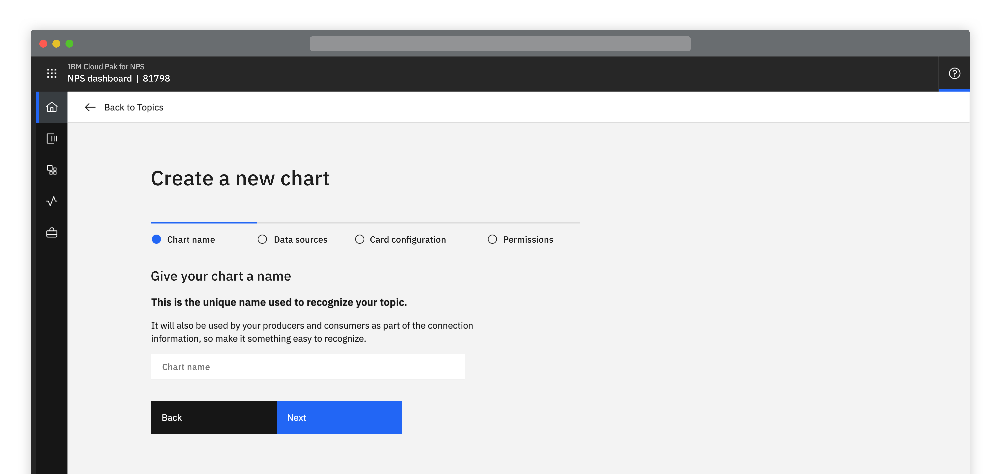

</ImageComponent>

*Patterns for Creating and Adding are identical, the difference is
the context in which they are used. It is important all 'Create' words are
replaced with 'Adding' and vice versa.*

#### Maintainers:

[Vikki Paterson](https://github.ibm.com/VICTORIA), [Arnaud Gillard](https://github.ibm.com/Arnaud-Gillard)

#### Status:

Experimental

## Options

<AnchorLinks small>

- [Full page](#full-page)
- [Side panel](#side-panel)
- [Modal](#modal)

</AnchorLinks>

## Full page

If there are more than 2 options involved in the creation process a full page modal / panel, overlaying the content where the creation was initiated should be used. 

The creation of resources can vary considerably in complexity and with this in mind there are a number of alternatives to consider when designing a creation flow.

<AnchorLinks small>

- [Advanced Option](#advanced-option)
- [Stepped creation](#stepped-creation)
- [Illustration or Image](#illustration-or-image)
- [Single scrollable page](#single-scrollable-page)
- [Button position](#button-position)

</AnchorLinks>

<ImageComponent cols="8">

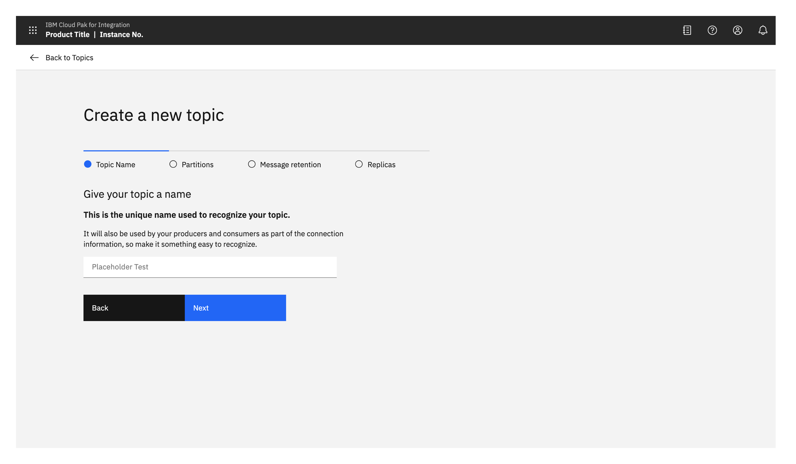

</ImageComponent>

### Advanced Option

Consider having an advanced option to avoid overwhelming users, while still allowing more advanced users to access everything.

In situations where there are large numbers of options consider, by default, having only a minimal set visible. Provide the ability for users to chose if they want to expose more advanced, optional, options. Users should always be able to get back out of advanced.

It is recommended that if the user switches to the advanced mode this is remembered and the next time they enter the same creation process it starts in advanced .

<ImageComponent cols="4">

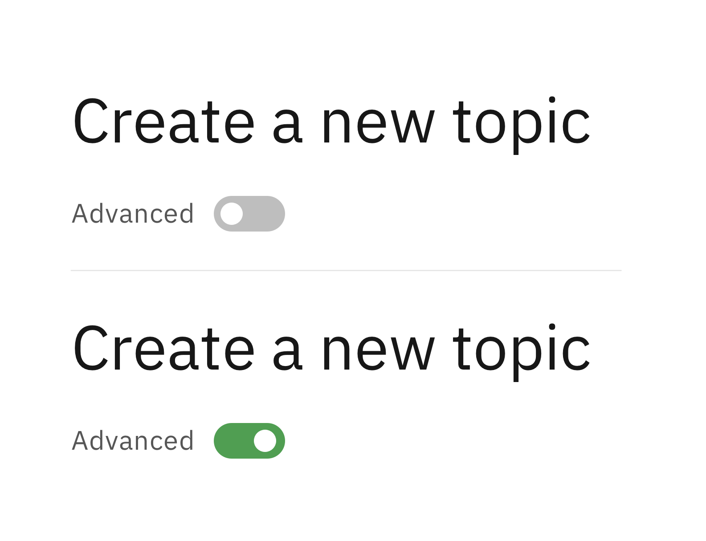

</ImageComponent>
 
<ImageComponent cols="8">

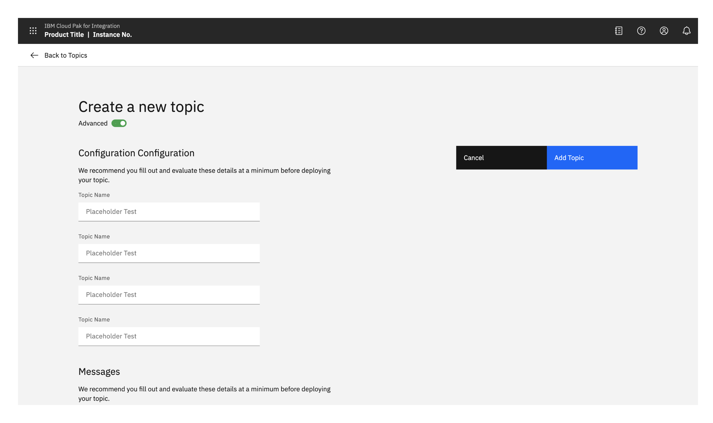

</ImageComponent>

Take into consideration that even if by default there are only a few options visible, you might want the ability to expose additional advanced options meaning more space would be required.

### Stepped creation
Consider whether breaking the process up into steps could help the user. 
If the creation task is complex or involves a large number of mandatory options, think about:
- Displaying related options together
- Grouping dependent options together
- Using the space to provide additional information / explanatory text for the option(s) 
- Using this as a simple stepped version with minimal options and extra guidance alongside the advanced option to expose all options 

<ImageComponent cols="8">

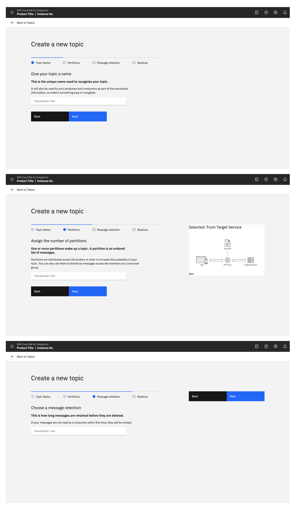

</ImageComponent>

### Illustration or Image
Consider if an illustration or image would help your users.

If you think an illustration or image could help explain the creation flow or task to your user or help with clarity then it should be placed in the right hand side of the creation panel.

<ImageComponent cols="8">

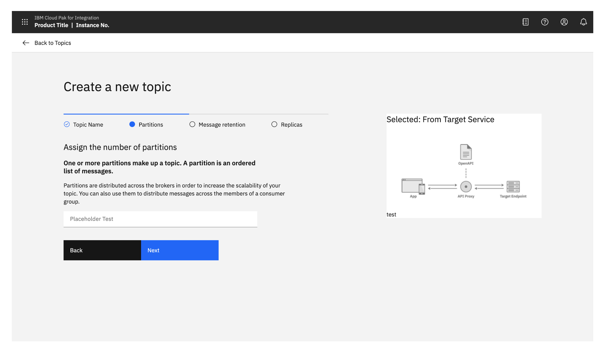

</ImageComponent>

### Single scrollable page
Having just a single scrollable page of options is not desirable however sometimes it might be necessary.  For example in the situations when the advanced option is used it will likely be a long scrollable list of options.

In this situation it is recommended that the buttons should be located in the top right and should stick upon scrolling, meaning they are always visible to the user and they don’t have to scroll to the bottom of the page to find them.
<ImageComponent cols="8">

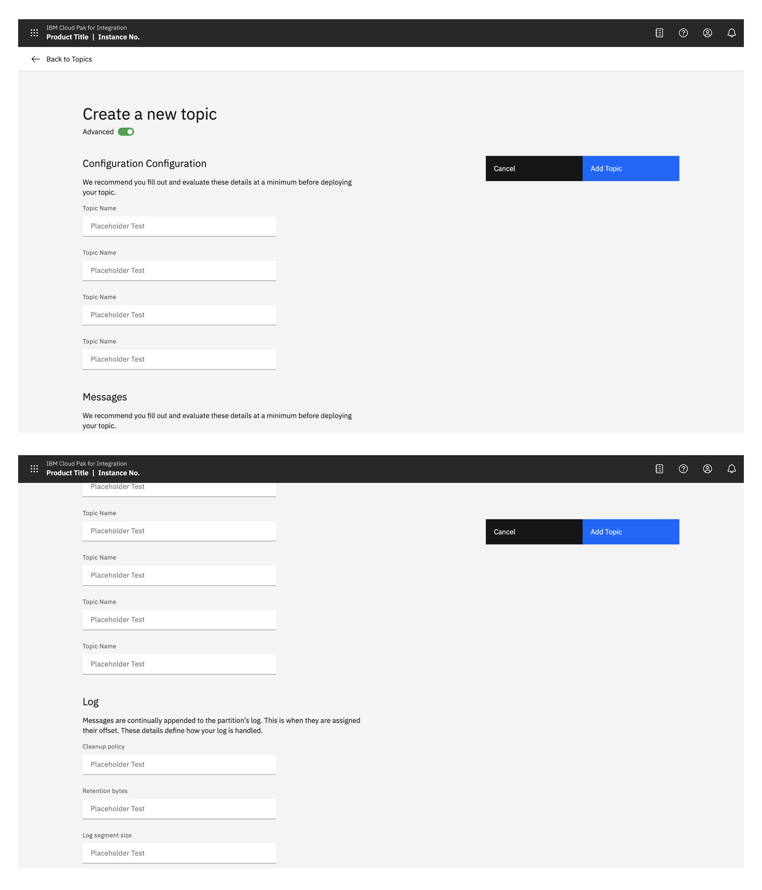

</ImageComponent>

### Button position

<ImageComponent cols="8">

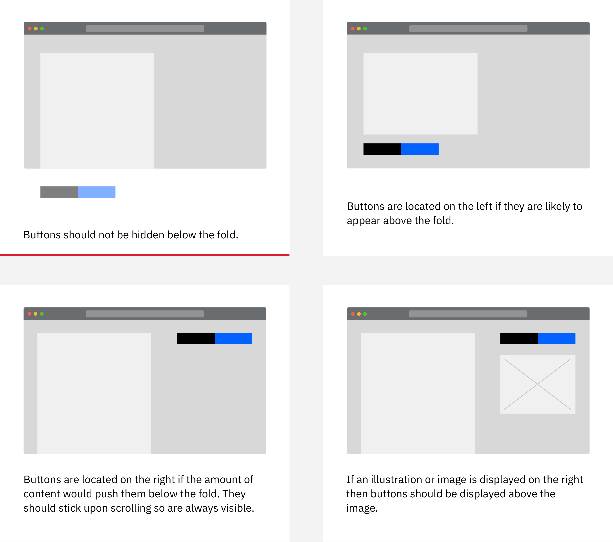

</ImageComponent>

## Side panel
There may be situations where using a full page modal seems too much space for the number of options or is felt to be removing the user too much from the context of where they were working. In these situations consider using a side panel to provide the flow. This could use either the slide in or slide over panels.

The content of the panel would be defined by the product as required, it could be a single list of options with Create and Cancel buttons at the bottom or you could chose to have stepped creation in it.

<ImageComponent cols="8">

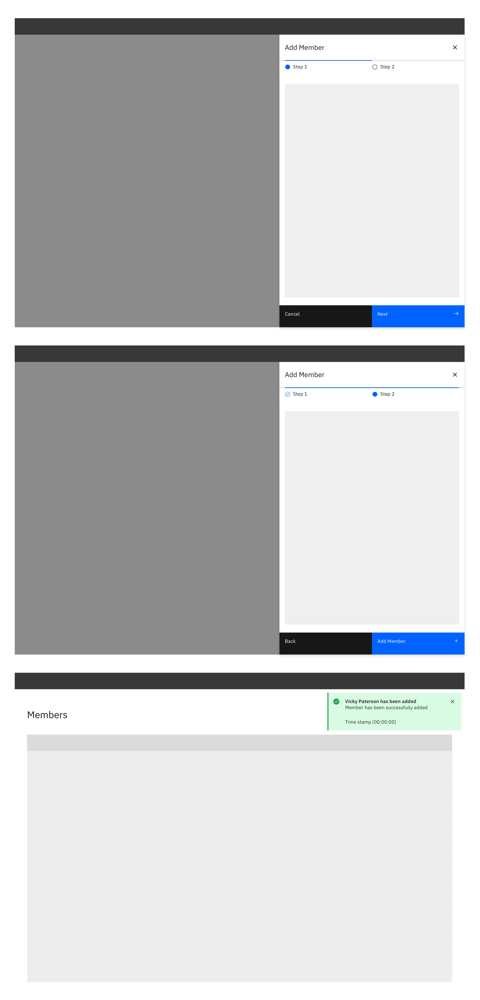

</ImageComponent>

<ImageComponent cols="8">

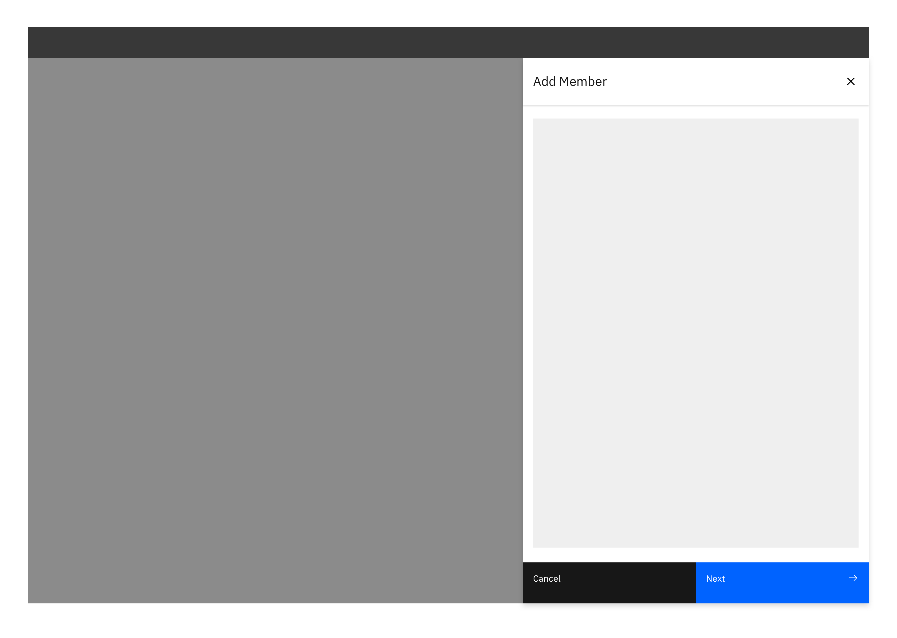

</ImageComponent>

## Modal
If there are only 1 or 2 options involved in the creation then use a small, standard modal, overlaying the content where the creation was initiated. Scrolling inside a small modal should be avoided. Before using a small modal, even if there are only a few options, consider whether it would be appropriate to use the additional real estate of the larger modal / panel overlay to provide additional guidance.

<ImageComponent cols="6">

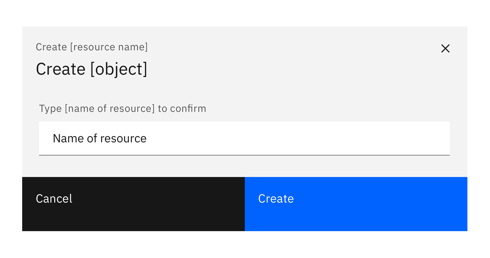

</ImageComponent>