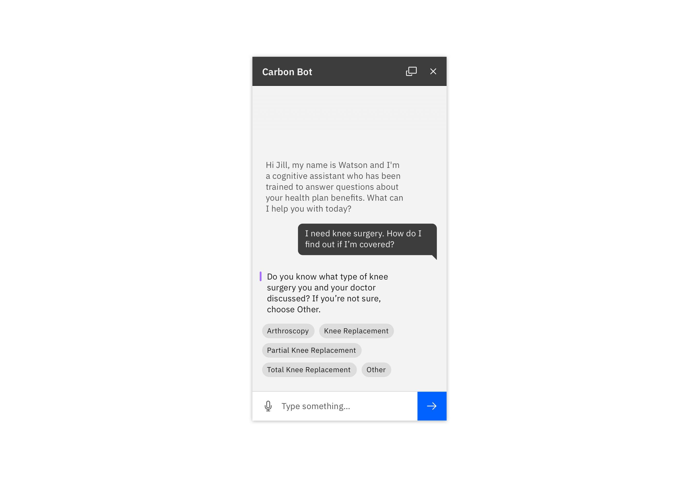

### Use a chatbot when an end user would benefit from requesting information on-demand with natural language. They should receive a useful and trustworthy response related to their question or task. 

<ImageComponent cols="8" caption="Shown in Gray 10 Theme">

 

</ImageComponent>

<AnchorLinks>

- [Common Use Cases](#common-use-cases)
- [User Needs](#user-needs)
- [Justifying a Chatbot](#justifying-using-a-chatbot)
- [Supported Chatbot Components](#supported-chatbot-components)

</AnchorLinks>

### Common Use Cases

Bots have become an increasingly popular way to solve common business problems across domains, including...

- **Providing in-context help and guidance** (e.g., scaling a company's FAQ or helping a user get started)
- **Triaging or setting priority of cases** by soliciting information from the user to decrease workload on humans (support tickets, patient symptom severity)
- **Performing common tasks or procedures** (e.g., pay a bill, transfer money, or assist with electing health benefits)
- **Using natural language to search for information** (e.g., find specific information like current balance, or dosing instructions for a medication)

### User Needs

#### A user may need...

- Access to help at any time
- An on demand, relevant answer to a question
- High-quality, consistent information about a product or service

#### Within a conversation, a user may need...

- To provide the bot with more context via structured responses
- To know what the bot understands, through reflection and confirming questions
- To identify the most recent and relevant message to improve understanding

### Why Use a Chabot?

Before using this approach, make sure that you have justified it as an appropriate solution by asking yourself these questions:

- What is the user's goal?
- How in-depth is the assistance the user will need?
- Is your domain something that is better off left in the hands of human assistance? 
- How is a bot superior to "x" (i.e. online documentation, contextual support, wizards, etc...)? 
- What kind of data sources or abilities can this bot leverage for your business and your users?

Don't use a chatbot when:
- A task could be accomplished more efficiently using a traditional user interface
- A process is very complex or could take a long time
- A real human is needed for sensitive or emotional topics.

See [IBM Design for Conversatonal AI](https://www.ibm.com/design/ai/conversation) for more information.

### Supported Chatbot Components

While conversational interfaces may contain many different kinds of components, Carbon currently offers these components out of the box to help get you up and running quickly. See the Usage tab for information on on how to use these components together.

| Component                                  | Status                 | 
| ------------------------------------------ | -----------------------|
| Chatbot Window                             | Design Available       |
| Chatbot Header                             | Design Available       |
| System Message                             | Design Available       |
| User Message                               | Design Available       |
| Structured Response                        | Design Available       |
| Chatbot Cards                              | Design Available       |
| Chatbot Text Input                         | Design Available       |

### Chatbot Add-on Library

<Row className="tile--resource--no-margin tile--group">
<Column offsetLg="4" colLg="4" colMd="4" noGutterSm>
  <ClickableTile
    title="Chatbot Add-on Library"
    href="sketch://#[@TODO - UPDATE]"
    type="resource">

  </ClickableTile>
</Column>
</Row>

### Maintainers

| Maintainer                                   Github Profile                   | 
| ------------------------------------------ | ---------------------------------|
| Vincent Snagg                              | https://github.com/vincentsnagg  |

