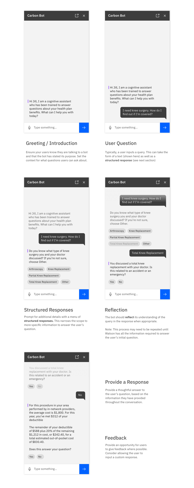

<AnchorLinks>

- [General Pattern Usage](#chatbot-pattern-usage)
- [Chatbot Variants](#chatbot-window-variants)
- [Launching the Bot](#)
- [Error Notifications](#)

</AnchorLinks>

### Component Specific Guidance

<AnchorLinks>

- [Chatbot Header](#chatbot-header)
- [Watson Message](#)
- [User Message](#)
- [Structured Reponses](#)
- [Chatbot Tile](#)
- [Chatbot Text Input](#)

</AnchorLinks>

### Chatbot Pattern Usage

The following flow shows a typical exchange between a user and a bot. This model can be used as a baseline to start building useful conversational experiences. See the Usage tab to see how to use the Chatbot Components to build these experiences.

<ImageComponent cols="8">

</ImageComponent>

_Please Note: It is important to customize the tone and messaging of your conversation to your product and its users._

### Chatbot Window Variants
The chatbot window comes in two variants, Regular and Tight. Use the Regular chatbot window variant when your chat interaction is the main experience and there are few to no other widgets on the screen. Consider pinning the chat window to one side of the screen if more space is required. Use the Tight variant and related symbols when embedding a chat interaction into a larger experience with significant amounts of existing content/information.

<ImageComponent cols="8">

</ImageComponent>

### Launching the Bot

### Chatbot Header
The header of the chatbot contains the title / label of the conversation and any actions your application supports (e.g., downloading, docking, or closing the chat window)

<ImageComponent cols="8">

</ImageComponent>

### Watson Message

### User Message

### Structured Responses

### Chatbot Tile

### Chatbot Text Input
