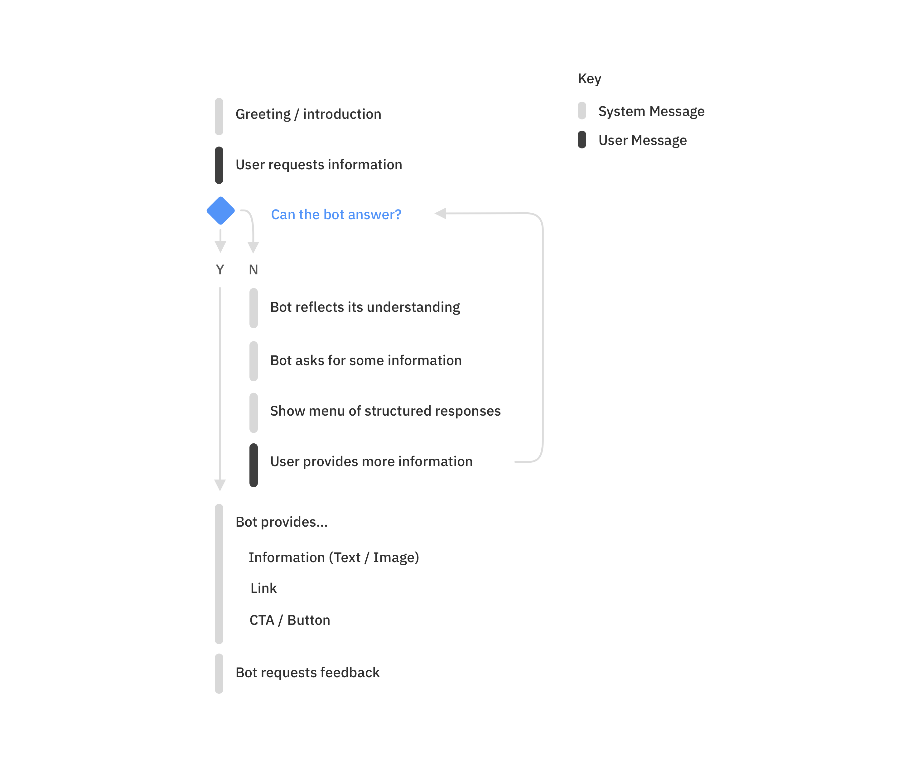
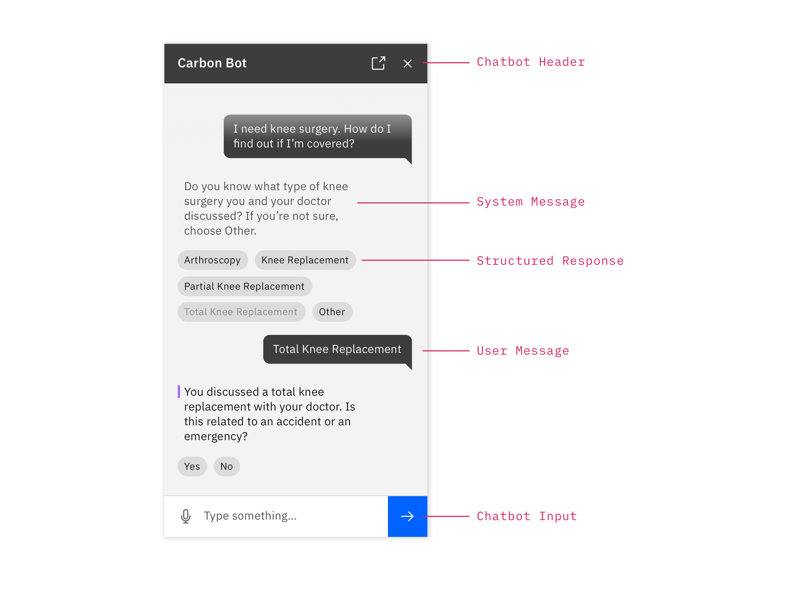
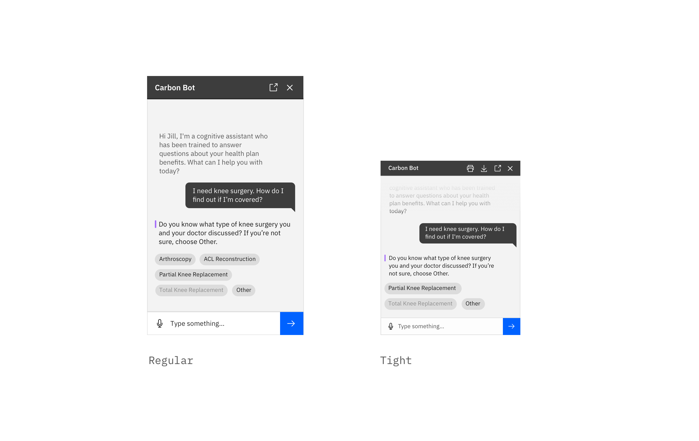

<AnchorLinks>

- [Anatomy of the Chatbot Pattern](#anatomy-of-the-chatbot-pattern)
- [Requesting Information from a Chatbot](#requesting-information-from-a-chatbot)
- [Best Practices](#best-practices)
- [Bot Variants](#chatbot-window-variants)
- [Launching the Bot](#)
- [Error Notifications](#)

</AnchorLinks>

### Anatomy of the Chatbot Pattern

The following diagram outlines the primary, non-experimental components within the chatbot pattern.

<ImageComponent cols="8">

</ImageComponent>

### Requesting Information from a Chatbot

The following flow shows a typical exchange between a user and a bot. This model can be used as a baseline to start building useful conversational experiences.

<ImageComponent cols="8">

</ImageComponent>

### Best Practices

Follow these minimum best practices to ensure a successful conversational experience. For more in-depth conversational principles, see the [Conversational Design Principles](content#conversation-design-principles-for-bots)

<ImageComponent cols="8">

</ImageComponent>

_Please Note: It is important to customize the tone and messaging of your conversation to your product and its users._

### Bot Variants
The chatbot window comes in two variants, Regular and Tight. Use the Regular chatbot window variant when your chat interaction is the main experience and there are few to no other widgets on the screen. Consider pinning the chat window to one side of the screen if more space is required. Use the Tight variant and related symbols when embedding a chat interaction into a larger experience with significant amounts of existing content/information.

<ImageComponent cols="8">

</ImageComponent>

### Launching the Bot (Experimental)

Bots should be launched from a clear floating trigger, at the bottom right of the screen, or from a button embedded within the UI. See Carbon Design Kit for the appropriate variants

<ImageComponent cols="8">

</ImageComponent>

### Error Notifications

Be sure to indicate to a user when their message has not been sent due to a connectivity or server problem. When in a connected state, remove the notification and any message error indicators.

<ImageComponent cols="8">

</ImageComponent>