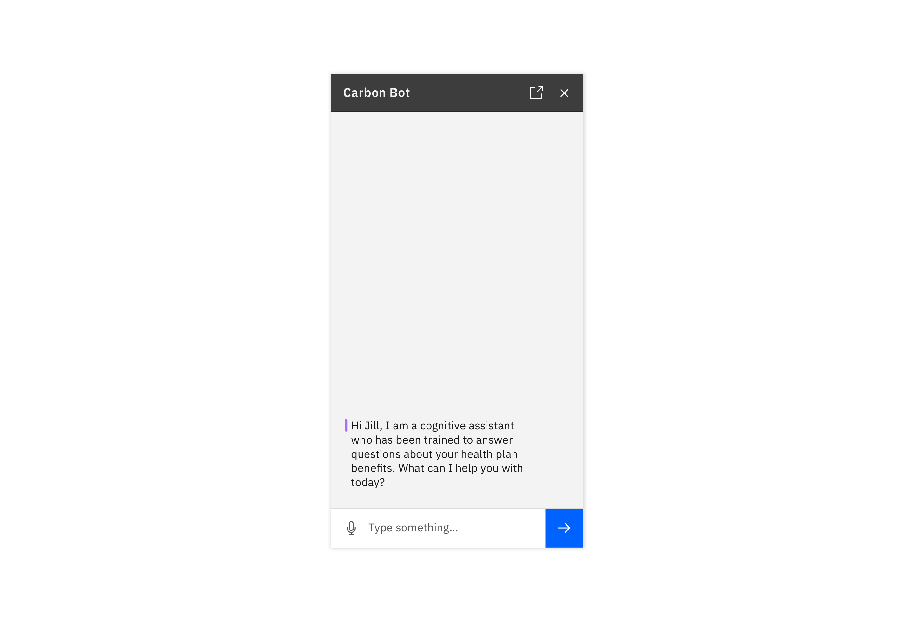
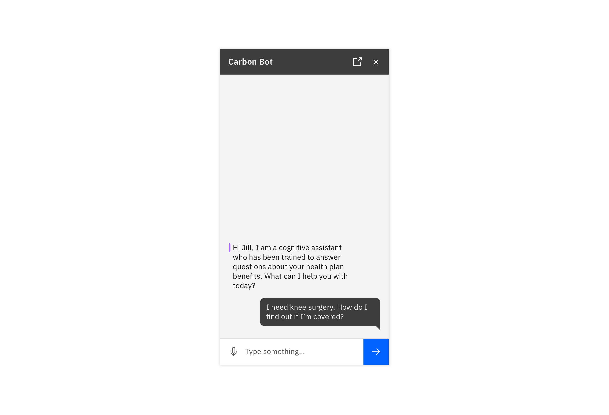
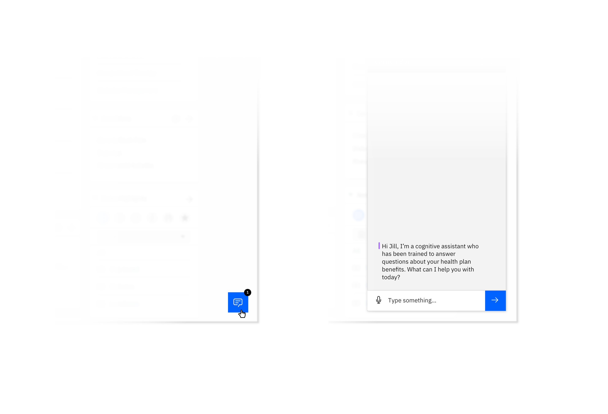

<AnchorLinks>

- [Anatomy](#anatomy)
- [Requesting information](#requesting-information)
- [Best practices](#best-practices)
- [Variants](#variants)
- [Launching a bot](#launching-a-bot-(experimental))
- [Error notifications](#error-notifications-(experimental))

</AnchorLinks>

## Anatomy

The following diagram outlines the primary components within the chatbot pattern.

<ImageComponent cols="8"> 

 

</ImageComponent>

### Chatbot elements

#### Chatbot header

The chatbot header contains the title of the chat and up to four action buttons that control the chatbot application. Typically, the “close” icon must always be included.

#### System message

System Messages represent what the bot has responded to the user with. Past messages will have a faded treatment, whereas active messages have an indicator applied (see below)

#### Structured response

Structured Responses present choices to the user that are easy for the bot to understand. When selected, a structured response will change its visual appearance and a user message will appear with the same content.

#### User message

A user message indicates what the user has input, via voice, text input, or structured response. 

#### Chatbot input

The Chatbot Input is comprised of a text input field, a button for voice input (optional) and an submit button

## Requesting information

The following flow shows a typical exchange between a user and a bot. This model can be used as a baseline to start building useful conversational experiences.

<ImageComponent cols="8">

</ImageComponent>

## Best practices

At a minimum, use these best practices to help ensure a successful conversational experience. For more in-depth conversational principles, see the [Conversational Design Principles](content#conversation-design-principles-for-bots)

#### Introduction

Ensure your users know they are talking to a bot and that the bot has stated its purpose. Set the context for what questions users can ask about.

<ImageComponent cols="8" caption="Chatbot greeting">

</ImageComponent>

#### User intent

Typically, a user inputs an intent, which can be request for information or a task for the bot to complete. This can take the form of a text (shown here) as well as a structured response (see next section)

<ImageComponent cols="8" caption="User intent">

</ImageComponent>

#### Structured responses

Prompt for additional details with a menu of structured responses. This narrows the scope to more specific information to answer the user’s question.

<ImageComponent cols="8" caption="Structured Responses">

</ImageComponent>

#### Reflection

The bot should reflect its understanding of the query in the response (when appropriate) to ensure understanding, or before performing a significant action. Note: This process of slotfilling may need to be repeated until the bot has all the information required to answer the user’s initial question.

<ImageComponent cols="8" caption="Reflection">

</ImageComponent>

#### Provide a response and request feedback

The bot should provide a thoughtful, informative response to the user’s intent, based on the information they have provided throughout the conversation. When appropriate, be sure to provide an opportunity for users to give feedback. Consider allowing the user to input a custom response. Provide an opportunity for users to give feedback where possible. Consider allowing the user to input a custom response.

<ImageComponent cols="8" caption="Provide a response and request feedback">

</ImageComponent>

## Variants
The chatbot window comes in two variants, regular and tight. Use the regular chatbot window variant when your chat interaction is the main experience and there are few to no other widgets on the screen. Consider pinning the chat window to one side of the screen if more space is required. Use the tight variant and related symbols when embedding a chat interaction into a larger experience with significant amounts of existing content/information.

<ImageComponent cols="8">

</ImageComponent>

## Launching a bot (Experimental)

Bots should be launched from a clear floating trigger at the bottom right of the screen, or from a button embedded within the UI. See Carbon Chatbot Add-on Design Kit for the appropriate variants.

<ImageComponent cols="8">  

  

</ImageComponent>

## Error notifications (Experimental)

Be sure to indicate to a user when their message has not been sent due to a connectivity or server problem. When in a connected state, temporarily show the success notification, and then remove it along with any message error indicators.

<ImageComponent cols="8">  

  

</ImageComponent>
