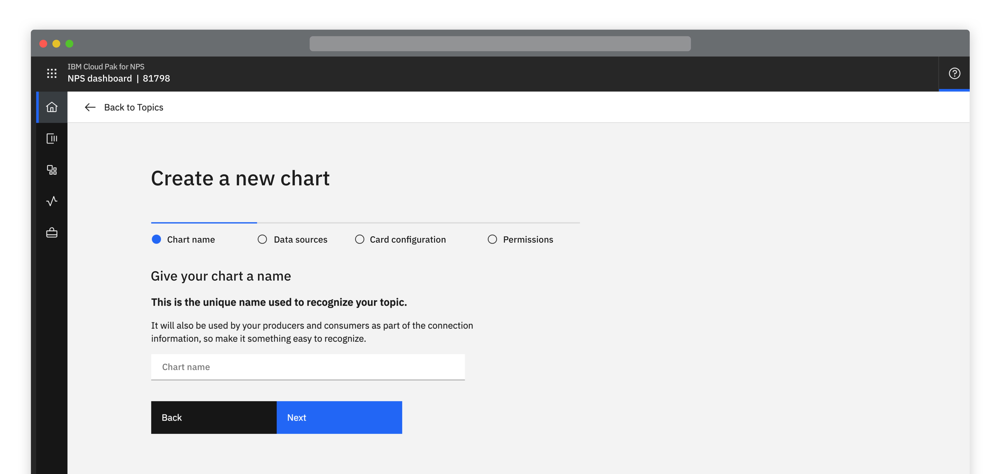
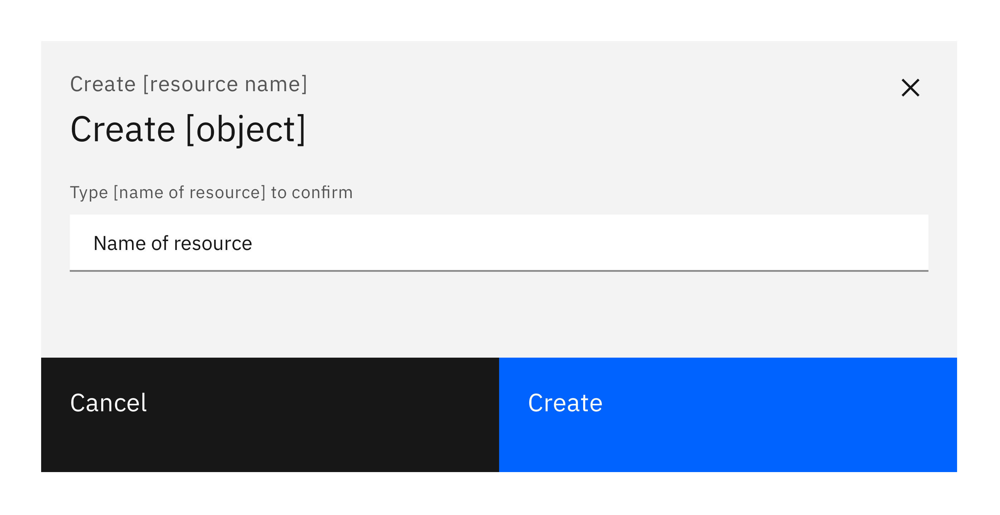
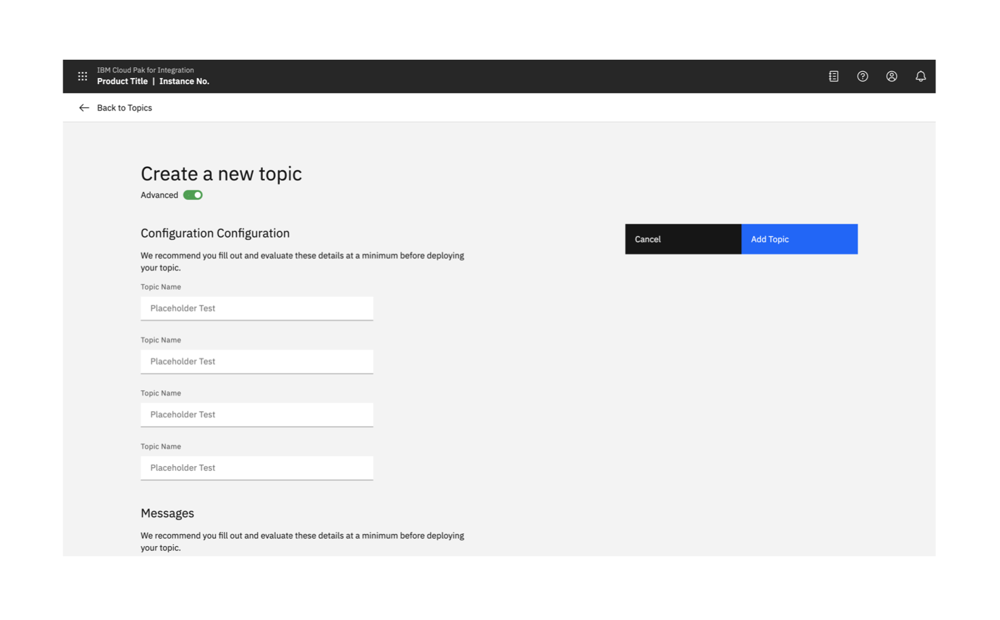
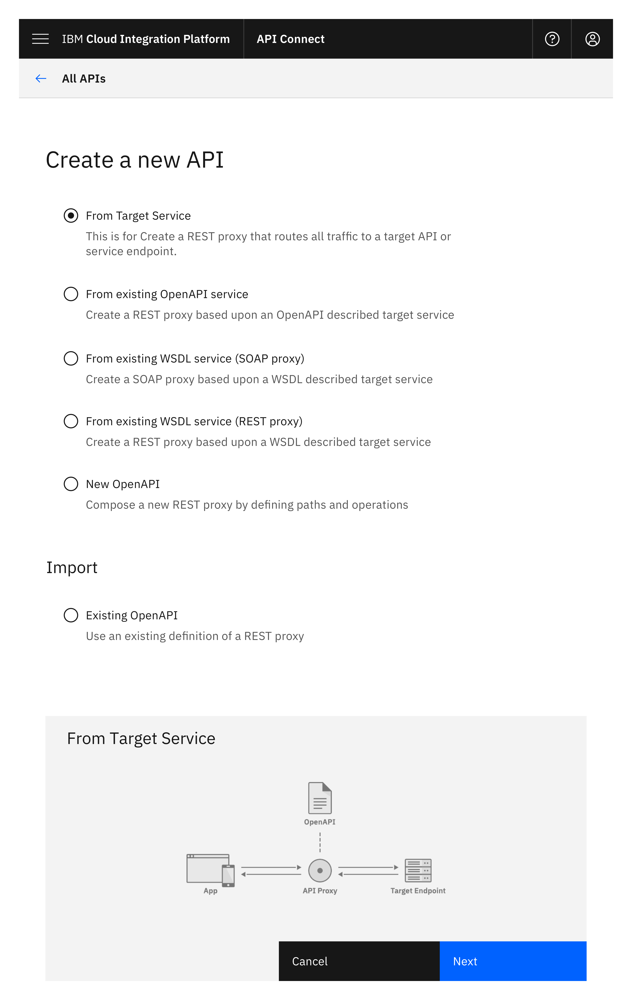
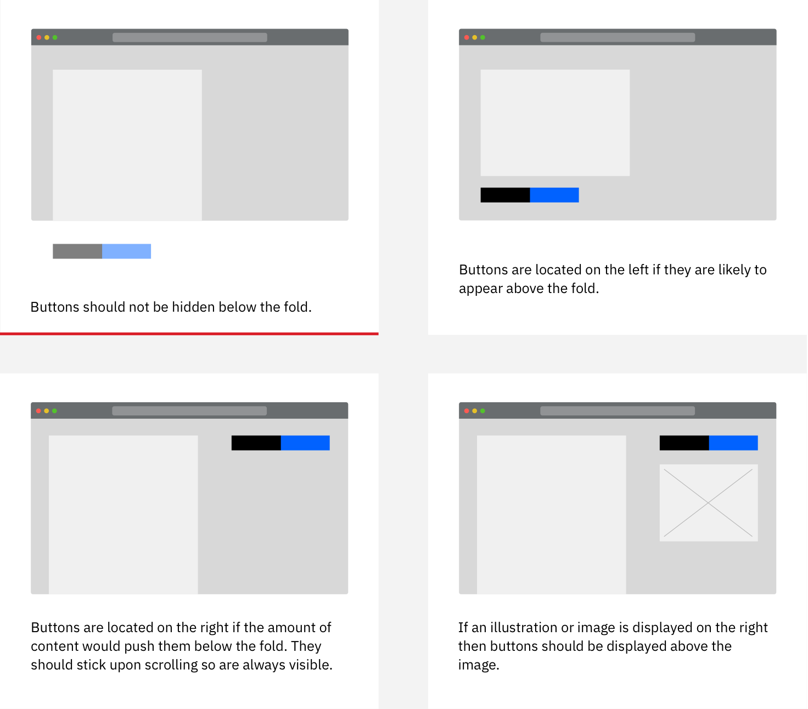
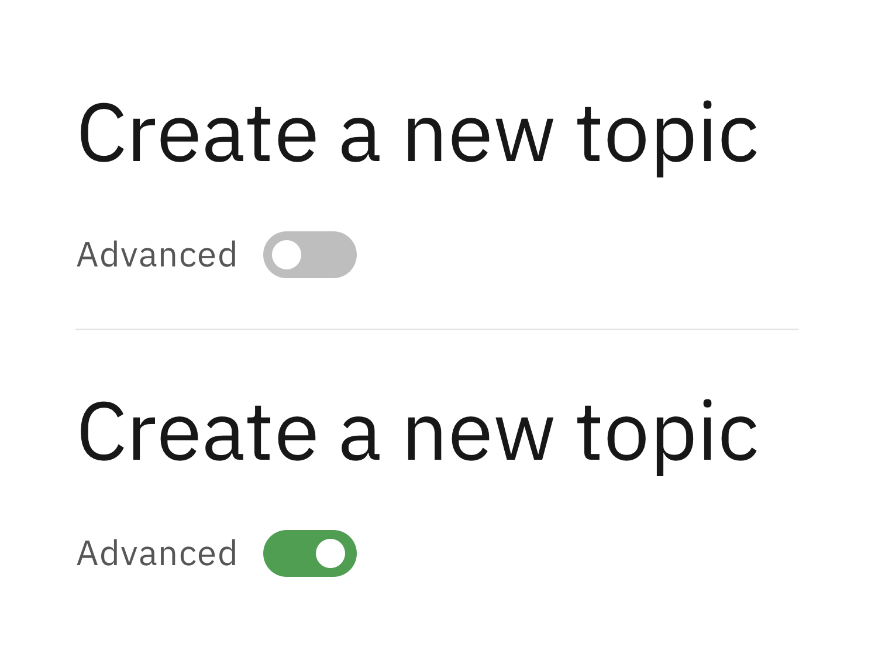
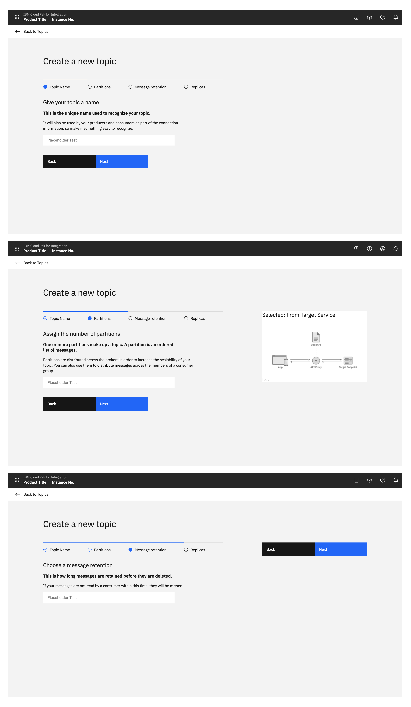
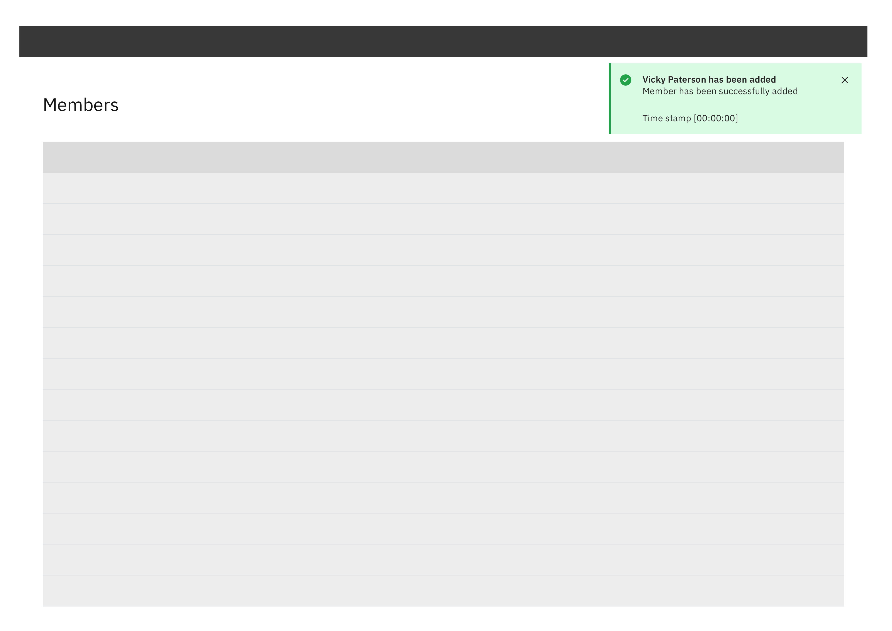

<ImageComponent cols="8">

</ImageComponent>

#### Status:

Experimental

## Options

<AnchorLinks>

- [Standard creation](#standard-creation)
- [Multistep creation](#multistep-creation)
- [confirmation](#confirmation)

</AnchorLinks>

## Standard Creation

<AnchorLinks small>

- [Modal](#modal)
- [Side panel](#side-panel)
- [Full screen](#full-screen)
- [Advanced option](#advanced-option)

</AnchorLinks>

### Modal
If there are only 1 or 2 options involved in the creation then use a small, standard modal, overlaying the content where the creation was initiated. Scrolling inside a small modal should be avoided. 

<ImageComponent cols="8">

</ImageComponent>

### Side panel
Consider using a side panel to take advantage of the added real-estate and keep the user in context of where they were working. You may choose to use either the slide in or slide over panels.

<ImageComponent cols="8">

</ImageComponent>

### Full page
Consider using this when wanting to take full advantage of the screen’s available real estate. 

<ImageComponent cols="8">

</ImageComponent>

<AnchorLinks small>

- [Button position](#button-position)
- [Image](#Image)
- [Advanced option](#advanced-option)

</AnchorLinks>

#### Button position
When the full page dialog is viewed in mobile, the buttons are positioned at the bottom of the screen.

<ImageComponent cols="8">

</ImageComponent>

On a larger screen it is recommended that buttons always remain visible to the user.

When there are enough fields going beyond the fold, buttons should be located in the top right and should stick upon scrolling. If only a couple are present, buttons can be placed on the left below the last field. 

<ImageComponent cols="8">

</ImageComponent>

#### Image
To include a supporting image, place it on the right hand side of the window. 

<ImageComponent cols="8">

</ImageComponent>

#### Advanced Option

The advanced option is used to avoid overwhelming users, whilst allowing advanced users to access everything. It can be applied to the side panel and the full page dialog.

Consider by default having a minimal set of options visible, with the ability for the user to chose if they want to expose more ‘advanced’ options.

If the user switches to advanced mode, ideally remember this for when they perform the same task.

<ImageComponent cols="4">

</ImageComponent>
 
<ImageComponent cols="8">

</ImageComponent>

## Multistep creation
If the creation task is complex, consider whether breaking the process up into steps could help the user.  Consider displaying related or dependant options together.

Multistep creation follows the same principles as Standard creation, with the addition of multisteps.

<AnchorLinks small>

- [Side panel](#side-panel)
- [Full page](#full-page)

</AnchorLinks>

### Side panel
<ImageComponent cols="8">

</ImageComponent>

### Full page
<ImageComponent cols="8">

</ImageComponent>

### Confirmation
When any create action is a success, a notification banner can be presented to visually confirm this. 

<ImageComponent cols="8">

</ImageComponent>

#### Maintainers:

[Vikki Paterson](https://github.ibm.com/VICTORIA), [Arnaud Gillard](https://github.ibm.com/Arnaud-Gillard)