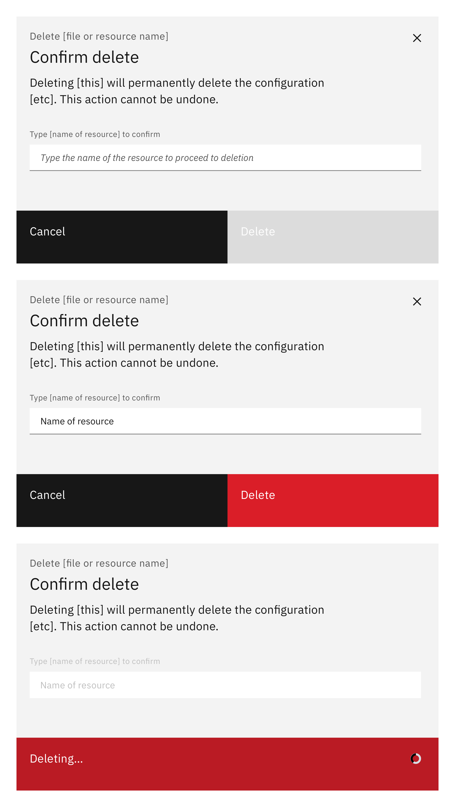
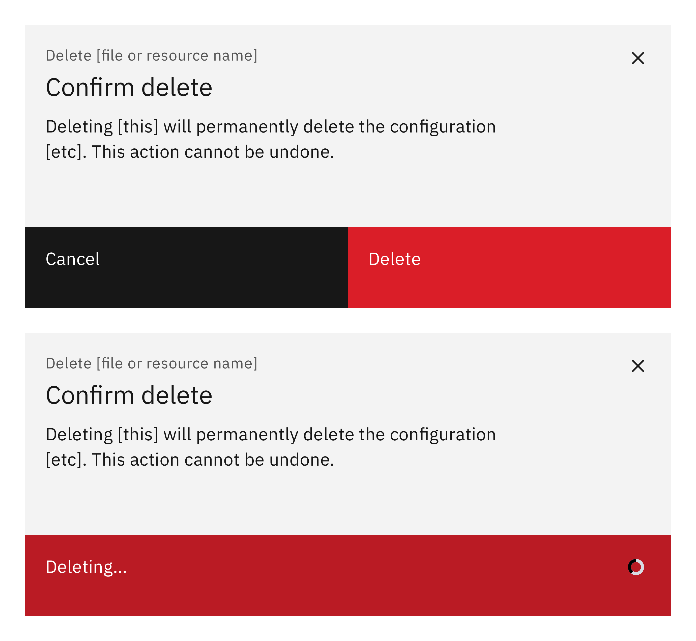

### Deleting is a destructive action. Due to the potential consequences of destructive actions, request user confirmation before deleting a resource or asset.

<AnchorLinks>

- [High impact](#high-impact)
- [Medium impact](#medium-impact)
- [Low impact](#low-impact)

</AnchorLinks>

<ImageComponent cols="8" caption="Example of a deletion pattern using a modal">

</ImageComponent>

#### Status:

Experimental

## High impact

A high-impact deletion cannot be reversed. The action would result in a significant loss for a user if done accidentally. For high-impact scenarios, a user should confirm the action by manually entering the name of the resource.

The text should tell the user the consequences of the deletion and that the action cannot be undone. Optionally, when the delete button is selected it changes to `Deleting…`.

<ImageComponent cols="6">

</ImageComponent>

You can choose to show a notification confirming deletion is completed. This is useful when the deletion of the resource takes more than a few moments.

<ImageComponent cols="6">

</ImageComponent>

## Medium impact

A medium-impact deletion is one that cannot be reversed, but would not be catastrophic if done accidentally. When deleting is medium-impact, a confirmation dialog should be presented to the user which displays:

* The name of the resource
* Consequences of the deletion
* The action cannot be undone.

Optionally, when the delete button is selected it changes to `Deleting…`.

<ImageComponent cols="6">

</ImageComponent>

You can choose to show a notification confirming deletion is completed. This is useful when the deletion of the resource takes more than a few moments.

<ImageComponent cols="6">

</ImageComponent>

## Low impact

Requiring the user to confirm deletion is generally recommended. However, in very low impact situations, such as when an ‘undo’ option is available, user confirmation may not be required.

#### Maintainers:

[Vikki Paterson](https://github.ibm.com/VICTORIA), [Arnaud Gillard](https://github.ibm.com/Arnaud-Gillard)
