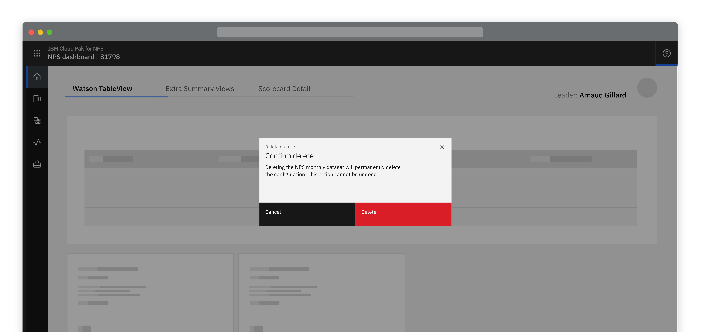
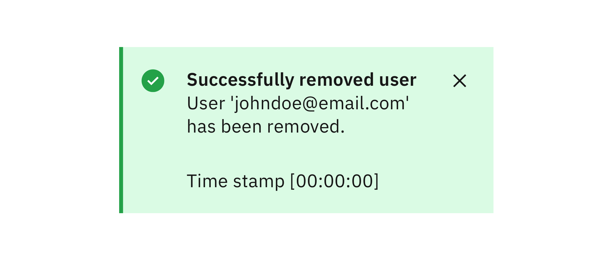
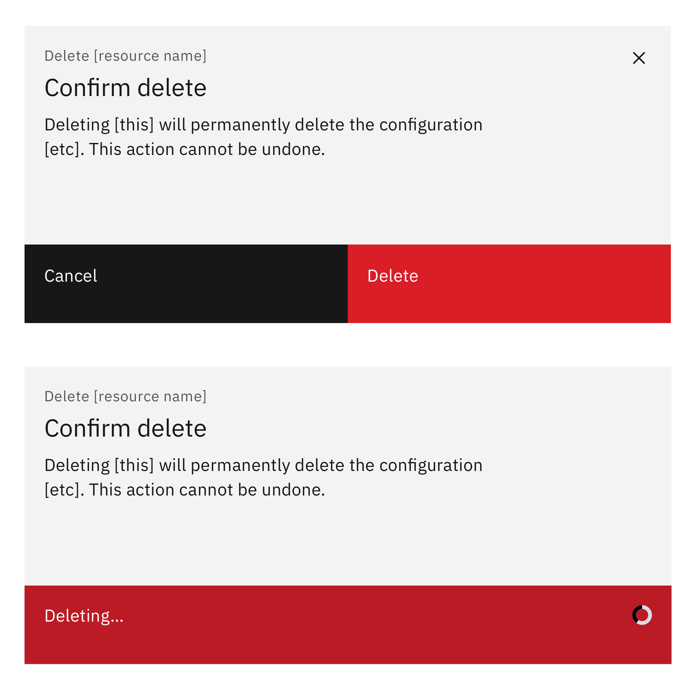

<ImageComponent cols="8">

</ImageComponent>

*Deleting is a destructive action that could have consequences therefore the recommended behaviour upon selecting to delete a resource or asset is to provide user confirmation.*

#### Status:

Experimental

## Options

<AnchorLinks>

- [High impact](#high-impact)
- [Medium impact](#medium-impact)
- [Low impact](#low-impact)

</AnchorLinks>

## High impact
When deleting is high impact, the user should confirm the action by manually entering the name of the resource.

- Text should tell the user the consequences of the deletion and that the action cannot be undone.

- Optionally, when the delete button is selected it changes to show ‘Deleting’.  

- Optionally, a notification shows when deletion is completed. This is useful when the deletion of the resource may take time.

<ImageComponent cols="6">

</ImageComponent>

<ImageComponent cols="6">

</ImageComponent>

## Medium impact
When deleting is medium impact, a confirmation dialog should be presented to the user which displays:
- The name of the resource

- Consequences of the deletion

- The action cannot be undone.

Optionally, when the delete button is selected it changes to show ‘Deleting’.  

Optionally, a notification shows when deletion is completed. This is useful when the deletion of the resource may take time.

<ImageComponent cols="6">

</ImageComponent>

<ImageComponent cols="6">

</ImageComponent>

## Low impact
Requiring the user to confirm deletion is generally recommeded. However in very low impact situations, such as when an ‘undo’ option is available, user confirmation may not be required.

#### Maintainers:

[Vikki Paterson](https://github.ibm.com/VICTORIA), [Arnaud Gillard](https://github.ibm.com/Arnaud-Gillard)