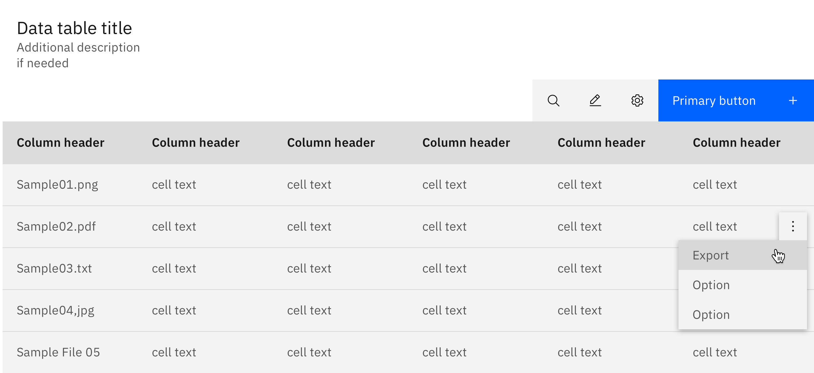
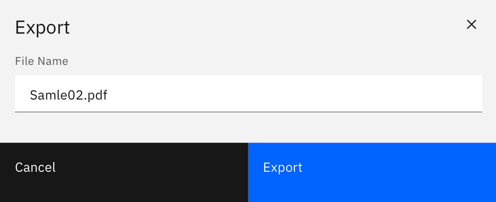
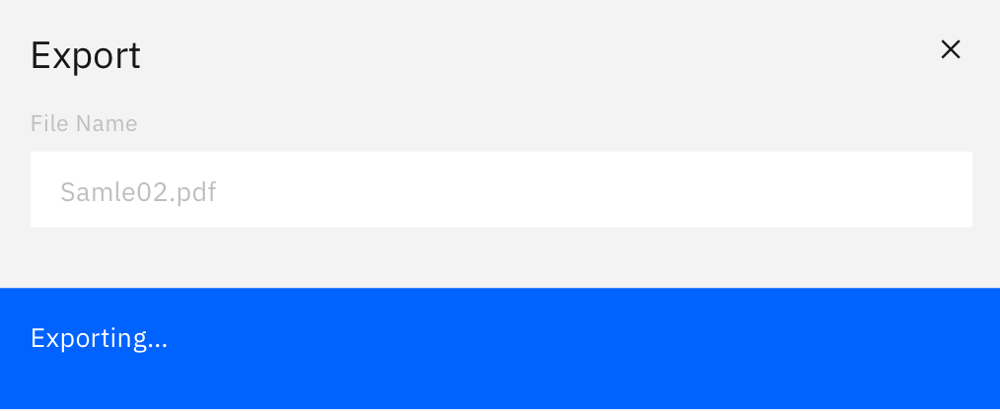

### Exporting saves data in a format or location different from your application

<AnchorLinks>

 - [Usage](#usage)
 - [Variants](#variants)
 - [Choose file location](#can-edit-the-name-of-the-file-and-choose-its-location)

</AnchorLinks>

<ImageComponent cols="12" caption="Export option in a modal">

</ImageComponent>

## Usage
 
#### Naming

Files should be given useful name by default, especially if you're not allowing the user to edit the file name.

#### File type

A file should be exported in a useful, industry-standard format. If you're giving a user the option to export multiple file types, be sure the types are compatible with your product.

#### Export location

Your user should typically select where a file should be exported. If you're exporting to a location dictated by your application, be sure the location is rational and consistent with other export windows.

## Variants

### Intuitive default name, no location choice, no format options

When the resource is given an intuitive name by default and there is no choice
of export location - export occurs on the click of the Export button and
nothing additional is displayed.

<ImageComponent cols="8" zoom="true">

</ImageComponent>

### Can edit the name of the file to be exported

Small modal

- Editable textbox pre-populated with the default name, allowing the user
  to modify it (if they wish)
- Format options should be displayed if there are any
- Primary CTA Export
- Secondary CTA Cancel

<ImageComponent cols="8" zoom="true">

</ImageComponent>
<ImageComponent cols="8" zoom="true">

</ImageComponent>

### Can edit the name of the file and choose it’s location

Small modal

- Editable textbox pre-populated with the default name, allowing the user
  to modify it (if they wish)
- Format options should be displayed if there are any
- Primary CTA Export
- Secondary CTA Cancel

<ImageComponent cols="6" zoom="true">

</ImageComponent>
<ImageComponent cols="6" zoom="true">

</ImageComponent>