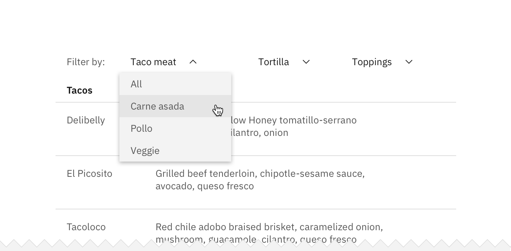
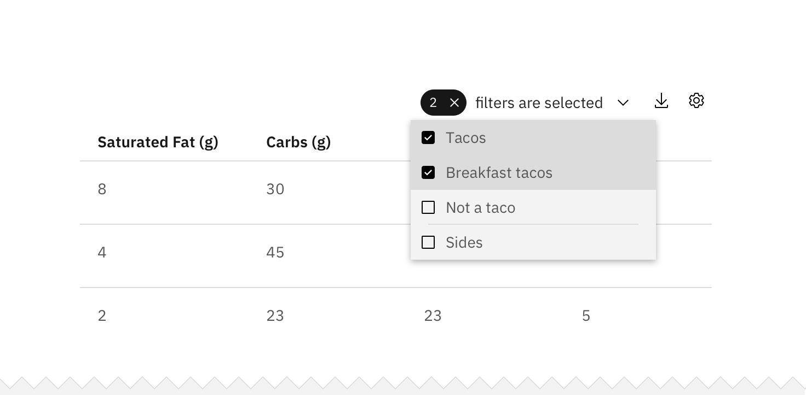
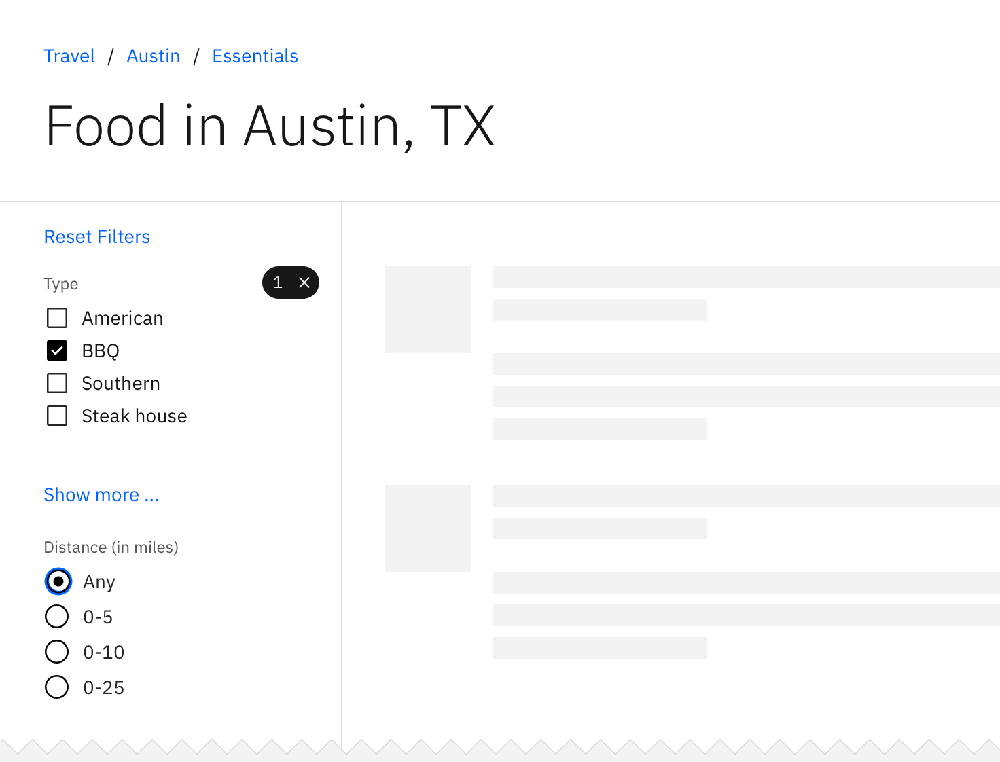
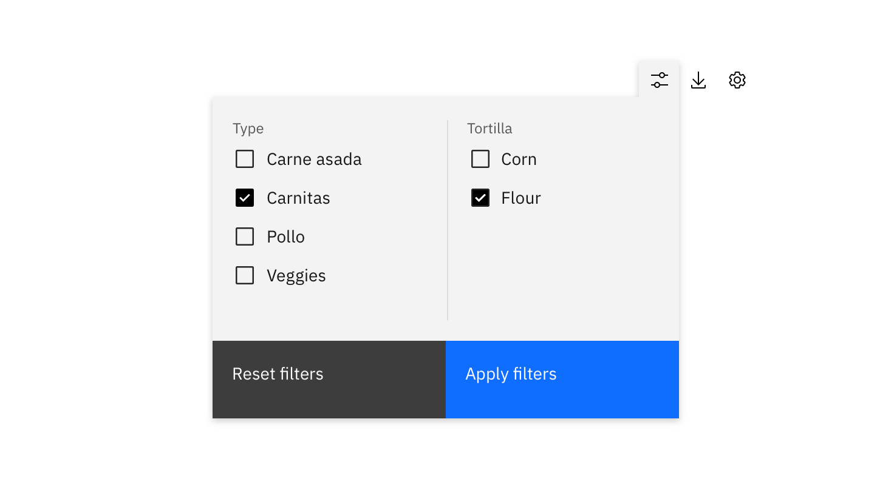
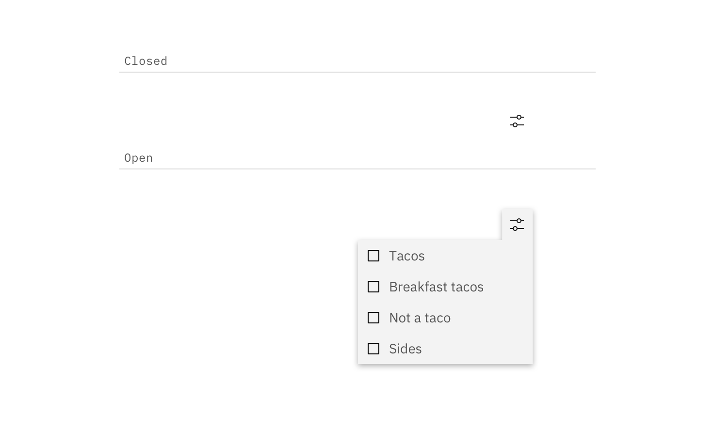
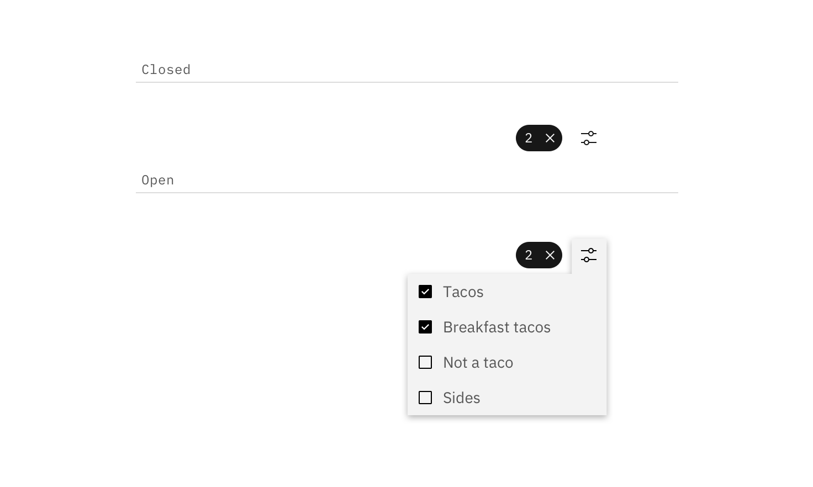

<anchor-links>
<ul>
    <li><a data-scroll href="#purpose">Purpose</a></li>
    <li><a data-scroll href="#selecting-filters">Selecting filters</a></li>
    <li><a data-scroll href="#triggering-filters">Triggering filters</a></li>
    <li><a data-scroll href="#filter-interaction">Filter interaction</a></li>
</ul>
</anchor-links>

## Purpose

_Filtering_ is the mechanism by which a user adds or removes data items from a displayed data set by turning on and off certain predefined attributes.

## Selecting filters

### Single selection

A _single-selection filter_ is employed when the user can pick **only one attribute** from a category to modify the data results. Under the hood, single selection behaves like a radio button. Ways in which a single selection filter can manifest include:

- Basic dropdown
- Inline dropdown
- Search
- Radio button set (either standalone or within a menu)

<image-component cols="8" caption="Single selection filter as an inline dropdown">

</image-component>

### Multi-selection

A _multi-selection filter_ is employed when the user has the option to pick **more than one attribute** from a category to modify the data results. Under the hood, multi-selections behave like _checkboxes_. Ways in which a single selection filter can manifest include:

- Multi-select dropdown
- Inline multi-select dropdown
- Search with tags
- Checkbox set (either standalone or within a menu)

<image-component cols="8" caption="Multi-selection filter set in a menu">

</image-component>

### Multiple categories

A _category_ is a set of filter items within the same topic. For example, "size" is the category and `small`, `medium`, `large`, and `extra large` are the filter choices. Multiple filter categories may be applied to the same data set. For example, the user can filter by size as well as color and price range.

Multiple category selection is most commonly manifested in either a vertical list on the left side of the page or within a horizontal drawer at the top of the data set. Multiple categories should never be put within a menu or dropdown.

<image-component cols="8" caption="Multiple filter categories in a left panel">

</image-component>

## Triggering filters

### Batch filter

A _batch filter_ is employed when all filters are applied together at the end of the selection process. The data set only refreshes once. The trigger is most commonly an "Apply filter" button.

The batch filter works best when the user is making several filtering selections across different categories that may take a longer time to mentally process. Batch filtering is also a good solution for slow data-return speeds. This can prevent the user from having to wait for the data to load after every selection.

<image-component cols="8" caption="Batch filter example in a drawer">

</image-component>

### Interactive filter

An _interactive filter_ returns results after each individual selection is made. The trigger is the individual selection and the filter manipulates the data in real time. This is a good solution for when the user is only selecting from one category or the user is expected to only make one filter selection.

## Filter interaction

Each filter interaction should contain the following patterns and states:

- Default start state
- Unselected and selected state
- Filter applied state
- Clear filter(s) action

### Starting states

Filters within each category should start either as _all unselected_ or _all selected_. When using multiple categories, the start state can vary from category to category. If the user wants only one or a few criteria to be excluded from the results, then all filters should be selected at the start. Vice-versa, if the user wants to see only results related to one particular criteria, then all filters should start as unselected.

### Filter applied

If the filter(s) can be hidden in either a drawer, dropdown, or menu, then there should be an indicator visible on the closed filter state that informs the user that filters have been applied. At a minimum, the indicator should include the number of filters applied and have the option to clear filters without re-opening the filter container.

<image-component cols="8" caption="Filters not applied">

</image-component>

<image-component cols="8" caption="Filters applied">

</image-component>

### Resetting filters

Each category should have a way to clear all applied filters at once without having to interact with each individual item. Clearing filters returns the filters to their original default starting state.

If multiple categories have been applied to the same data set then there should be a way to dismiss all filters across all categories at once.

<image-component cols="8" caption="Filter reset example for all categories and a single category">

</image-component>
