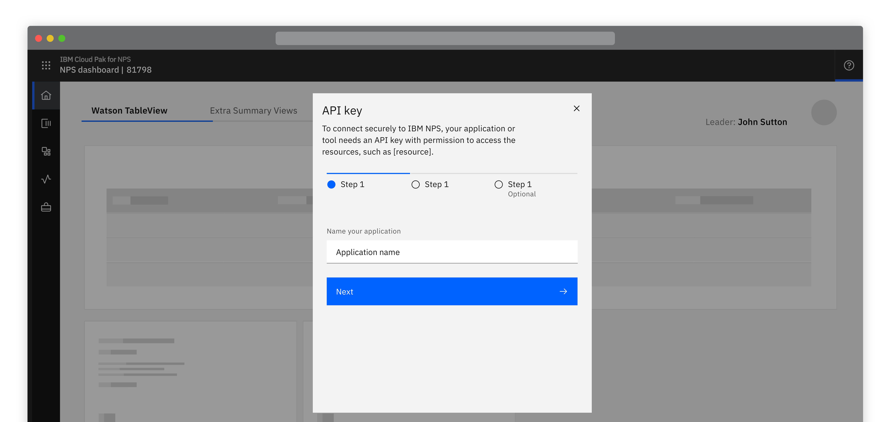
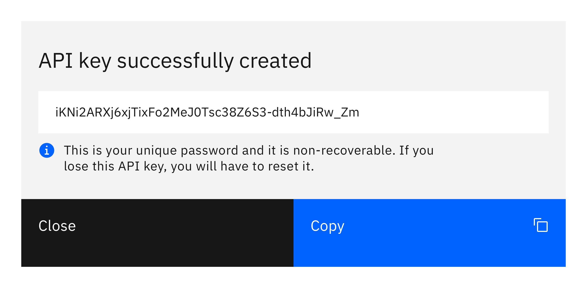
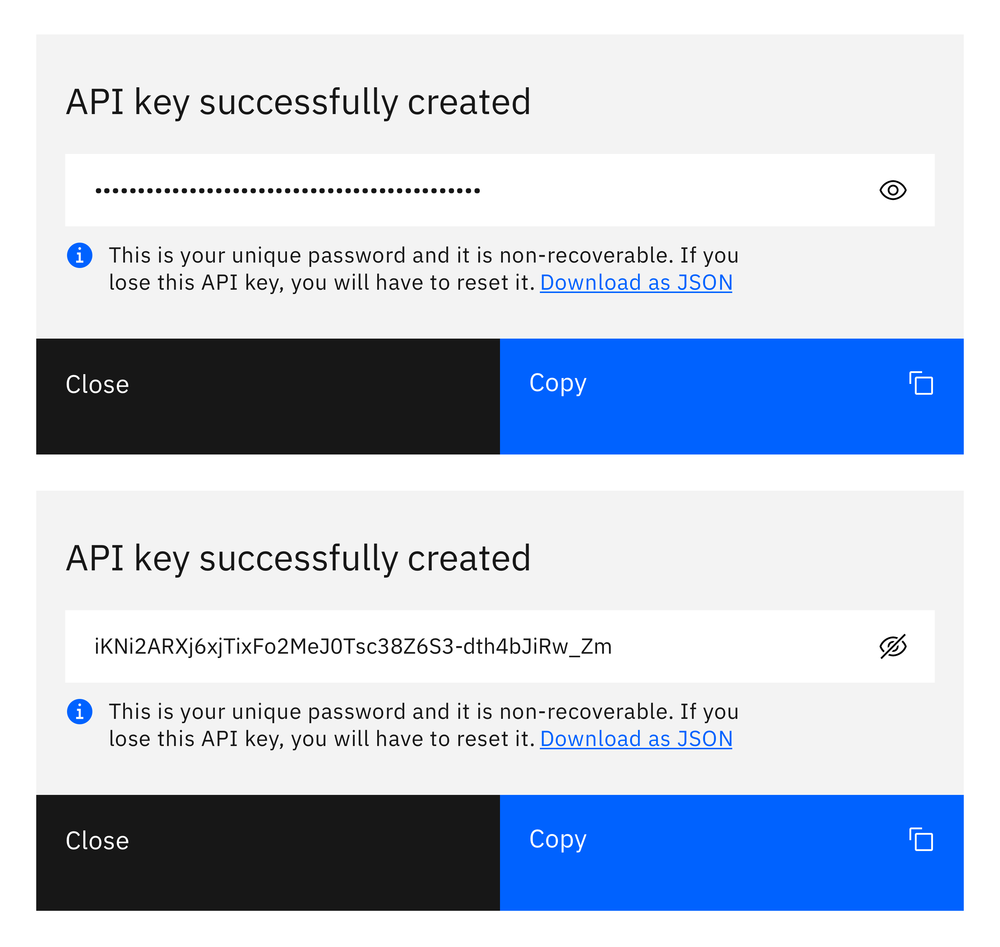
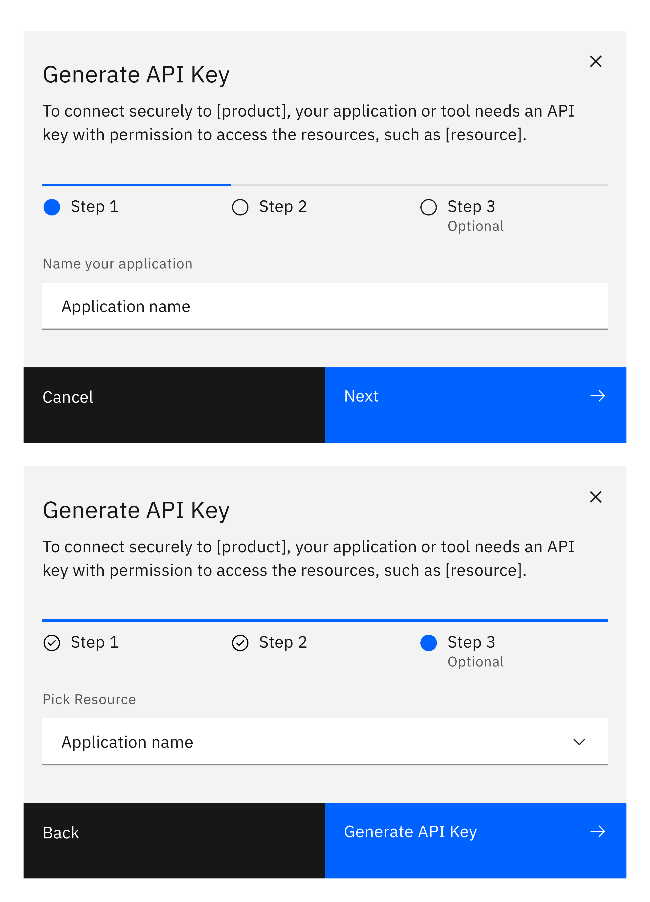

<ImageComponent cols="8">

</ImageComponent>

#### Status:

Experimental

## Options

<AnchorLinks>

- [Generic access](#generic-access)
- [Assigning specific access control permissions](#assigning-specific-access-control-permissions)

</AnchorLinks>

## Generic access
Users click a primary ‘Generate’ button. Consider displaying a ‘Generating’ state if the API key takes time to generate. 

<ImageComponent cols="6">

</ImageComponent>

Once the API key is generated it displays in a modal.

<ImageComponent cols="6">

</ImageComponent>

Optionally: 

- Allow users to toggle the visibility of the key

- Provide a secondary link to download the key

<ImageComponent cols="6">

</ImageComponent>

## Assigning specific access control permissions
This follows the same principles as Generic access, with the addition of one or more steps for the user to assign specific access control and permissions, before the API key is generated.

<ImageComponent cols="6">

</ImageComponent>

#### Maintainers:

[Vikki Paterson](https://github.ibm.com/VICTORIA), [Arnaud Gillard](https://github.ibm.com/Arnaud-Gillard)