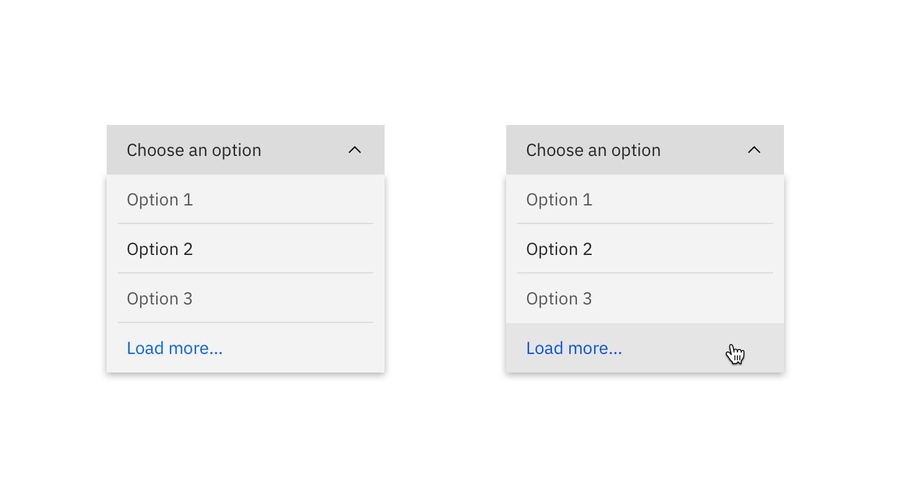

<page-intro>**Loading** is applied when additional information takes an extended amount of time to process and appear on screen. Skeleton states and the _loading_ component are two interactions that communicate to users that data is currently loading and the screen is not frozen.</page-intro>

## Skeleton states

_Skeleton states_ are simplified versions of Carbon components used on an initial page load to indicate that the information on the page has not entirely loaded yet. They should only appear for 1-3 seconds, disappearing once the actual content loads in.

A Carbon skeleton state is shown as a stripped down, bare bones version of a component, using a `field-01` rectangular block for text. Motion is used in a skeleton state to convey that the page is not stuck loading but rather that data is still being pulled in.


_Example of a text skeleton state in a data table._

### Usage

Skeleton states are not meant to represent every component on a page, but rather to illustrate the overall architecture of the page while it's loading. Typically, components that should have skeleton states are container-based components (_tiles_, _structured list_, etc.), data-based components (_data tables_, _cards_, etc.), and data-based text. Action components (_button_, _input fields_, _checkboxes_, _toggle_, etc.) do not need to have a skeleton state in most use cases, as they are not pulling in data and do not need additional time to load in.

There are several components that should **never** be represented by a skeleton state since the data for these items should already be loaded in by the time a user interacts with them. These include:

- toast notification
- overflow menu
- dropdown items
- modal (elements inside a modal may have a skeleton state, however the modal itself should not be skeletonized)
- small and large loader (used for other loading cases but not skeleton states)

### Progressive loading

When utilizing skeleton states, the order in which components, data, and content load in needs to be planned and designed for using the _progressive loading_ technique. Progressive loading is when content loads in batches. The first batch to load should be the most simplified view of the page, followed by the secondary and tertiary batches, with each batch adding more page detail until the entire viewport has been loaded. The primary batch should illustrate a page's structural layout (the skeleton state versions of the container-based components), data-based text (the skeleton state version of text) and non-data text. Secondary and tertiary batches can include images, content below the fold, interactive (action-based) components, and/or data-based text. Remember that not all items need a skeleton state, but instead can be expressed as negative or white space until they load in. For example, a 600 x 600px image could be shown as a 600 x 600px area of white space until the secondary or tertiary batch when the full image loads in.


_Example of a dashboard using skeleton states to demonstrate progressive loading_

### Code

The skeleton state for _most_ components can be displayed simply by adding a modifier class of `bx--skeleton` to the component while data is loading and then removing the class after it has loaded in. You will have to create your own custom JavaScript to implement this based on your environment.

```html
<button class="bx--btn bx--btn--primary bx--skeleton"></button>
<button class="bx--btn bx--btn--primary">Button loaded</button>
```

If you are using our [React library](http://react.carbondesignsystem.com/) there are separate skeleton state components available to display while data is loading. View an [example](https://codesandbox.io/s/wq264y43k8) of this for React.

```javascript
const DataComponent = ({ loading, data }) => {
  if (loading) {
    return <CarbonComponent.skeleton />;
  }
  return <CarbonComponent field1={data.field1} />;
};
```

| Component          | Vanilla                                   | React                                     |
| ------------------ | ----------------------------------------- | ----------------------------------------- |
| Accordion          |                                           |  |
| Breadcrumb         |  |  |
| Button             |  |  |
| Checkbox           |                                           |  |
| Code Snippet       |                                           |  |
| Data Table         |                                           |  |
| Date Picker        |                                           |  |
| Dropdown           |  |  |
| Icon               |  |  |
| Label              |  |  |
| Number Input       |  |  |
| Pagination         |                                           |  |
| Progress Indicator |  |  |
| Radio Button       |                                           |  |
| Search             |                                           |  |
| Skeleton Text      |  |  |
| Slider             |  |  |
| Small Toggle       |  |  |
| Structured List    |                                           |  |
| Tabs               |  |  |
| Tag                |  |  |
| Text Area          |                                           |  |
| Text Input         |                                           |  |
| Toggle             |  |  |

## Loading components

A _loading_ component is a rotating shape indicating the application is processing and informing users that the system has reacted to an action taken.

Use cases include:

- When data processing takes more than a few seconds but no longer than one minute to load in
- User-inputted data is being saved or submitted

### Loading (large)

The [_loading_](/components/loading/code) component should be used when the entire page is processing; for example, when data is being submitted or saved by the user.


_Example of a large loader in context._

### Inline loading

The [_inline loading_](/components/inline-loading/code) component is used when a single component is processing and appears inline to the relative component. For example, when a user tries to restart a stopped application, an _inline loading_ component indicates the system is processing the restart request.


_Example of inline loader in context._

## 'Load more' button

A 'Load more' button may be used to extend a list where there are a large number of options (25 or more) that the user can choose from. It can also be used in cases where the list of options is populated via a database. Using 'Load more' allows the data to load in progressive batches.


_Example of 'Load more' button in context._

<!--## Progress Loader

A Progress Loader is used to represent a specific load time for an item. This amount of time, whatever unit, can be measured based on actual events.

Use cases for a Progress Loader include:

- A file being uploaded (0 to 100%)
- A new item being provisioned (0 to 10 minutes)

*Example gif of file being uploaded (Is this the best use case?*-->
