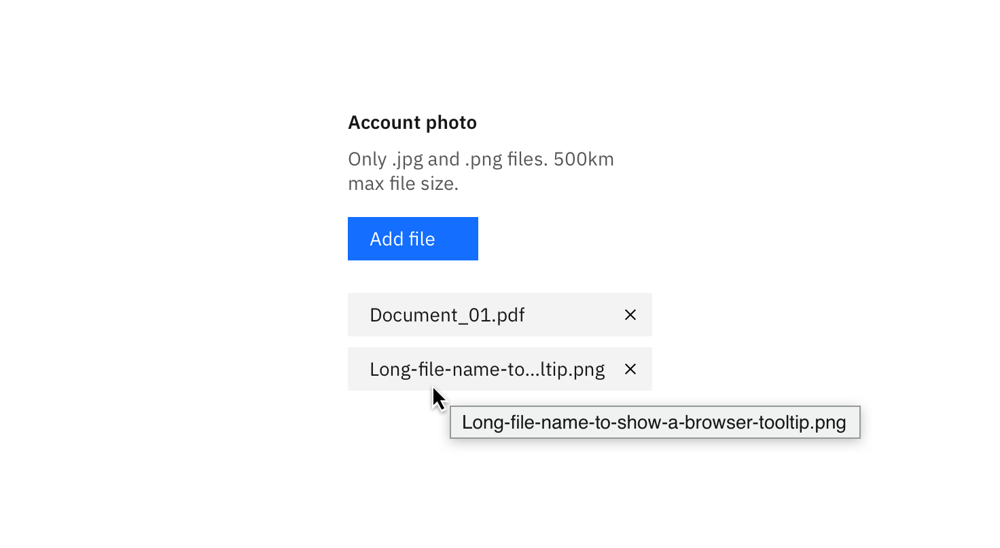
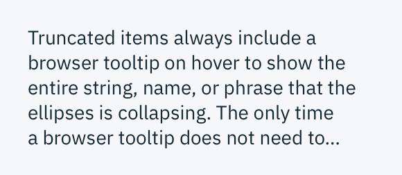
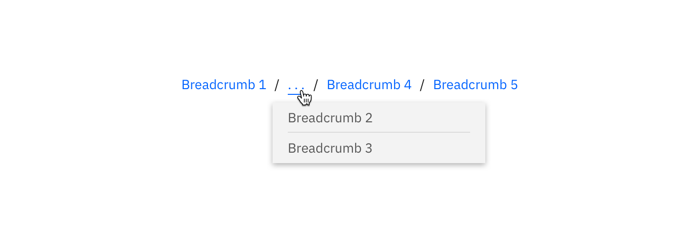
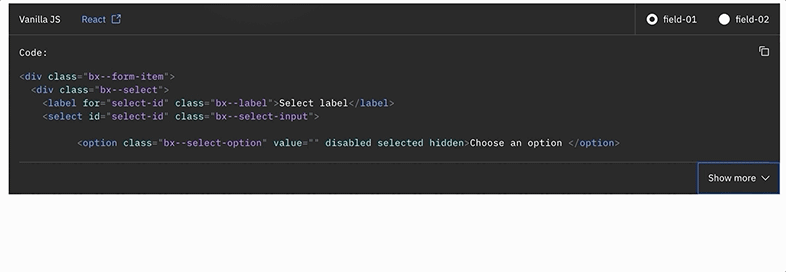

<page-intro>**Overflow content** is text, such as a paragraph or a text string, that exceeds a desired space. It also applies to a series of components that surpass a given space. Overflow content is typically reduced to fit a space or reduce repetition. Truncation and ‘Show more’ buttons are two ways to indicate that overflow content is continued elsewhere or below the fold.</page-intro>

## Truncation

Truncation, or shortening, is typically used for static text or links that exceed the size of their container. Truncated items are represented by an ellipsis `...` and should represent three or more truncated characters in a text string. There must be at least four characters of non-truncated content in a truncated string. Truncated items always include a browser tooltip on hover to show the entire string, name, or phrase that the ellipsis is representing. The only time a browser tooltip does not need to be used is at the end of a truncated paragraph.


_Example of a browser tooltip being used for truncation._


_Example of end-line truncation for a paragraph._


### Usage

Good use cases for truncation include:

- breadcrumbs
- pagination
- long URL links
- paragraph of text (i.e. a description paragraph)
- shortening of a long item name (user- or platform-generated)

Truncation should **not** be used on page headers, titles, labels, error messages, validation messages, notifications, menu items, or tabs.

### Variations

There are three types of truncation: front-line, mid-line, and end-line.

| Type          | Purpose                                                                                                                                                                                                                        | Default                       | Truncated                   |
| ------------- | ------------------------------------------------------------------------------------------------------------------------------------------------------------------------------------------------------------------------------ | ----------------------------- | --------------------------- |
| **Front-line** | Used at the beginning of a text string to indicate the text is continued from a previous location.                                                                                                                             | `123456789`                   | ...56789                    |
| **Mid-line**   | Used when several text strings have different beginnings and/or endings but the exact same middle characters. Can also be used to shorten a phrase or text string when the end of a string cannot be truncated by an ellipsis. | `123400005678` `987600004321` | `1234...5678` `9876...4321` |
| **End-line**  | Used at the end of a character string or paragraph to indicate that there is more content in another location, to show that the pattern in a sequence continues, or to shorten a long text string.                             | `123456789`                   | `12345...`                  |

An ellipsis on its own may also represent condensed content. This type of truncation requires an overflow menu on hover instead of a browser tooltip.


_Example of a truncated breadcrumb utilizing an ellipsis with an overflow menu._

### Code

To use front- and end-line truncation, enter the appropriate class below and add `title` to populate the browser tooltip that appears when truncated text is hovered. The `width` of the container (or the text element itself) also needs to be configured in order to calculate where the truncation will start.

| Type          | Class                       |
| ------------- | --------------------------- |
| **Frontline** | `.bx--text-truncate--front` |
| **End-line**  | `.bx--text-truncate--end`   |

**Example Usage**

```html
<div class="container">
  <span title="123456789" class="bx--front-line">123456789</span>
</div>
```

```css
.container {
  width: 65px;
}
```

```css
.bx--front-line {
  width: 100%;
  display: inline-block;
  direction: rtl;
  text-overflow: ellipsis;
  white-space: nowrap;
  overflow: hidden;
}
```

**Result**


#### Mid-line truncation

Mid-line truncation does not have its own class as it requires JavaScript. This example in CodePen shows how it is implemented.

<iframe height='300' scrolling='no' title='Middle Truncation' src='//codepen.io/team/carbon/embed/KRoBQe/?height=300&theme-id=30962&default-tab=result&embed-version=2' frameborder='no' allowtransparency='true' allowfullscreen='true' style='width: 100%;'>See the Pen <a href='https://codepen.io/team/carbon/pen/KRoBQe/'>Middle Truncation</a> by Carbon Design System (<a href='https://codepen.io/carbon'>@carbon</a>) on <a href='https://codepen.io'>CodePen</a>.
</iframe>

### 'Show more' buttons

The ‘Show more’ button is used when there is a significant amount of overflow content. Implementing a ‘Show more’ button gives a user the ability to see the content in more digestible chunks, as opposed to all at once. A ‘Show more’ button is used in place of scrolling, gradients, or fades as they are more prominent and actionable. If needed, a 'Show less' can be used to again hide the content the user opened. ‘Show more’ can also be presented as ‘Load more’ in cases where performance is a concern. See the [Loading](/components/loading) section for additional details.


_Example of the 'Show more' button in context._
