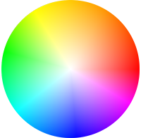

## GitHub Repos

<grid-wrapper col_lg="8" flex="true">
<clickable-tile
    title="Carbon Design Kit"
    href="https://github.com/ibm/carbon-design-kit"
    type="resource"
    >
    
</clickable-tile>
<clickable-tile
    title="Carbon Components"
    href="https://github.com/ibm/carbon-components"
    type="resource"
    >
    
</clickable-tile>
<clickable-tile
    title="Carbon Components React"
    href="https://github.com/ibm/carbon-components-react"
    type="resource"
    >
    
</clickable-tile>
<clickable-tile
    title="Carbon Components Angular"
    href="https://github.com/ibm/carbon-components-angular"
    type="resource"
    >
    
</clickable-tile>
</grid-wrapper>

## Tools

<grid-wrapper col_lg="8" flex="true">
<clickable-tile
    title="Carbon CodePen"
    href="http://www.codepen.io/team/carbon"
    type="resource"
    >
    
</clickable-tile>
<clickable-tile
    title="Themeing Sandbox"
    href="http://themes.carbondesignsystem.com/"
    type="resource"
    >
    
</clickable-tile>
<clickable-tile
    title="Color Contrast Checker"
    href="https://marijohannessen.github.io/color-contrast-checker/"
    type="resource"
    >
    
</clickable-tile>
<clickable-tile
    title="Carbon Boilerplate"
    href="https://github.com/carbon-design-system/carbon-boilerplate"
    type="resource"
    >
    
</clickable-tile>
<clickable-tile
    title="Carbon React Storybook"
    href="http://react.carbondesignsystem.com/"
    type="resource"
    >
    
</clickable-tile>
</grid-wrapper>

## Additional Resources

### [IBM Plex](https://github.com/IBM/plex)

IBM uses the font Plex across products for brand consistency and cohesion.

### [IBM Design Language](https://www.ibm.com/design/language/)

Carbon uses the IBM Design Language as our guiding principle. These core values remind us to design for an outcome and to be authentically thoughtful.

## Featured

<grid-wrapper col_lg="12" flex="true">
<clickable-tile
    type="article"
    title="Smashing Magazine's “Design Systems” Book"
    href="https://www.smashingmagazine.com/design-systems-book/"
    >
    
</clickable-tile>
<clickable-tile
    type="article"
    title="Winter 2017 HOW In-House Design Award Winner"
    href="http://www.howdesign.com/84-award-winning-projects-from-in-house-design-teams/"
    >
    
</clickable-tile>
<clickable-tile
    type="article"
    title="Path to Design System Maturity"
    href="https://medium.com/ux-power-tools/the-path-to-design-system-maturity-d403daba692a"
    >
    
</clickable-tile>
<clickable-tile
    type="article"
    title="Responsive Web Design Podcast"
    href="https://responsivewebdesign.com/podcast/ibm-carbon/"
    >
    
</clickable-tile>
<clickable-tile
    type="article"
    title="UX Pin Virtual Design Summit"
    href="https://www.youtube.com/watch?v=eSvq5MieOdw&t=144s"
    >
    
</clickable-tile>
</grid-wrapper>

## Articles

<grid-wrapper col_lg="12" flex="true">
<clickable-tile
    type="article"
    title="Up & Running with Carbon React in less than 5 minutes"
    author="Josh Black"
    date="October 19, 2018"
    href="https://medium.com/carbondesign/up-running-with-carbon-react-in-less-than-5-minutes-25d43cca059e"
    >
    
</clickable-tile>
<clickable-tile
    type="article"
    title="Hacktoberfest with Carbon"
    author="Josh Black"
    date="October 16, 2018"
    href="https://medium.com/carbondesign/hacktoberfest-with-carbon-95c48943f586"
    >
    
</clickable-tile>
<clickable-tile
    type="article"
    title="Data Table updates in Carbon React v5.22.0"
    author="Josh Black"
    date="February 20, 2018"
    href="https://medium.com/carbondesign/data-table-updates-in-carbon-react-v5-22-0-6da0c24a96d6"
    >
    
</clickable-tile>
<clickable-tile
    type="article"
    title="Introducing Carbon Themes"
    author="Bethany Sonefield"
    date="August 11, 2017"
    href="https://medium.com/design-ibm/introducing-carbon-themes-83d3985a8627"
    >
    
</clickable-tile>
<clickable-tile
    type="article"
    title="Carbon: Designing inside Big Blue"
    author="Bethany Sonefield"
    date="March 30, 2017"
    href="https://medium.com/design-ibm/carbon-designing-inside-big-blue-8577883cfe42"
    >
    
</clickable-tile>
</grid-wrapper>
