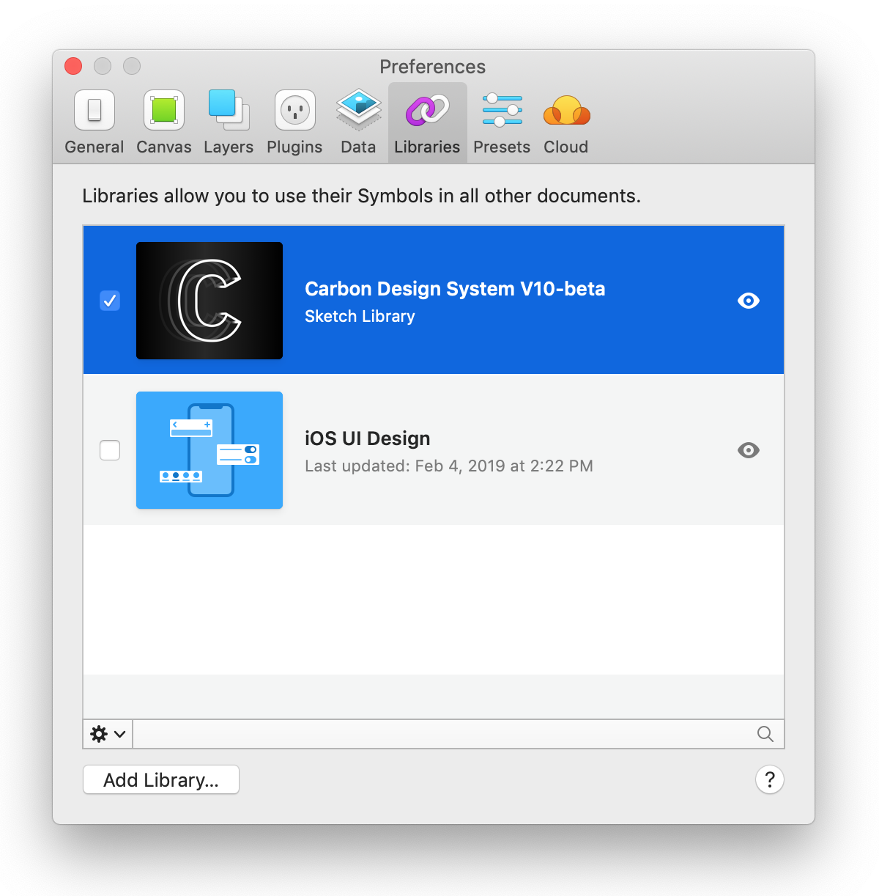
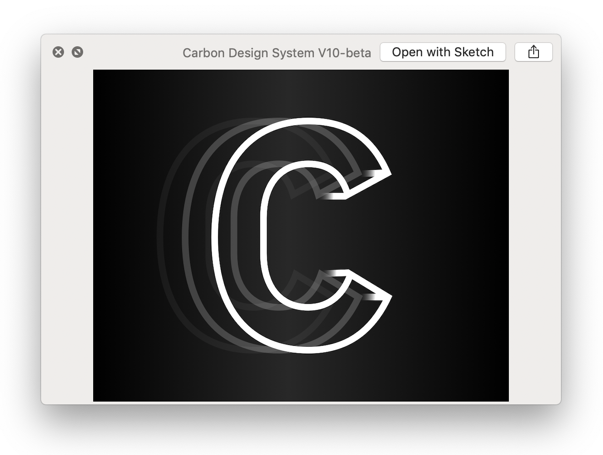
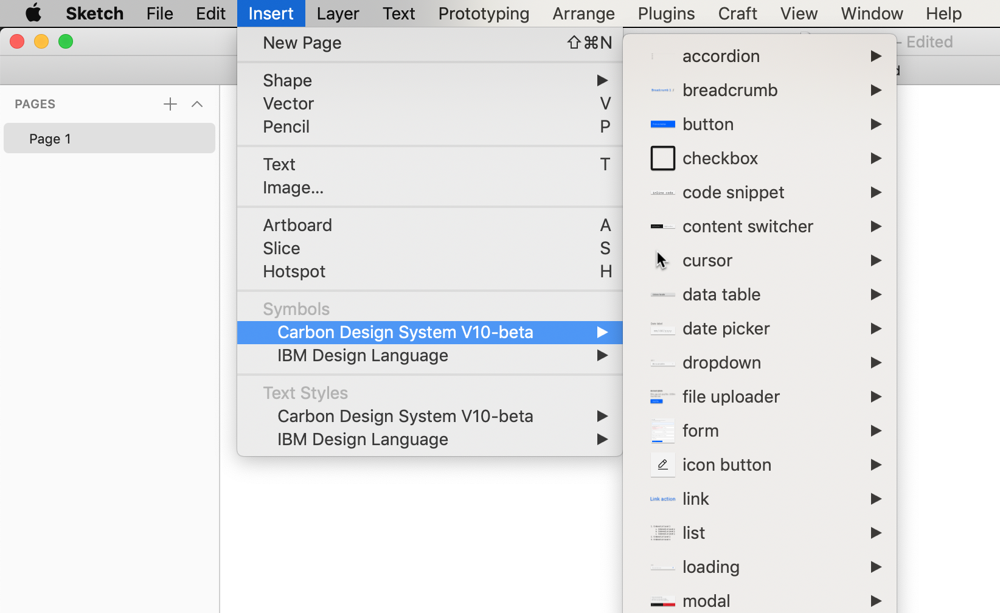
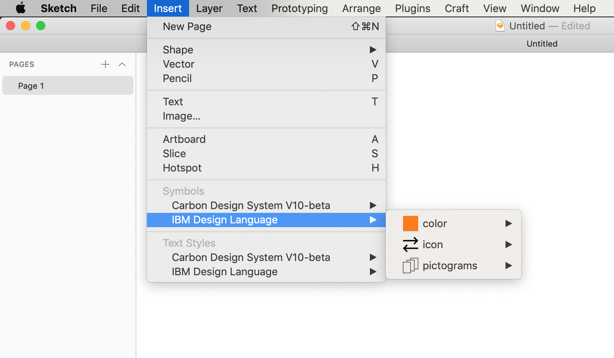

<AnchorLinks>

- [IBM Design Language](#ibm-design-language)
- [Design kit](#design-kit)
- [Themes](#themes)
- [Icons](#icons)
- [Typography](#typography)
- [Motion](#motion)
- [Layout and grid](#layout-and-grid)
- [Design migration strategy](#design-migration-strategy)
- [Feedback](#feedback)

</AnchorLinks>

## Resources

<GridWrapper col_lg="8" flex="true" bleed="true" className="tile--resource--no-margin">
  <ClickableTile
    title="Subscribe to Carbon Design Kit Library (Sketch Cloud)"
    href="sketch://add-library/cloud/JaVzz"
    type="resource">

  </ClickableTile>

<ClickableTile
    title="Subscribe to IBM Design Language Library (Sketch Cloud)"
    href="sketch://add-library/cloud/75VZZ"
    type="resource">

  </ClickableTile>

<ClickableTile
    title="Download the IBM Grid Template (Sketch Cloud)"
    href="https://sketch.cloud/s/ngV7z"
    type="resource">

  </ClickableTile>
</GridWrapper>

## IBM Design Language

Carbon v10 delivers the new <a href="https://www.ibm.com/design/language/" target="_blank">IBM Design Language</a> to product teams. It represents a complete visual refresh of the system, delivering the ethos of IBM Design. With tooling and  guidance on color, layout, typography, iconography, motion, patterns, and content, Carbon v10 is a modern, open-source framework for building digital products and experiences.

## Design kit

Carbon v10 includes a completely revised Sketch design kit, updated for the new IBM Design Language. All components in the kit have been aligned with the Design Language, as well as colors, icons, typography, motion, and grid elements.

Also new in Carbon v10 is Sketch Cloud Sync capabilities for the design kit. This is a completely new way of working with the Carbon Design Kit. Rather than downloading a Sketch file, working with it locally, and having to periodically check the repo for updates, designers can now subscribe to the design kit library via Sketch Cloud, and updates to the contents of the kit will be pushed to subscribers as they become available.    

Please note that upgrading to the v10 kit will not automatically change any files created in previous versions of the kit. In Sketch, the migration of existing v9 layouts will be a manual process for the designer; although there is no simple way to automatically update entire Sketch files from one version of the library to another, V9 symbols can be easily swapped for V10 symbols through the "Replace With" function. Also note that even though libraries from multiple versions of Carbon can exist at the same time in Sketch, **using v10 components in the same layout as pre-v10 components is not an approved use of the design system.**

### What's changed from the v9 kit

- New Sketch Cloud method of keeping your design kit in sync
- New IBM Design Language styling
- Improved kit structure
- Updated text styles
- Updated spacers
- Icon updates
- New color tokens
- Updated elements page
- New Getting Started page
- Updated layer styles

For more details on these changes to the design kit, see the What's New page in the Design Kit Sketch file itself.

### Setting up the kit

The new method for using the kit is via Sketch Cloud subscription. [Subscribe to the Carbon Design Kit as a library](sketch://add-library/cloud/JaVzz). 

If prompted by your browser, select "Open Sketch."

This will open the Preferences panel in Sketch, where you should see the Carbon Design System kit in your list under Libraries. Congratulations, you are now subscribed to the design kit!

<ImageComponent cols="8" caption="Installing the design kit library">

</ImageComponent>

_Optional_ To open the design kit as a Sketch file, click on the “eye” icon in the Preferences panel. Then click on “Open with Sketch.” You can use this file for visual reference and guidance while working with the kit.

<ImageComponent cols="6" caption="Opening the library as a Sketch file">

</ImageComponent>

#### Icons, pictograms, and the full IBM color palette

To access the IBM Design Language icons, pictograms, and colors, [subscribe to the IBM Design Language Kit via Sketch Cloud](sketch://add-library/cloud/75VZZ), using the same method you used for the Carbon Design Kit. **Please note that icons are no longer a native part of the Carbon kit; all icons in the Carbon kit are imported from the IBM Design Language library.**

After adding the two libraries, you can use the `Insert` menu in Sketch to insert any element or component from either of the kits to your working file. Note: For product work at IBM, use the text styles for Carbon. For marketing and other non-product digital work, use the IBM Design Language text styles. 

<ImageComponent cols="8" caption="Using the Carbon Sketch library">

</ImageComponent>

<ImageComponent cols="8" caption="Using the IBM Design Language Sketch library">

</ImageComponent>

#### IBM grid template

The IBM grid template provides an easy starting point for designing layouts on the IBM grid. To install the template, first [Download the IBM Grid Template](https://sketch.cloud/s/ngV7z). 

Open the downloaded file in Sketch, and then navigate to `File → Save as Template`. Confirm the save. Now you can access the page template via `File > New from Template`. Use this method any time you need to start a fresh file for designing a layout using the IBM grid. 

Don't forget that this very site contains more detailed guidance on all [components](/components/overview) and [elements](/guidelines/color/overview) that appear in the kit, as well as the [grid](/guidelines/layout).

## Themes & color

Carbon now offers four preset visual themes for IBM products, offering more options than ever for accessible components. See [themes guidelines](/guidelines/themes) for detailed info on using themes in Carbon v10.

Carbon color tokens also have been updated with v10 to include several new and updated color tokens. 

[v10 Color migration](https://github.com/IBM/carbon-elements/blob/master/docs/migration/10.x-color.md)

## Icons

The iconography in Carbon v10 has been significantly updated to better align with the new IBM Design Language, with dozens of new, accessible icons and design improvements to many of the existing icons. The full library of icons and pictograms is available via the IBM Design Language Kit library. Click on the tile at the top of this page to subscribe to this library. 

Any icons being used with Carbon v9 (outside of those integral to a component) should be reviewed against the new icons before publishing. Wherever possible, replace old icons with their revised IBM Design Language versions.

[Iconography guidelines](/guidelines/iconography/library)
[v10 Iconography migration](https://github.com/IBM/carbon-elements/blob/master/docs/migration/10.x-icons.md)

## Typography

The primary typeface for Carbon (IBM Plex) is unchanged from v9. However, the type token architecture has been completely redesigned for better clarity and flexibility in v10, moving from a basic type scale model to a more robust token-based architecture. Work with your development team to discuss how this new architecture might affect your team's workflow.

[Typography guidelines](/guidelines/typography/overview)
[v10 Typography migration](https://github.com/IBM/carbon-elements/blob/master/docs/migration/10.x-type.md)
[v10 Typography preview](https://carbon-elements.netlify.com/type/examples/preview/)

## Motion

Carbon v10 introduces the new IBM Design Language motion standards, designed to bring unity and cohesion to all IBM motion. All interactions that include motion should abide by these standards. 

[Motion guidelines](/guidelines/motion/basics)

## Layout, Grid, Spacing

The grid has been completely redesigned for v10, to align with the IBM Design Language. The official IBM grid is now 16 columns. However, to make the migration process for v9 products smoother, Carbon v10 will default to the 12-column grid, with an option to switch to the 16-column grid. Designers starting on new layouts using v10 should use the 16-column grid.

Layout and spacing token names have also been updated in v10 but the values remain the same.

[Layout guidelines](/guidelines/layout)
[v10 grid demo](https://carbon-elements.netlify.com/grid/examples/preview/)
[v10 spacing migration](https://github.com/IBM/carbon-elements/blob/master/docs/migration/10.x-layout.md#migrating)

## Design migration strategy

For the designer, the first step in migrating to Carbon v10 is to download and get familiar with the Carbon v10 Design Kit, along with the usage content on this website. The components and elements in the kit have been completely revised from v9. Be sure to note the changes to the color palette, spacing and layout, and iconography in the kit.

Set up a meeting with your dev team and OM to discuss the migration process. Using this page as a starting point, establish a plan of attack for the migration together. 

Ideally, your product team will upgrade on a parallel branch, where any interface issues can be worked out between design and dev, before going GA with the update.

### "Code-first" approach

The fastest approach to v10 migration starts with the front-end developer. The developer, with help from the migration guidelines found on this site, will update the product's front end code to v10. This should not cause any major breaks in the UI, but there might be some funky looking stuff that needs to be resolved by the design team. Product teams using v9 components in their code should see a mostly seamless transition.  

The product design team should review the updated UI with a critical eye and a solid knowledge of the v10 design guidelines. Do the fonts look right? Are the colors correct? Is the spacing between components correct? Do animations in the UI match the new motion standards? Does the general layout still work, and does it express the IBM Design Language accurately and effectively? Working together, the design and dev teams will fix any anomalies or glitches in the layout.

## Feedback

To leave feedback for the Carbon team, make suggestions for improvements, or just ask a question, you can [open an issue](https://github.com/carbon-design-system/carbon-website/issues/new?template=feedback.md&labels=feedback&title=User+feedback+for+Migration+Designers+page) on GitHub.

Internal IBM users can also subscribe to the [#carbon-design-system Slack channel](https://ibm-studios.slack.com/messages/C0M053VPT/details/), which is monitored by the Carbon team and the broader Carbon community.

_Last updated: 20 March 2019_
