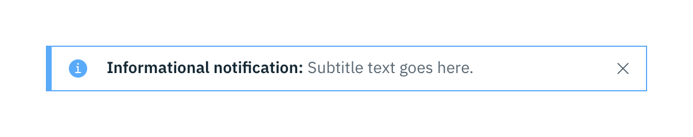

<page-intro>**Common actions** are frequently used actions that appear multiple times across different components and workflows. For platform consistency, these actions should only be applied in the ways described below.</page-intro>

## Regressive actions

### Cancel

Cancel stops the current action and closes the component or item. The user should be warned of any possible negative consequences of stopping an action from progressing, such as data corruption or data loss. [View in glossary](http://carbondesignsystem.com/guidelines/content/glossary#cancel)

**Usage:** Use a Secondary Button or a Link.

_Cancel action as a button._

### Clear

This action clears data from fields or removes selections. Clear can also delete the contents of a document, such as a log. Typically, the default selection or value is reset for controls that have a default selection or value, such as Radio Buttons. [View in glossary](http://carbondesignsystem.com/guidelines/content/glossary#clear)

**Usage:** Use the `x` icon on the right side of a field, item, or value.

_Clear action in Multi-select dropdown (top) and in Search (bottom)._

### Close

This action closes the current page, window, or menu. For example, closing a secondary window containing help. Close is also used to dismiss information, such as notifications. [View in glossary](http://carbondesignsystem.com/guidelines/content/glossary#close)

**Usage:** Use the `close` icon, which is typically placed on the upper right side of the element. Do not use close in a Button.

_Close action in an Inline Notification._

### Delete

This action eradicates an existing object. Delete actions cannot be easily undone and are typically permanent. The user should be warned of the negative consequences of destroying an object, such as loss of data. [View in glossary](http://carbondesignsystem.com/guidelines/content/glossary#delete)

**Usage:** Use either the `delete` trash can icon, a Danger Button, or a danger option in a menu. A Danger Modal is used when a warning is needed to confirm an action.

_Delete action in a Modal (top) and an Overflow Menu (bottom)._

### Remove

This action removes an object from a list or item however the object is not destroyed as a result of the action. Multiple objects can be removed at once. [View in glossary](http://carbondesignsystem.com/guidelines/content/glossary#remove)

**Usage:** Use as a Button or `subtract` icon or glyph.

_Remove action in as an icon._

### Reset

This action reverts values back to their last saved state. The last saved state includes the values stored the last time the user clicked or triggered Apply. [View in glossary](http://carbondesignsystem.com/guidelines/content/glossary#reset)

**Usage:** Typically applied as a Link.

_Reset action in a filter._

## Progressive actions

### Add

This action adds an existing object to a list, set, or system. For example, adding a document to a folder. [View in glossary](http://carbondesignsystem.com/guidelines/content/glossary#add)

**Usage:** Use a Primary Button, Button with Icon, `add--glyph` or `add--outline` icon.

_Add action as a Button with Icon in a Data Table._

### Copy

Creates a new identical instance of the selected object(s) to a specific destination. [View in glossary](http://carbondesignsystem.com/guidelines/content/glossary#copy)

**Usage:** Use the `copy` icon with the confirmation 'copied' tooltip appearing post click.

_Copy action as an icon with Tooltip in a Code Snippet._

### Edit

This action allows data or values to be changed. Edit commonly triggers a state change to the targeted object or input item. [View in glossary](http://carbondesignsystem.com/guidelines/content/glossary#edit)

**Usage:** Use as an option in a menu, or as a Button or `edit` icon.

_Example of edit options for a Data Table cell and Overflow Menu._

### Next

Advances the user to the next step in a sequence of steps, such as in a wizard. [View in glossary](http://carbondesignsystem.com/guidelines/content/glossary#next)

**Usage:** Use a Button with Icon or a stand alone `forward` icon.

_Next action as a Button with Icon in a Wizard._

### Refresh

This action reloads the view of an object, list, or data set when the displayed view has become unsynchronized with the source. [View in glossary](http://carbondesignsystem.com/guidelines/content/glossary#refresh)

**Usage:** Use the `refresh` icon or a Button.

_Refresh action as a Ghost Button with Icon in the action bar of a Data Table._
