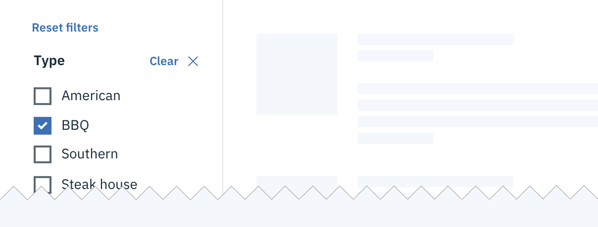

<page-intro>**Filtering** is the action by which a user adds or removes data items from a shown data set by turning on and off certain predefined criteria.</page-intro>

## Selecting filters

### Single selection
A single selection filter is when the user can pick **only one criteria** from a category to modify the data results. Under the hood, single selection is a radio button. Ways in which a single selection filter can manifest is in a/an:

- Basic Dropdown
- Inline Dropdown
- Search
- Radio Button set (either stand alone or within a menu)

_Single selection filter as an Inline Dropdown_

### Multi-selection
A multi-selection filter is used when the user has the option to pick **more than one criteria** from a category to modify the data results. Under the hood, multi-selections are Checkboxes. Ways in which a single selection filter can manifest is in a/an:

- Multi-select dropdown
- Inline multi-select dropdown
- Search with tags
- Checkbox set (either stand alone or within a menu)

_Multi-selection filter set in a menu_

### Multiple categories
A category is a set of filter items within the same topic. For example, "size" is the category and small, medium, large, & extra large are the filter choices. Multiple filter categories may be applied to the same data set. For example, the user can filter by size as well as color and price range.

Multiple category selection is most commonly manifested in either a vertical list on the left side of the page or within a horizontal drawer at the top of the data set. Multiple categories should never be put within a menu or dropdown.

_Multiple filter categories in a left panel_

## Triggering filters

### Batch filter
A batch filter is when all filters are applied together at the end of the selection process. The data set only refreshes once. The trigger is most commonly an "apply" filter button.

The batch filter is beneficial to use when the user is making several filtering selections across different categories that may take a longer time to cognitively process. Batch filtering is also a good solution for slow data return speeds. This can prevent the user from having to wait for the data to load after every selection.

_Batch filter example in a drawer_

### Interactive filter
An interactive filter returns results after each individual selection is made. The trigger is the individual selection and manipulates the data in real time. This is a good solution for when the user is only selecting from one category or the user is expected to only make one filter selection.

## Filter interaction
Each filter interaction should contain the following patterns and states:

- Default start state
- Unselected & selected state
- Filter applied state
- Clear filter(s) action

### Starting states
Filters within each category should start either as all unselected or all selected. When using multiple categories the start state can vary from category to category. If the user wants only one or a few criteria to be excluded from the results then all filters should be selected at the start. Oppositely, if the user wants to see only results related to one particular criteria then all filters should start as unselected.

### Filter applied
If the filter(s) can be hidden in either a drawer, dropdown, or menu, then there should be an indicator visible on the closed filter state that informs the user that filters have been applied. At a minimum the indicator should include the number of filters applied and have the option to clear filters without re-opening the filter container.

---
***
> 

_Filters not applied_

---
***
> 

_Filters applied_

### Resetting filters
Each category should have a way to clear all applied filters at once without having to interact with each individual item. Clearing filters returns the filters to their original default starting state.

If multiple categories have been applied to the same data set then there should be a way to dismiss all filters across all categories at once.

_Filter reset example for all categories and a single category_
