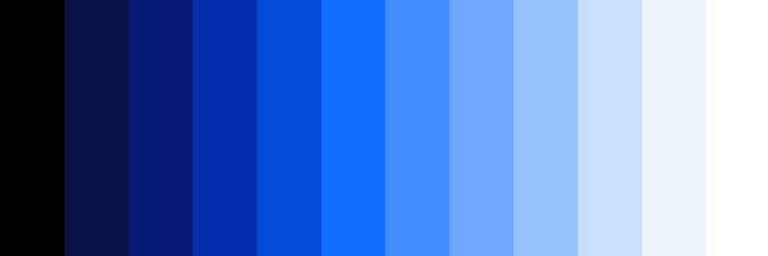
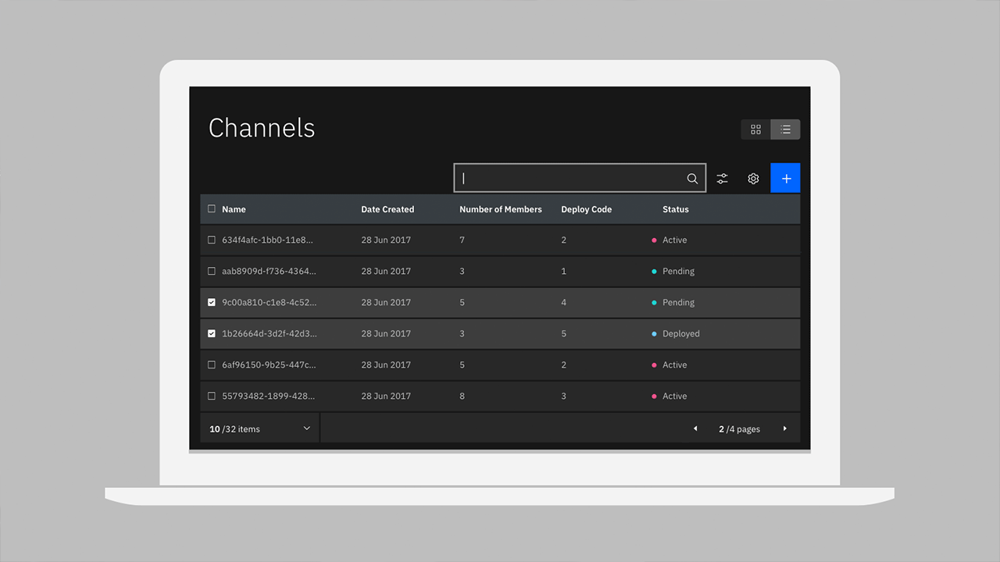

### Getting Started

<feature-tile
    href="/getting-started/designers"
    label="Start"
    title="Designing"
    margin="true">

</feature-tile>
<feature-tile
    href="/getting-started/developers"
    label="Start"
    title="Developing">

</feature-tile>

### Other Resources

The Component Libraries give developers a collection of re-usable React components they can use for building websites and user interfaces. See a [complete list of resources.](/resources)

<grid-wrapper col_lg="8" flex="true" bleed="true">
<clickable-tile
    dark="true"
    title="Carbon Design Kit"
    href="https://github.com/ibm/carbon-design-kit"
    type="resource"
    >
    
</clickable-tile>
<clickable-tile
    dark="true"
    title="Carbon Components"
    href="https://github.com/ibm/carbon-components"
    type="resource"
    >
    
</clickable-tile>
<clickable-tile
    dark="true"
    title="Carbon Components React"
    href="https://github.com/ibm/carbon-components-react"
    type="resource"
    >
    
</clickable-tile>
<clickable-tile
    dark="true"
    title="Carbon Components Angular"
    href="https://github.com/ibm/carbon-components-angular"
    type="resource"
    >
    
</clickable-tile>
</grid-wrapper>

### Latest Articles

<grid-wrapper flex="true" bleed="true">
<clickable-tile
    dark="true"
    type="article"
    title="What to expect in Carbon 10"
    author="Robin Cannon"
    date="December 10, 2018"
    href="https://medium.com/carbondesign/what-to-expect-in-carbon-10-5af1bd6e25f6"
    >
    
</clickable-tile>
<clickable-tile
    dark="true"
    type="article"
    title="Up & Running with Carbon React in less than 5 minutes"
    author="Josh Black"
    date="October 19, 2018"
    href="https://medium.com/carbondesign/up-running-with-carbon-react-in-less-than-5-minutes-25d43cca059e"
    >
    
</clickable-tile>
<clickable-tile
    dark="true"
    type="article"
    title="Hacktoberfest with Carbon"
    author="Josh Black"
    date="October 16, 2018"
    href="https://medium.com/carbondesign/hacktoberfest-with-carbon-95c48943f586"
    >
    
</clickable-tile>
</grid-wrapper>
